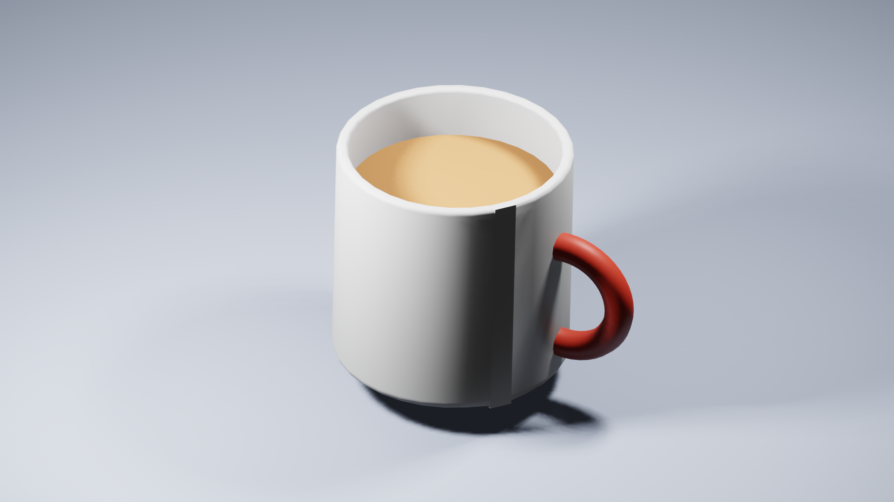
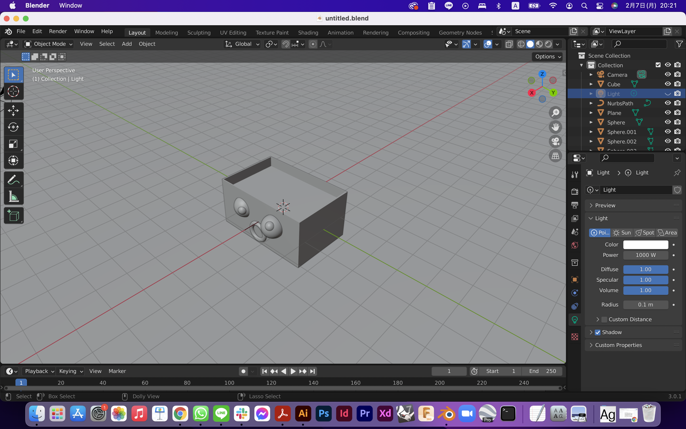
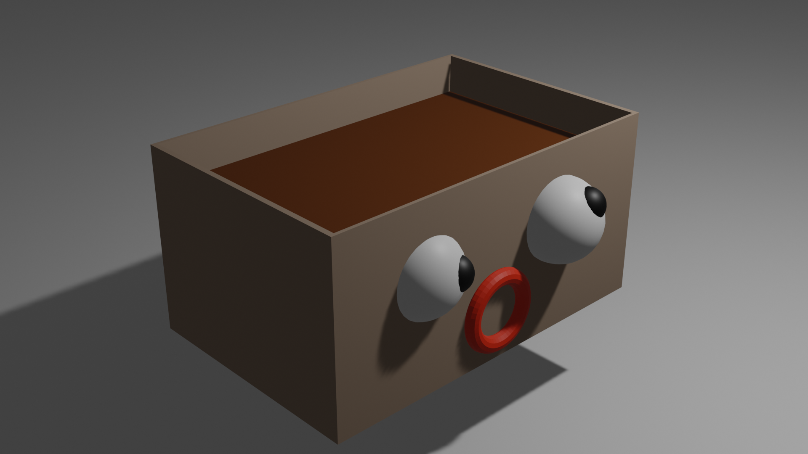
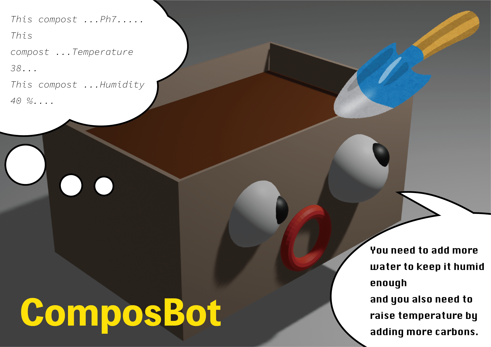

---
hide:
    - toc
---

**2nd week Feb.7 Computer aided design**
===============

This week we learned computer aided design. I am used to design with rhinoceros for 3d modeling but other software is not practical for me. This time, because we had a blender session, I tried to use it as much as I could.

I learned the basics so I am not that skillful to design anything with the blender yet, so I tried first to model the coffee cup which could be the easiest for me now.

I rendered by trying to put the materials on each part and lights for the rendering. I watched some tutorial videos on Youtube that gently taught me the basic skills.

After learning through the coffee cup modeling, I then tried to model something that relates to my project. I modeled the Compotbot which can be a speculation for my project because I am trying to design a compost toolkit sensor now that detects some important information to keep compost healthy.

If I had more time and more skills, I want to try modeling sensors that can really work. I am sure I will try it when I am designing a sensor.

