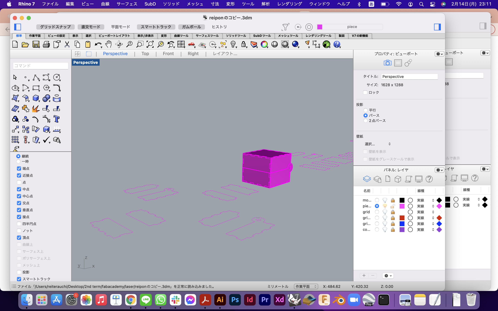
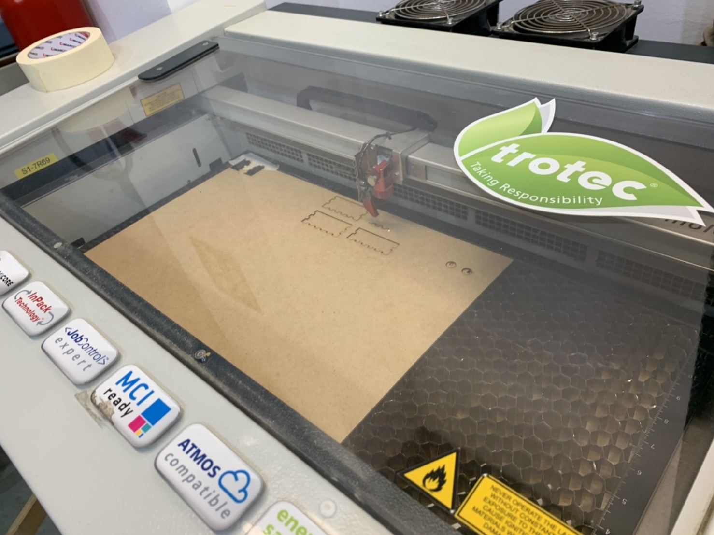
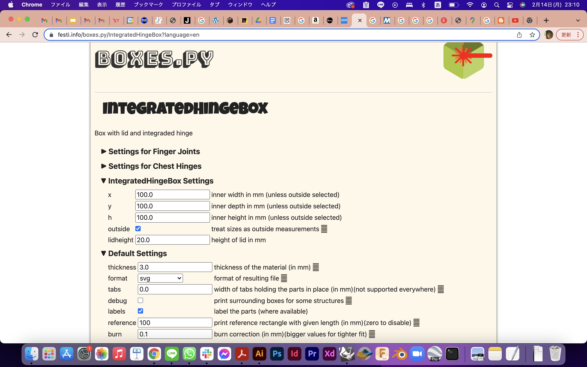
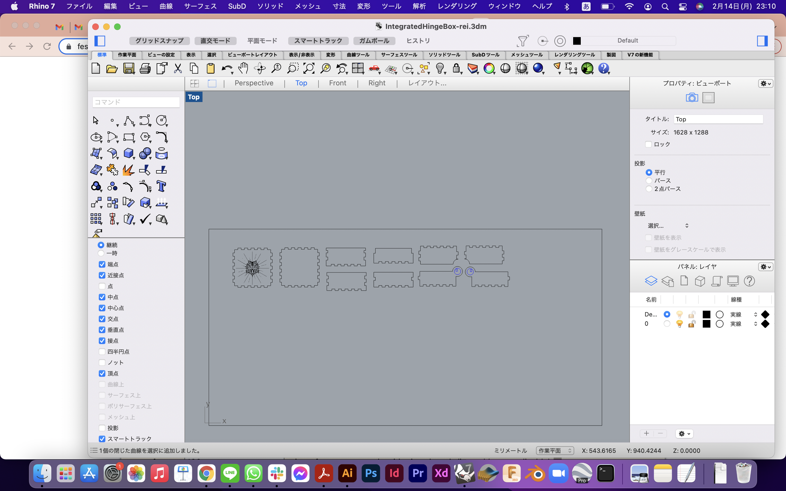
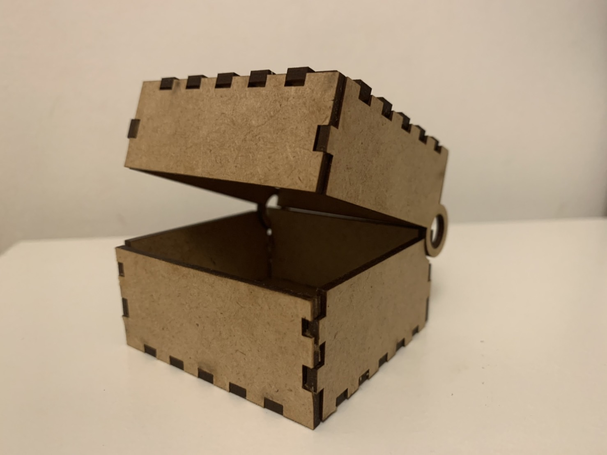
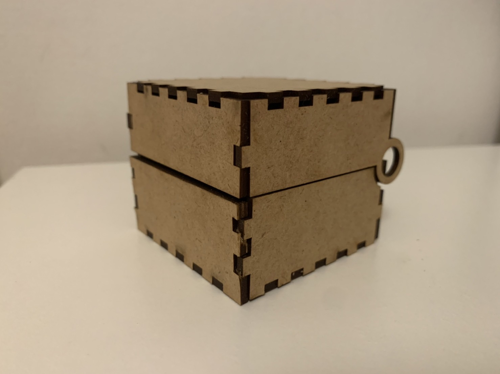

---
hide:
    - toc
---

**3rd week Feb.9 Computer-controlled cutting**
===============

This week we learned about laser cutting. Mostly learned basic skills and knowledge about how to use a laser cutter and by using this what we can make.

From last week’s task, I learned how to design with 3d modeling softwares, I used rhinoceros to design my thing to laser cut.

I designed a box that opens in the middle like a ring box.

When I was about to print my data, I have recognized the material (MDF) was not as thick as I designed.(the wrong information was on the webpage)
I almost cried in tears but I truly learned that I have to measure the material before I design.
Also, somehow my way of designing intersections was not great, I had to fix it again before cutting.

While this happened, Santi told me that he had seen a website that can parametrically generate a box that looks exactly like I designed.

That time I did not have enough time for print,(the booking system was messed up and I only had 5 mins to do)I chose to download the generator design and printed it.

I don’t think that it was a waste of time because designing is important and teaches us a lot of things, but for the easy prototyping or something like that I would rather choose something open source.

Many sad things happened, though I learned a lot too.

