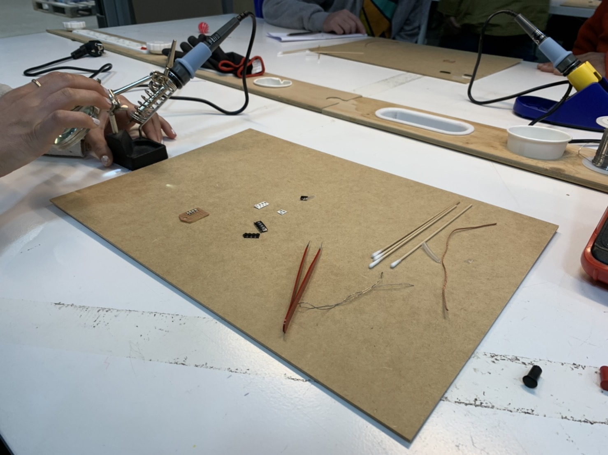
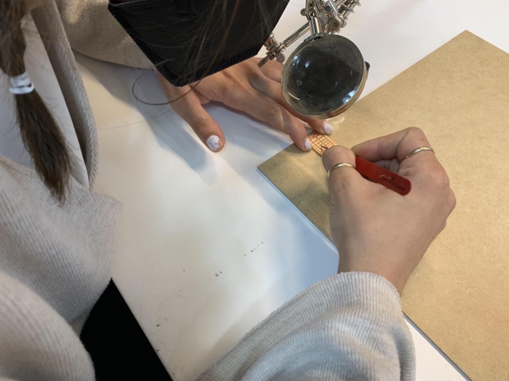

---
hide:
    - toc
---

**4th week Feb.16 Electronic Productions**
===============

This week we learned about electronic production. We learned from the very scratch of how to make a PCB. Designing and fabricating. Then soldering and building.

It was quite difficult for me to fully understand, honestly. Though, if I have a chance to build something on my own, I would love to try.

I soldered this LEDs on the PCB with Andrea.

