---
hide:
    - toc
---

**5th 3D Printing Feb.23**
===============

This week we learned how to make a model to data and use 3D printers.
I was familiar with 3D printing since uni, though it was my first time printing on my own.

I wanted to make my first printing related to the design intervention I am working on. Though I did not come up with any idea and I just thought if I could use this time for mending the cloth, which is a jacket that has lost its button. I modeled a button and booked a 3D printer.

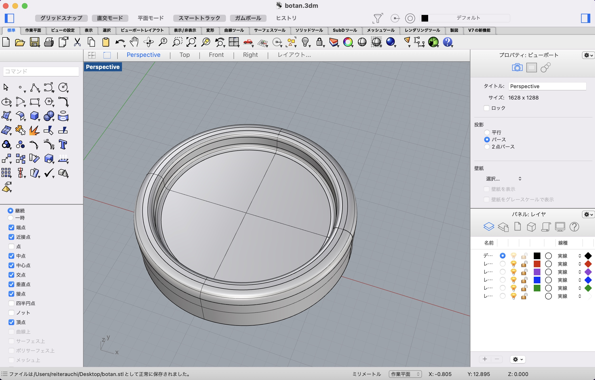
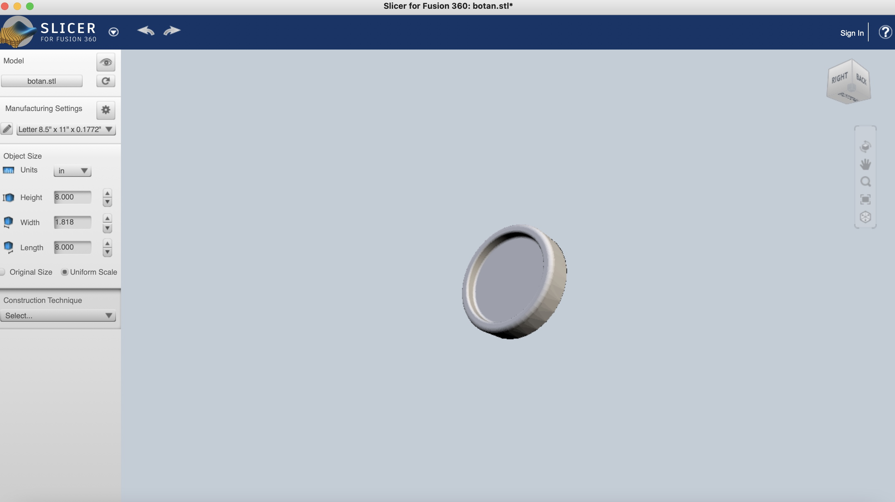

 I actually booked an Ender for printing, but somehow the booking system was messed up and I was not able to use the one I booked. So I used ANYCUBIC. When I tried to use it, it was not working properly with the configuration. So with the help of Edu I set up the Z axis.

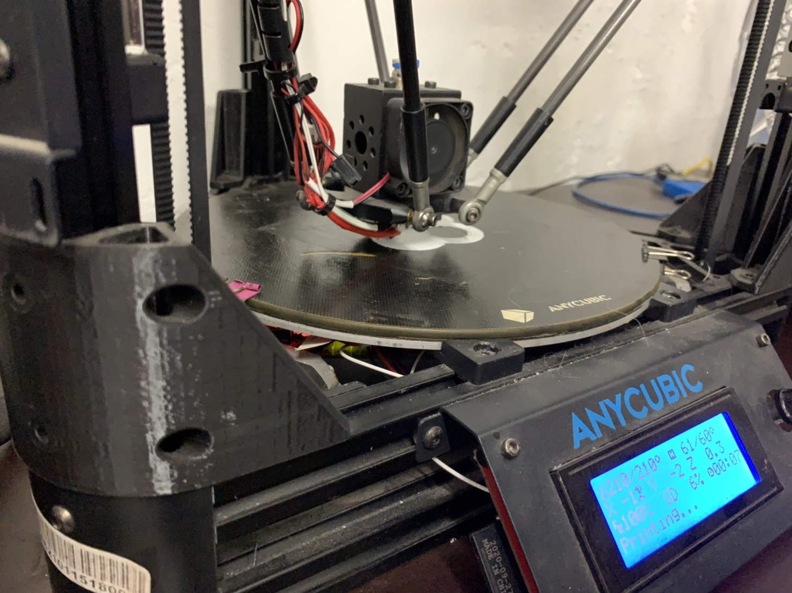
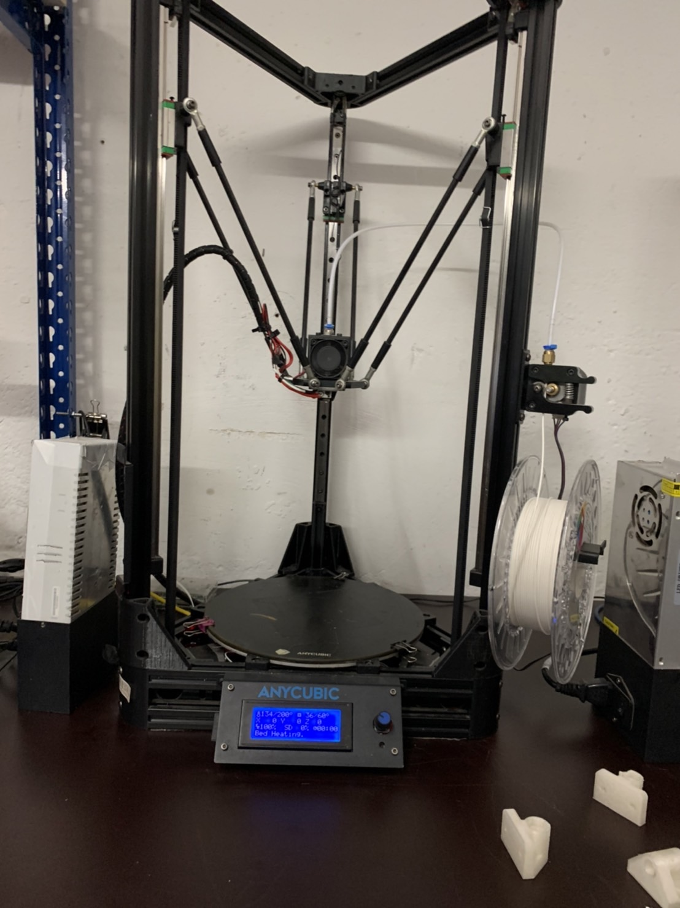

I started to print with high quality and the result was nice. 

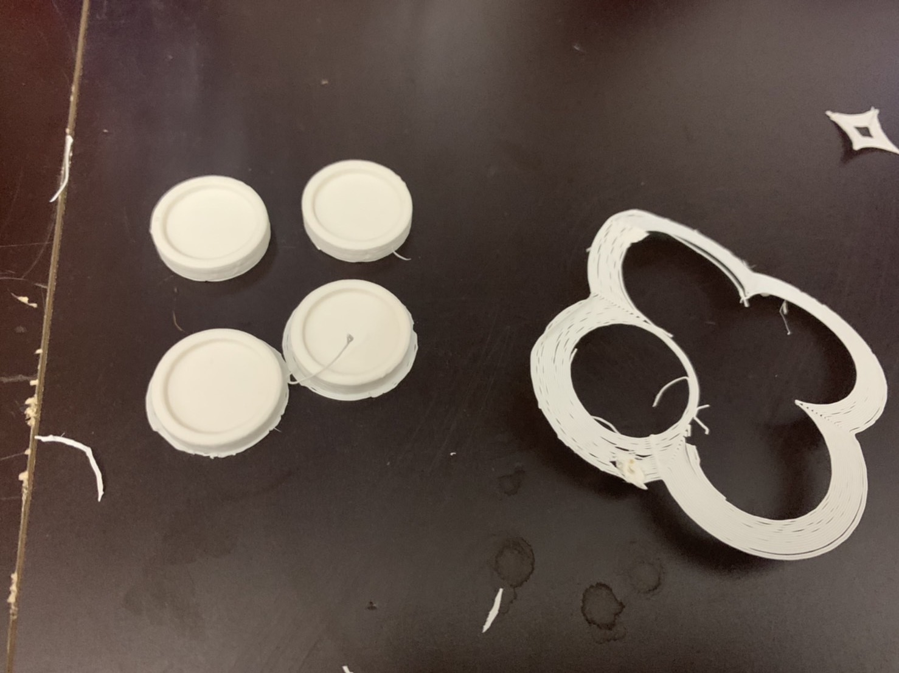

These buttons can be used as they are but I wanted to make biomaterial buttons, so I made a mold with silicon and made pine resin bio material.

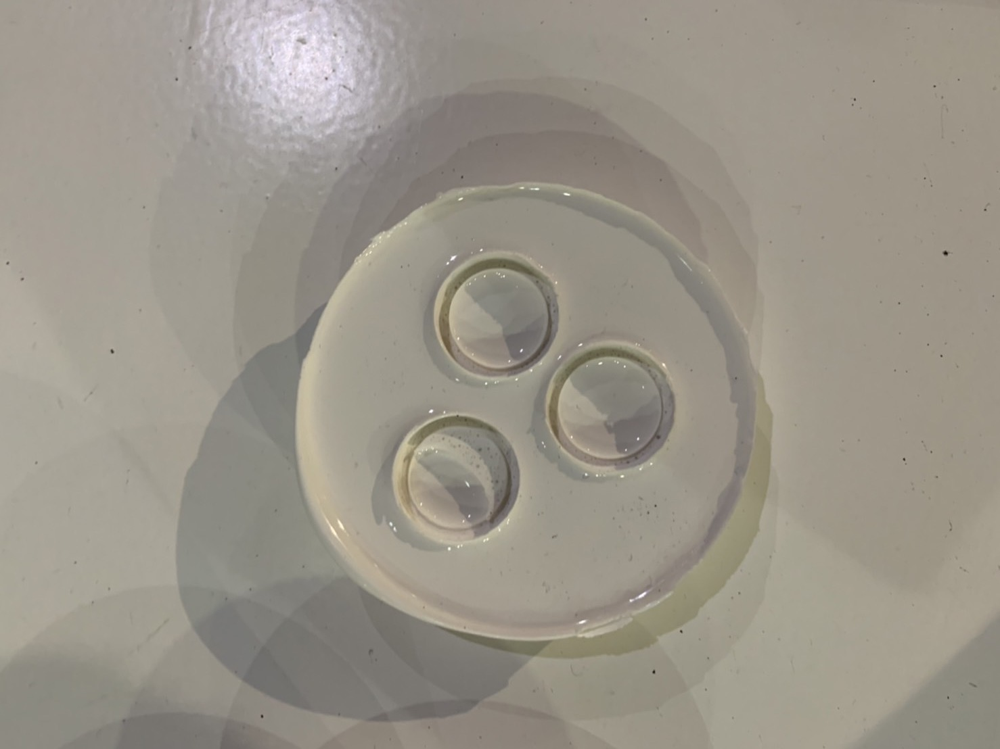

As I knew it is hard to make holes in the buttons with the mold, so I drilled to make holes after biomaterial became solid.

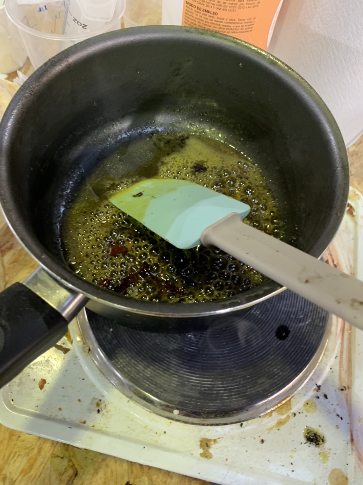
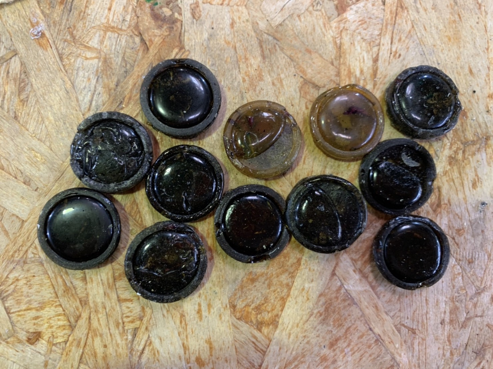

Though pine resin biomaterial  is still fragile, most of it broke when I made the holes. Only the one that survived was this one and I used it to mend the jacket.

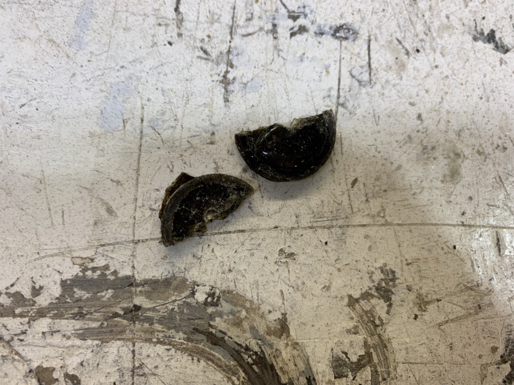
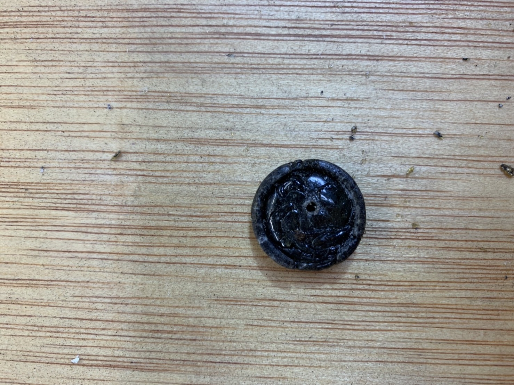

It turned out like this and I sewed it to the jacket which had lost its button. It looks very nice.

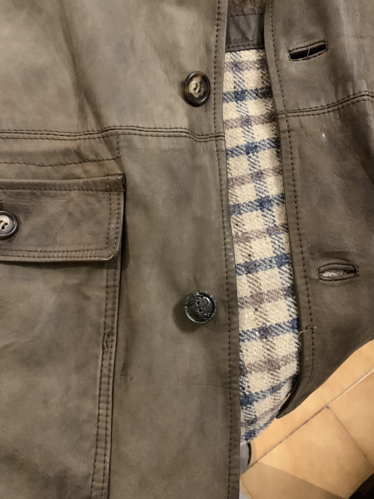
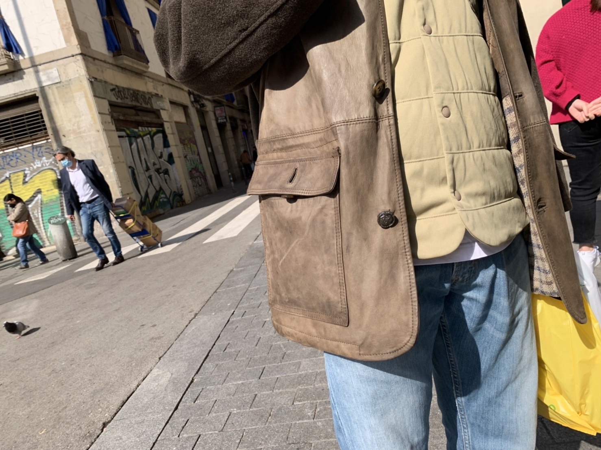

