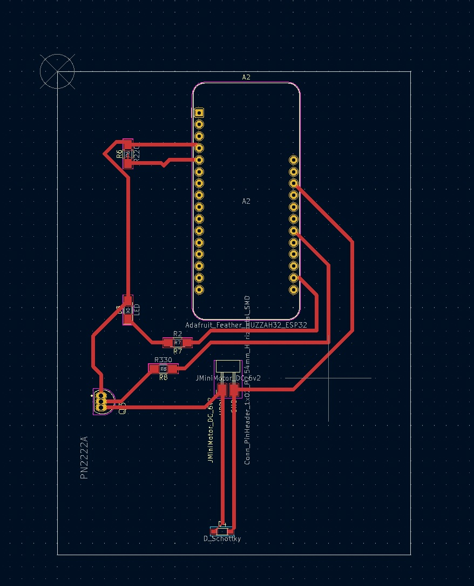
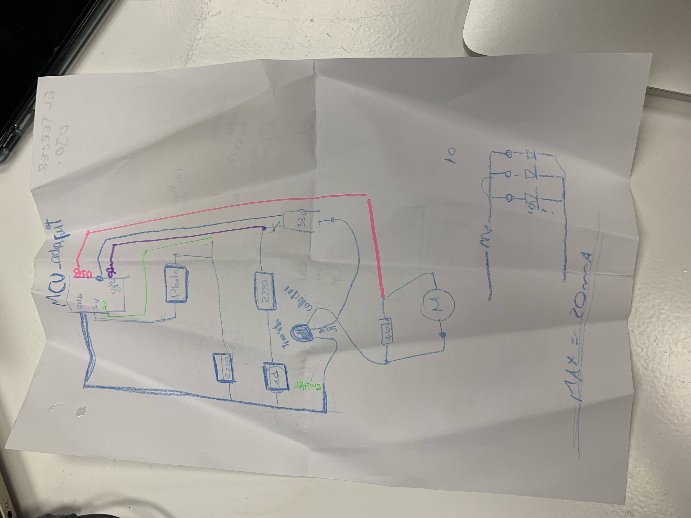

---
hide:
    - toc
---

**6th Electric Design Mar.2**
===============
For this kicad lecture, and also for other tasks that  required  electric development, Emilio, Fiorella, and I formed a group to work together. (because we needed help from each others) 
For this, we planned to make a circuit for a mini car that runs when the sensor catches the light source. 

Kicad

Hand drawing plan

 
