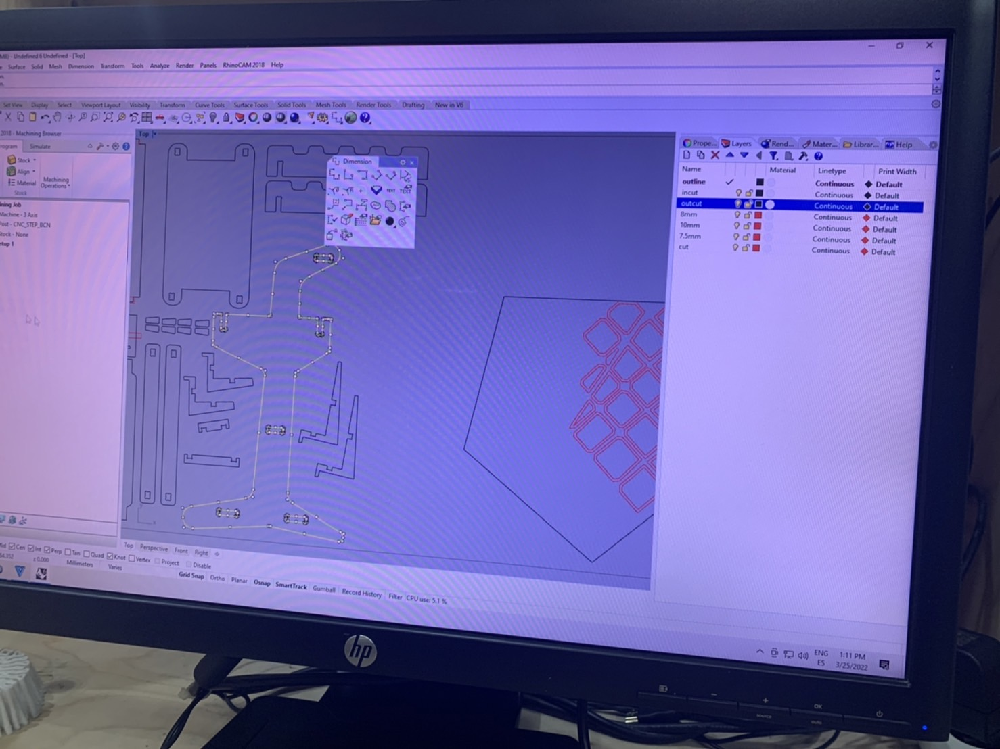

---
hide:
    - toc
---

**7th Computer Controlled Machine Mar.9**
===============

For the CNC, I did the project with Emilio.
We made a push cart for carrying food waste from home/restaurant to a community garden.
And some small furnitures for Design Dialogue exhibition.

.

We first thought about the design by looking through pinterest to have some ideas, then modeled with rhinoceros.

.

It was kind of hard to think about the tolerance because the plywood thickness differs even in one board. We decided to make -0.25mm each for both sides of the receptacle and insert parts.

.

We made cutting data on the pc at the Fabacademy classroom. We also struggled on making pockets where the endmill can escape on the corners. We made it exactly as the diameter of the endmill can go around.

.

We then cut with 15mm thick plywood. We placed the data with other students in order to avoid wasting the rest of the board.

.
.

We assembled and all the parts perfectly fit in and were stable!

.
.
.
.

