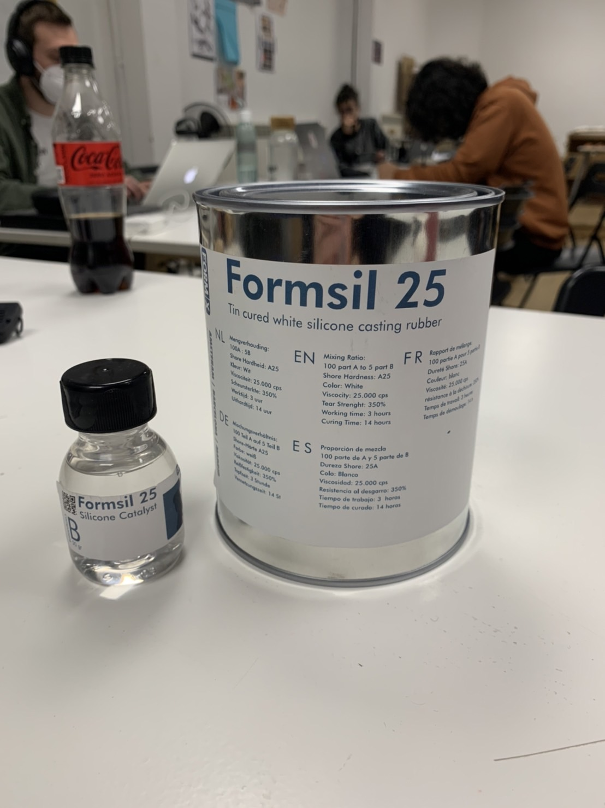
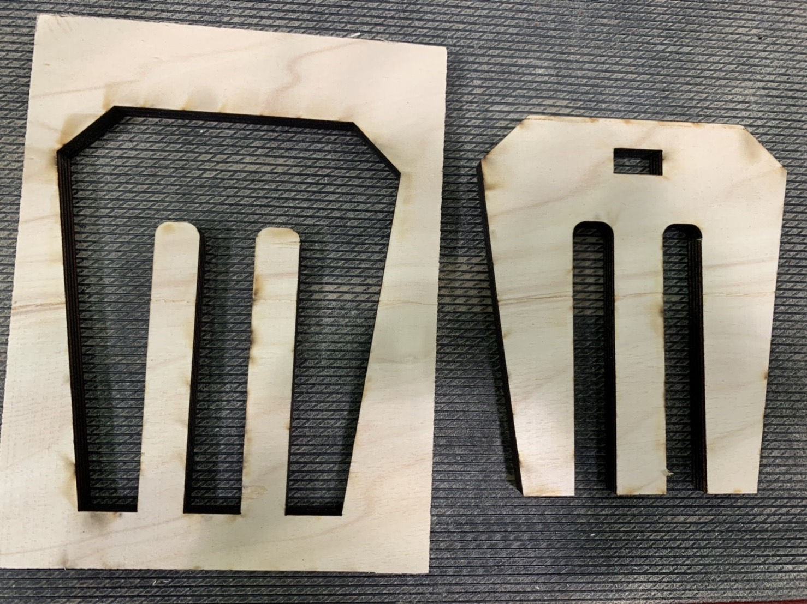
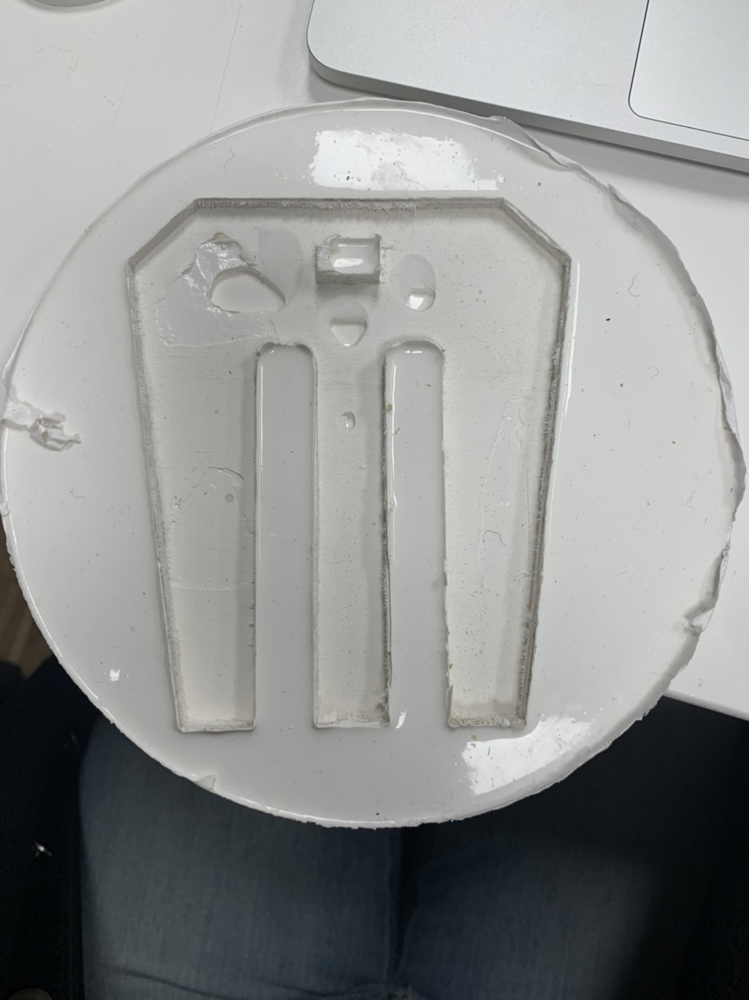
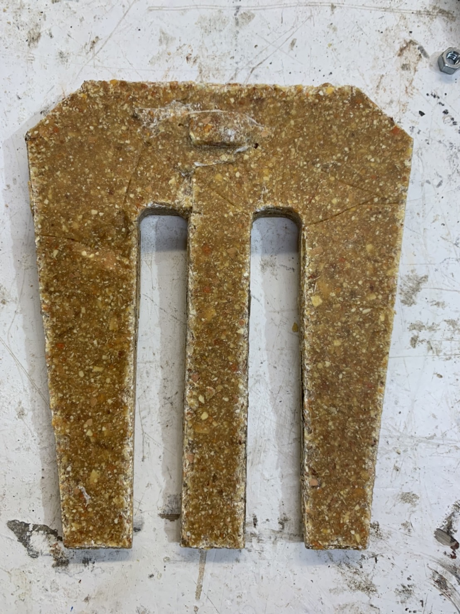

---
hide:
    - toc
---

**9th Modeling and Casting Mar.23**
===============

I molded a soil mixing fork for making biomaterial tools for use in compost.
I first designed the fork with illustrator then laser cut the board.

.
.

Cut out parts were also a mold for biomaterial. Though since I tried with biomaterial it did not work out much because the biomaterial sticks to the edge of wooden mold. I decided to make a silicone mold for this fork so the biomaterial can be easily taken off.

I mixed the silicone solution, then placed the wooden cut out fork on the bottom of a pan with tapes to avoid floating. There I poured the silicone solution and let it sit for several days. 

Some days after, I took the wooden fork out of the silicone but it looks like the fork kind of floated on the solution so the thickness of the mold has been changed.  So I did not try casting this time with this mold.

.
.

Though I did both modeling and casting for week 5 with 3d printed buttons.

