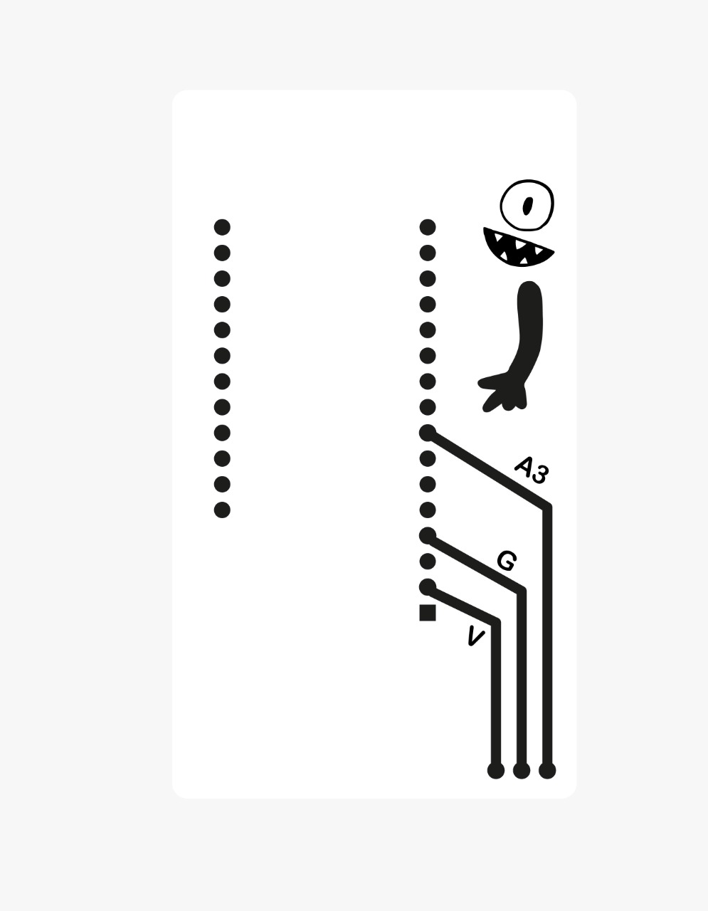
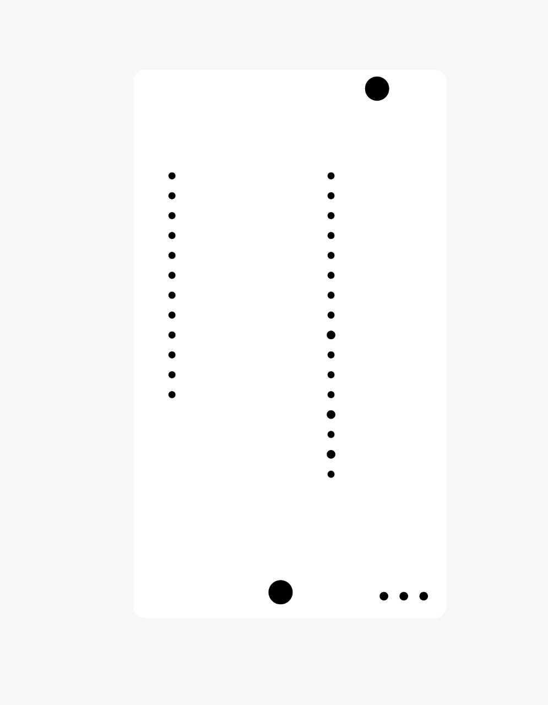
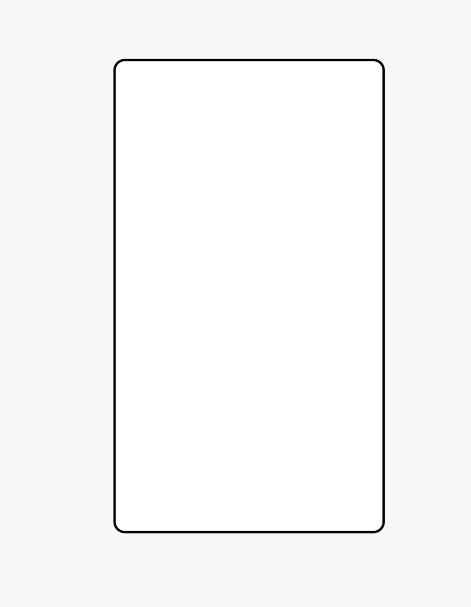
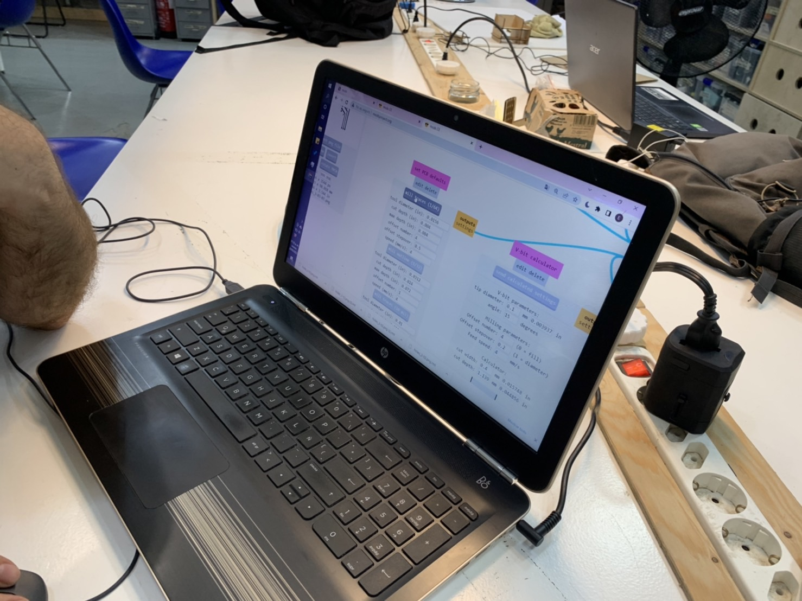
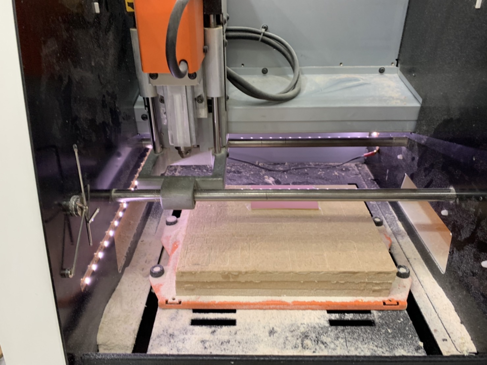
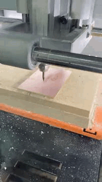
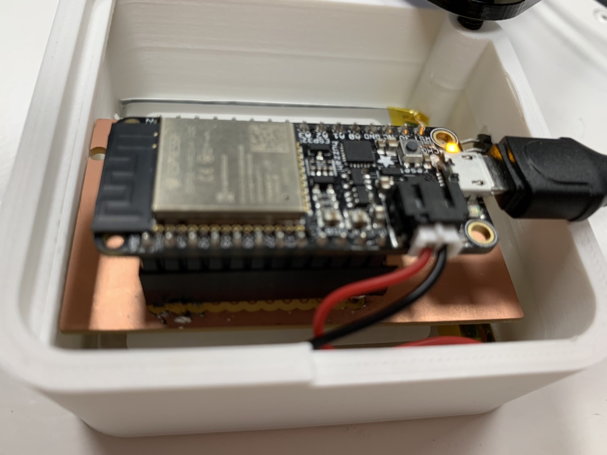
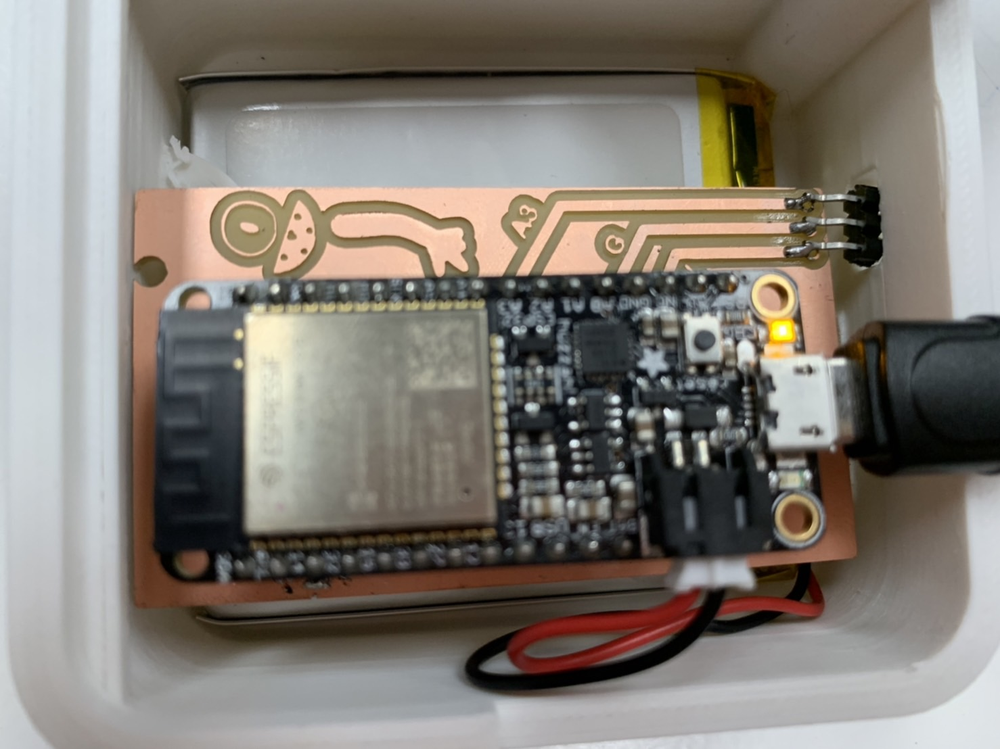
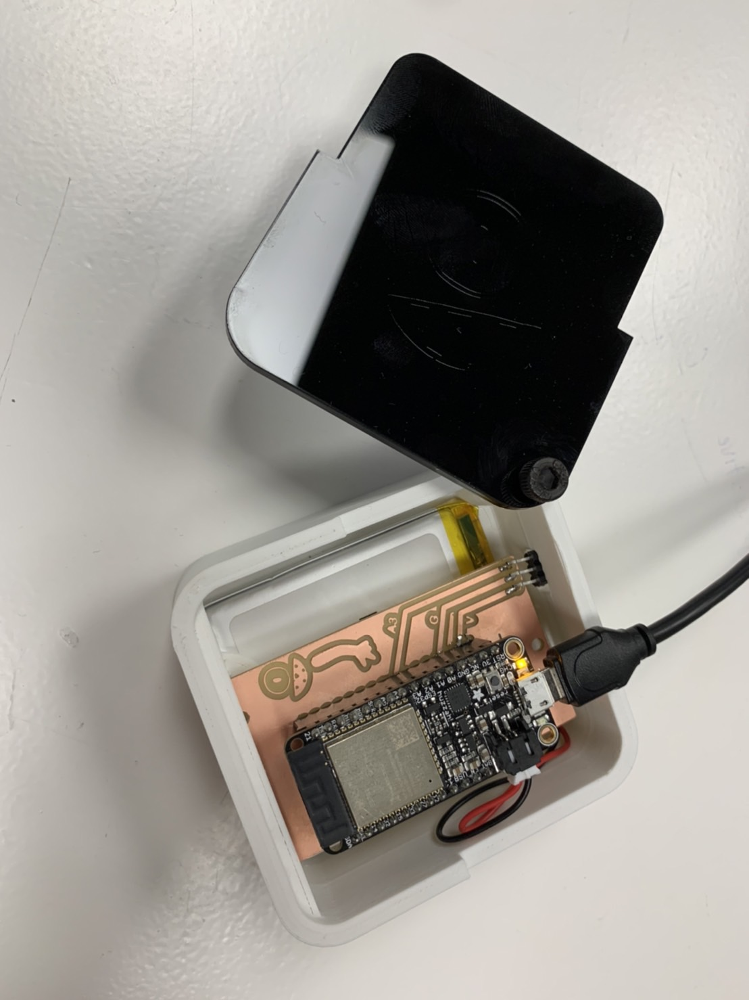

---
hide:
    - toc
---

**10th Output Devices **
===============
We actually did not mill the one we did for week6 since it doesn't have any relativity to the project we are working on. So We made a PCB for the humidity  sensor thatwe have been working on from fabchallenge3. 

Here is a drawing and we converted the data through the site and milled with the machine.
 And soldered and put into a 3D printed box with a rechargeable battery. So now it is ready to use at the compost bin without caring about electricity.

Drawing of Kicad

Process

Final Product

