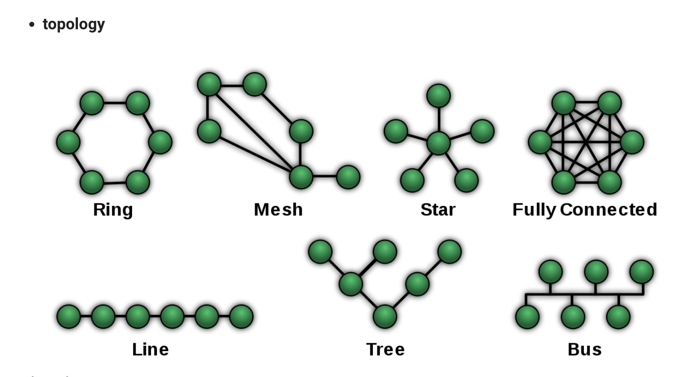
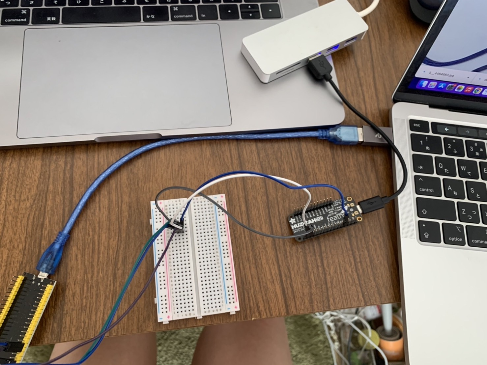
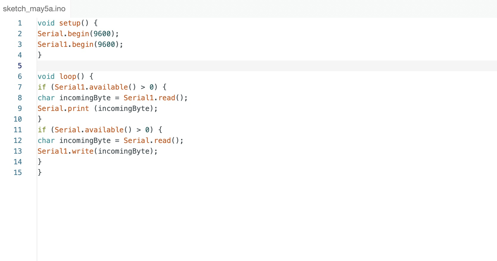

---
hide:
    - toc
---

**14th Networking and Communications **
===============
For this week I learned the different types of networking. Wired/wireless and types of topology. I think this theory/logic is applied to a network-based project such as one I am trying to develop for the compost project.
My ideal network made by a platform could look like the fully connected topology which all the participants are connected or the ring topology that participants are connected one another without a center. Both are decentralized ideas and I think it is difficult to control but ideal for making democratic network.

For the task, I did it at home with my partner. I used two ESP32 and connected them TX,RX and the GND by using a breadboard since I didn’t have any female to female wires.

As I tried to establish the connection, it kind of denied by showing an error. I actually used ESP32 Feather and ESP32 Wroom, so that I needed to download the new board manager library. I did so and the outcome was still an error exit status2. I think now, it is the problem for my USB port. I always had an error when uploading codes with my computer. I couldn’t fix this since I searched how to complete, I couldn’t solve it. The other computer was fine compiling. 

How it gets data from a sensor plants.

Here is the code below.

