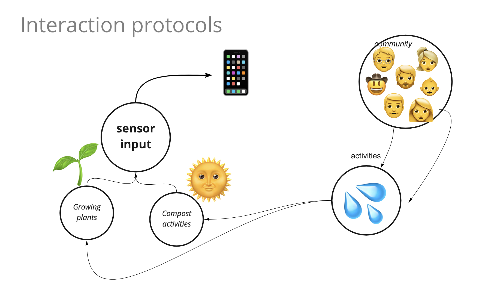
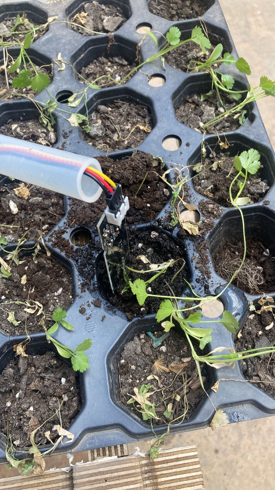
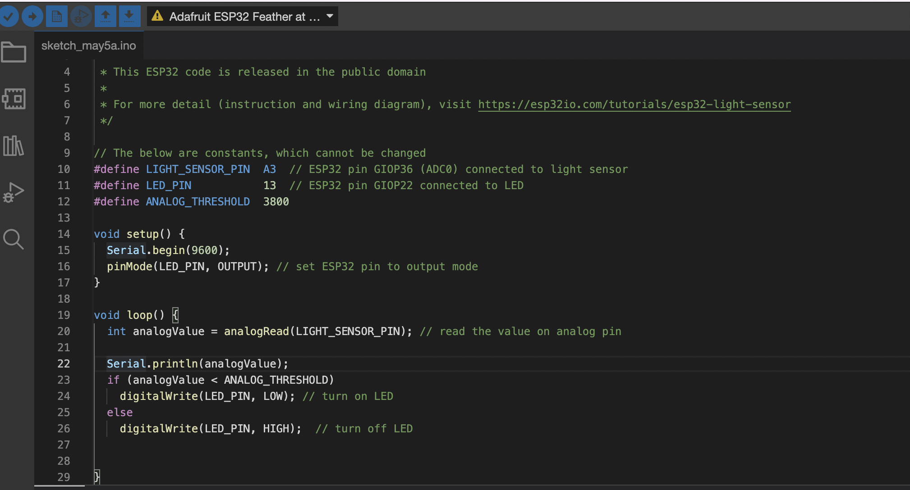

---
hide:
    - toc
---

**14th Networking and Communications **
===============
I did this as an opportunity in fabchallenge. We as a group tried to make an ESP32 feather communicating to your device through wifi.

We did this activity by detecting humidity from the sensor in soil, so you can get to know when to add water in compost.
You Can see this humidity percentage as long as you are connected to the IP address of the page.

 
Networking Plan

How it gets data from a sensor plants.

Here is the code below.

