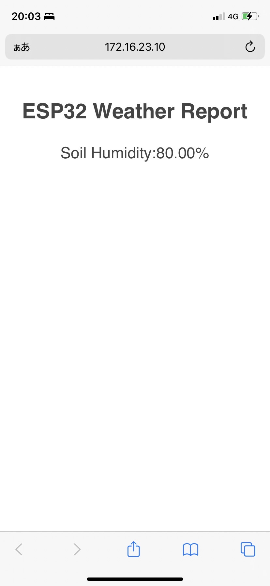
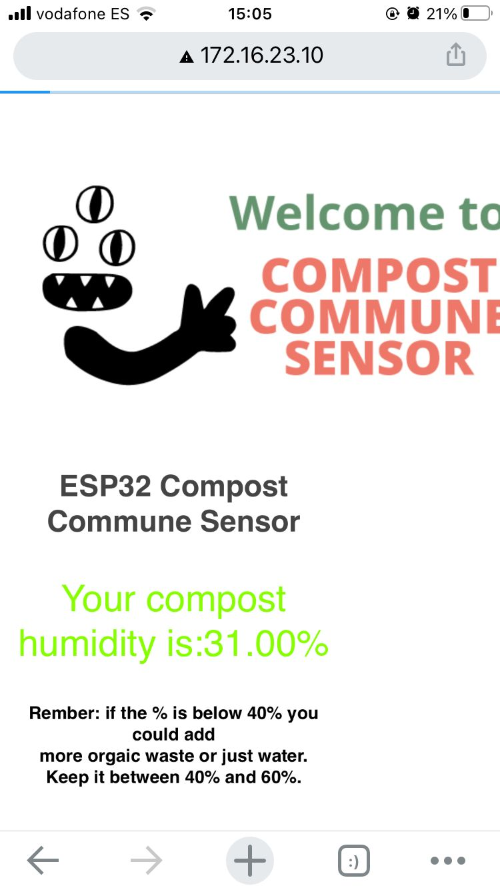

---
hide:
    - toc
---

**15th Interface & application Programming **
===============
Continuous work and part of work for the fabchallenge3, the humidity that you can check on your device from the humidity sensor through wifi is via interface. We tried to make it as simple as possible so the local people, who are mostly old, can understand the humidity percentage easily. We also arranged to tell what they need to do according to the percentage as an interface.

Coding below.

