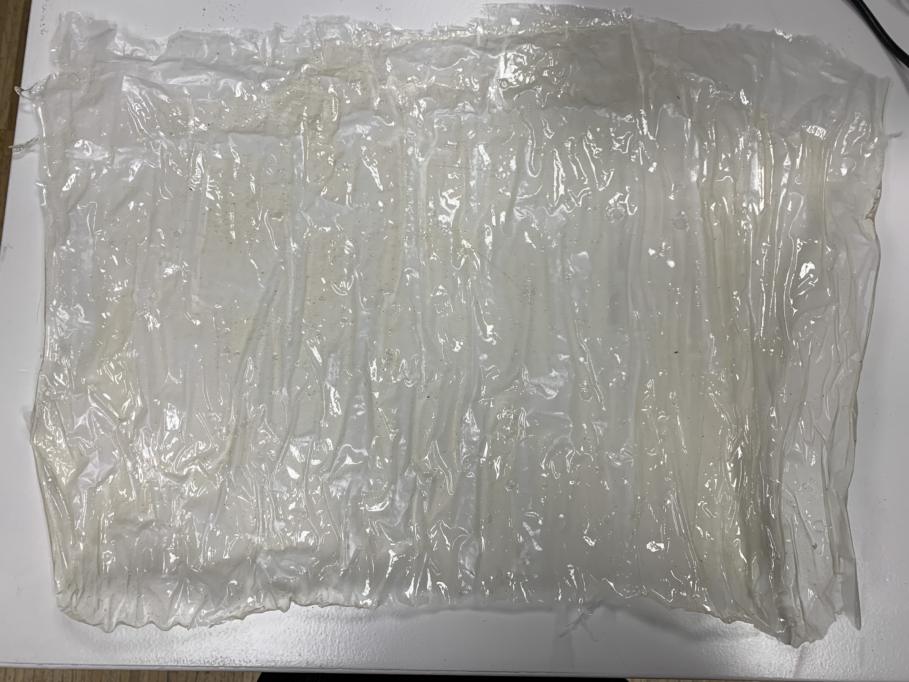
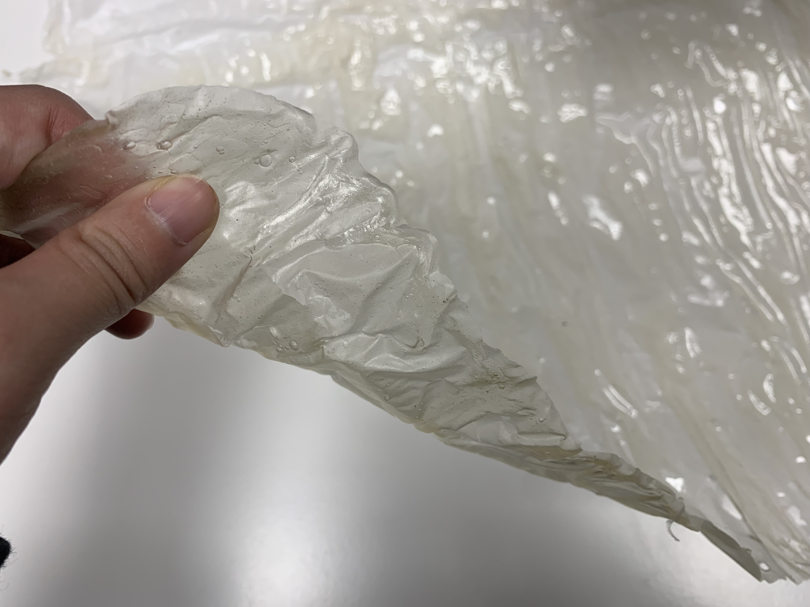
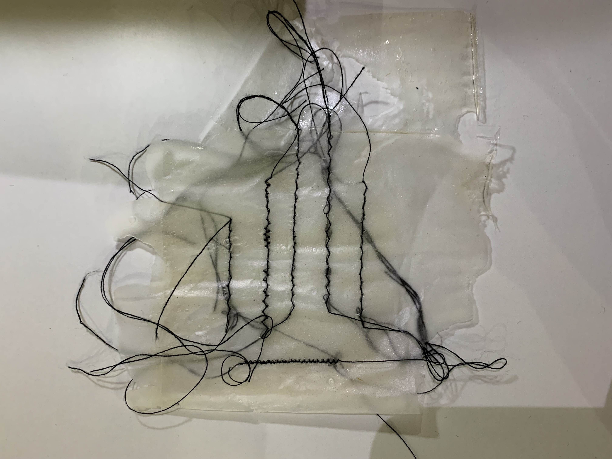
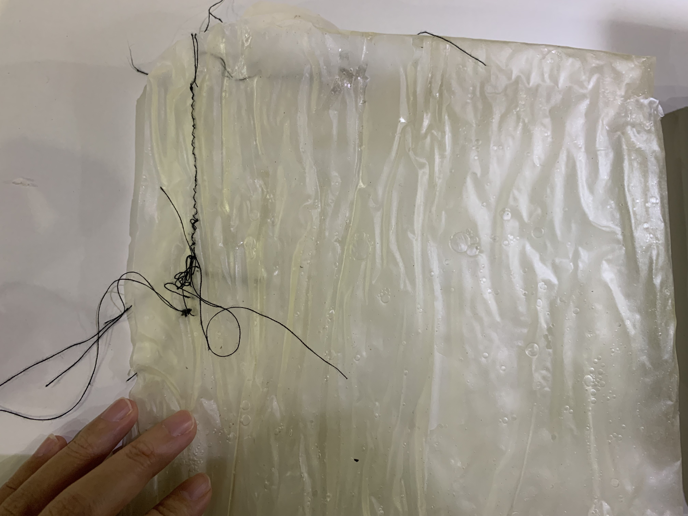
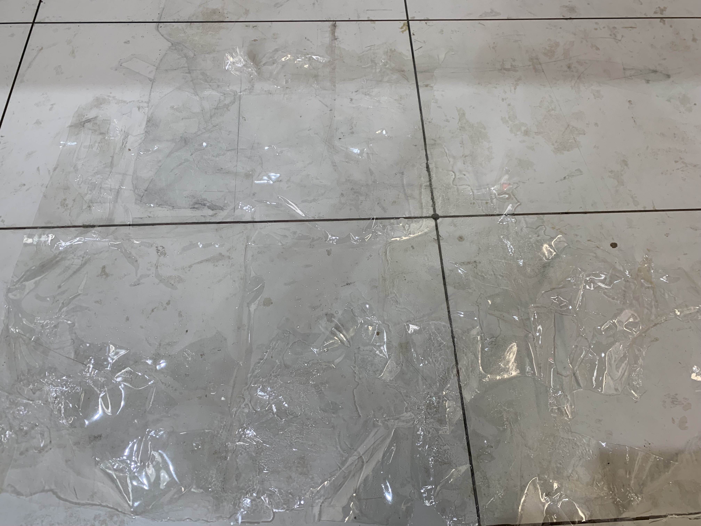
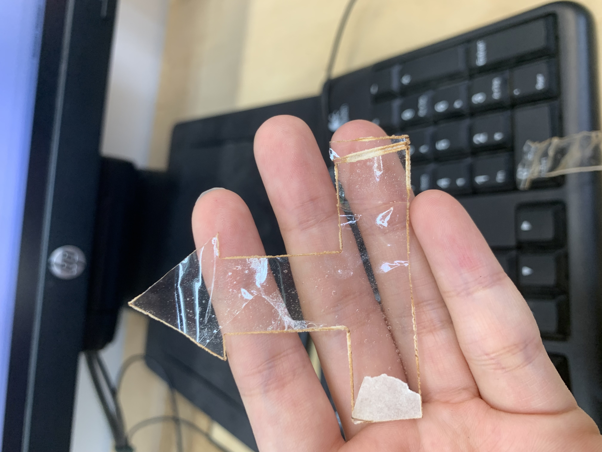
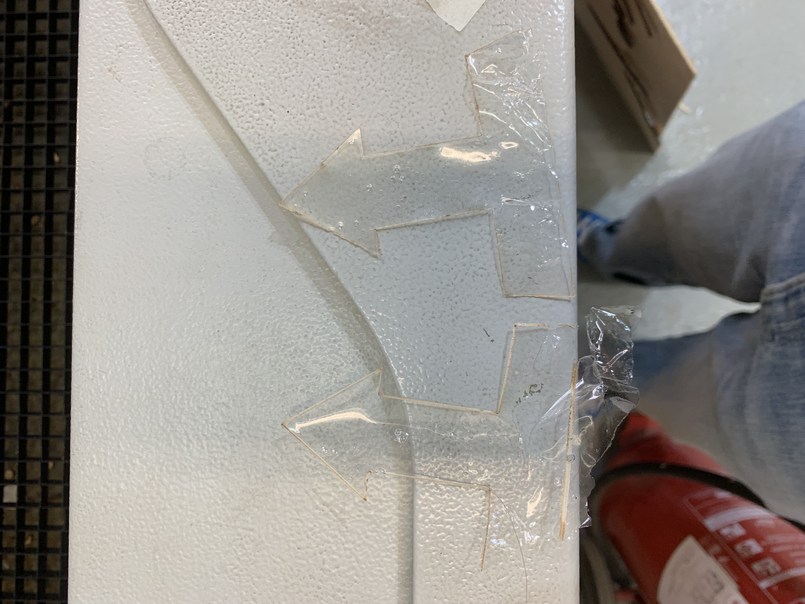
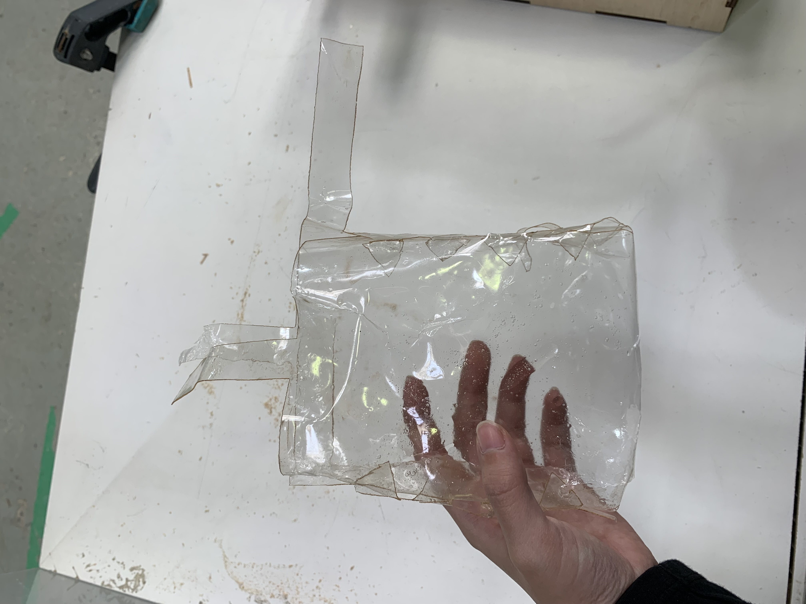
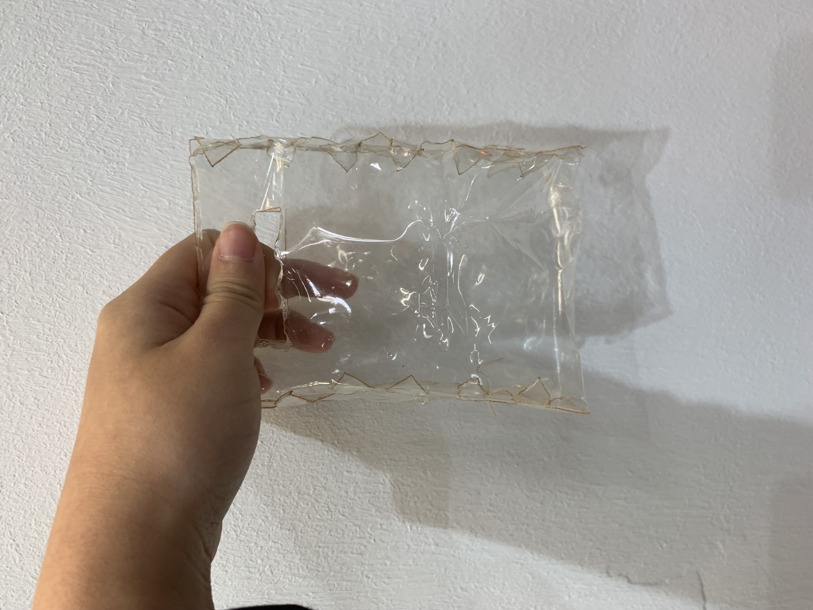
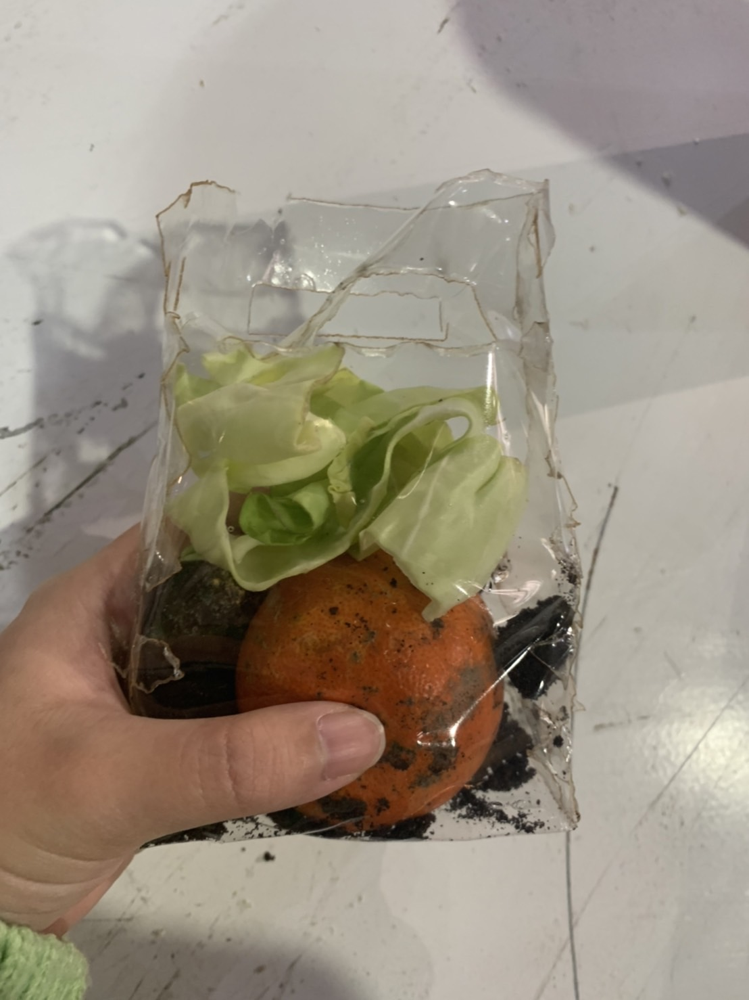

---
hide:
    - toc
---

**16th Wildcard week **
===============
This time I tried the laser cutting with biomaterial I made.
I made the biomateriial with zelatina, water, and grycelyn.I followed exactly this recipe,which was an opensource from FabTextile.( http://fabtextiles.org/biobags-collection/)
And the biomaterial turned out like this.

I wanted to saw with a sawing machine, though when I tried it, the stings got tangled. I think it is because the material is too thick so it is too hard to saw. I guess why this happened is because I put the cooking paper under the solution.

So I tried to do the whole process again. This time I decided not to put the cooking paper, so I directly poured the solution onto the acrylic board. And result was very nice.

I this time decided to laser cut the material, since it is an another challenge for me. When I asked Dafne she said it is not ideal to laser cut the biomaterial,but I researched on it and it says it can be done. 
Though I tried so many test cuts. I first set the parameter too fast, it burnt and melted the edge of the pieces. I then tried with the slow and low power. I was kind of worried if it is going to start the fire, thoigh it worked out. I think this time I set the parameter as same as the thin paper one. 

Then I cut out two different patterns of bag and assembled. It looks like this. Actually one is exactly the same one I downloaded as an opensource above, the other is the one I modified to my own design from the original.

Both kind of worked out and I used it for carrying food waste.

