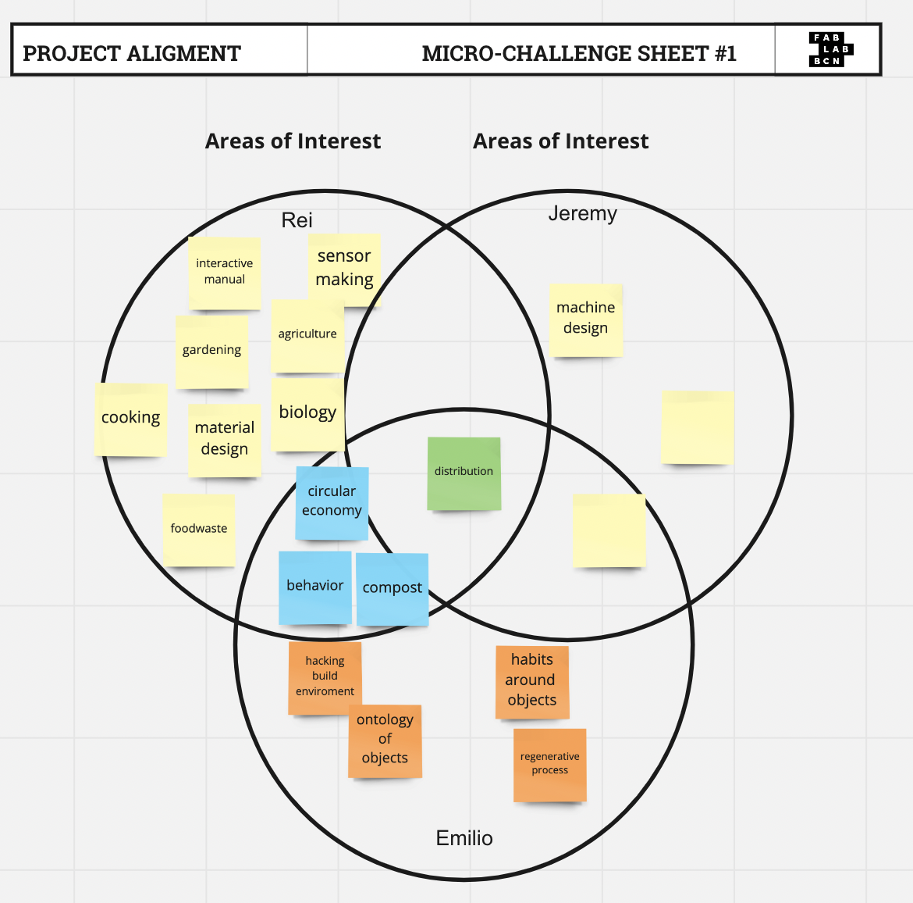

*FabAcademy 1st Challenge Feb.15-18**
===============

Repository is here below:
https://github.com/emiliosmith/FabAcademy-challenge

by [Rei Terauchi](https://terauchi-rei.github.io/mdefweb/) & [Emilio Smith](https://emiliosmith.github.io/mdef_emilio2/)

## Group
We formed a group based on the design intervention. Rei and Emilio were working on the compost intervention, so we easily came to this idea of making part of our intervention related to making a compost toolkit.
First Jeremy was also in the group, but eventually separated to do the different things after talking about what we want to make for this challenge.

## Initial Idea
When we started designing, we also had reviews from Guillem, Kate and alumni Pablo for the design intervention and that influenced us to work on this challenge as a prototype for intervention.

Since we talked with them, we wanted to develop a compost toolkit sensor that detects some information about the status of the compost such as temperature, humidity, ph, etc.. We discussed focusing on the one feature now to understand how it can be interactive even without using electric sensors, but in an analog way.  

Gillem advised us to use thermochromic paint which can change its color with the temperature to see how warm the compost gets inside the box. Also to show that and what kind of food waste is thrown away is important because it can lead to the consciousness of waste.

**We decided to make a transparent compost box for food waste consiousness and making the composting process to be seen**

## Design Process
Based on this concept, we decided to build a transparent compost box that has two layers and also has thermochromic features. It is designed for a compost beginner that wants to see what is going on inside and wants to make sure the temperature which indicates the status of compost.

# 1.Sketch

We first drew a sketch, like a really simple one with adding the features.
We wanted this compost box with these following features.

- with a Lid to avoid the smell
- showing the process
- air can come in
- people can look what is inside
- people can put food waste
- sieving compost
- detect temperature change of the compost
- scaling how much compost decreased

# 2.Modeling

We used Rhinoceros to model. We finalized the design by researching some references.

[Bio Compostera Digital](http://www.fablab.uchile.cl/proyectos/455/biocompostera-digital/)

This is how we finished up designing. As we knew Emilio would leave earlier, so we wanted to keep it simple for Rei to be able to  manage everything.

It has two layers. The top layer is for decomposing. The bottom layer is used for ready-to-use compost which is sieved from the top layer that has new food waste to decompose. It also dehydrates from the top parts to the bottom. Bottom part can also be used for the plant pot.
This compost box can also be a demonstration or exhibition of making awareness of food waste to people because it has a hole on the top so people can look at it.

Based on the modeling, we made a cutting data. We made the tolerance for + 0.3 mm.

# 3.Material

Also we wanted to make it transparent to show the inside and the thermochromic color would turn transparent with the heat, so we decided to use acrylic. We actually wanted to use plywood for the back part of the box in order to paint, but there was no plywood that has the same thickness.

-3mm Acrylic Board 600x1000mm

-thermochromic paint

-soil

-foodwaste

**※All the following is documented by Rei**

# 4. Laser Cutting

I tested the joints with acrylic to see how much tolerance should. Then I got to know that it should be less than the thickness of the material because the laser burns it. So I changed the tolerance to -0.1mm.

First the parameter was too weak, it did not cut through the board. Then changed the parameter keeping the same power but slower speed. Then it finally cut through.

I did the preassembly to make sure if it all fits.

It was fine so I then moved to the paint.

# 5. Paint

I used thermochromic paint I bought to apply on the back part of the box. I painted with a brush,(it actually recommended airbrush or spray which I don’t have)

I put almost 5 layers by firstly applying the primer on the surface.

I also did a test first.

It turns transparent when it attaches to something that is 26-31 degrees.

I dried it completely and now it is ready to assemble!

# 6. Assembly
 I assembled it using a rubber hammer to completely fit the joints.
And I put some compost on the top layer. Some soil that is ready to use goes to the bottom
.
.

Now it is ready to use!

## Learnings 

-When making cutting data, it is always important to test cut the joints first 
-When cutting with laser, it is always important to test cut with the parameter
-Materials tend to vary the thickness even in the same piece of board
-Acrylic is hard to assemble with finger joints that it sometimes cracks the edge
-Designing parametrically is necessary for the  joint design

## Next Step

Now I placed it on the corner of our class room. So anyone can throw away their food waste from the hole on the lid and mix it with the shovel. It can be interactive as it changes the color on the back part which indicates how active this compost is because active compost increases temperature.
I also want to give it to a compost begginer to test how these features can be effective for them to start doing a compose -these features make it easier? Interactive? Understandable? Fun?

Based on the reflections to the test, I will develop a new version of a compost box.

.
.
