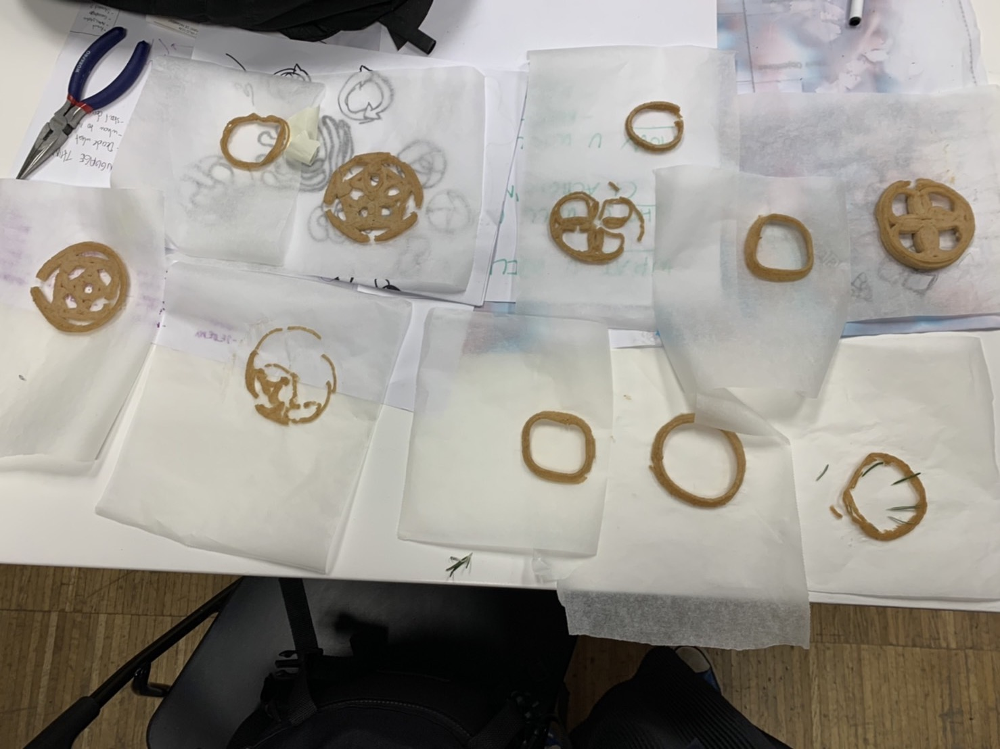

*2nd Fabacademy Challenge**
===============

##Initial Ideas and Purpose 

This time we have decided to print local food waste in Poblenou to regenerate something edible. Since we have been focusing on food waste and compost for the past design interventions, we have wanted to have another approach to it. Actually we were planning to design a hydroponic chair for this time, but when we came to think about the relation and continuation from our design intervention, we thought that we should keep focusing on the food waste topic. Probably we will work on the hydroponic chair another time. (Also we need to figure out arduino stuff to do it)

##Link to our project
For the past few weeks, we have been trying to get engaged in the Poblenou local community, especially those of community gardens and local restaurants in order to make a small circulation in the area. We have been asking if we can get their food waste to make compost in local community gardens to local restaurants, and we have been asking if we can collaborate in making compost for local community gardens.

.
.

Recently we have been in touch with this restaurant just across the street of IaaC called Galega, and the owner is so friendly. He gives us a lot of coffee waste and sometimes bread from the day before. Bread can be printed into something like a cookie we found in the article. We decided to 3D print it and exhibit it at the design dialogue as our different perspective/approach to the food waste and compost topic.

Also to exhibit, we have decided to make a stand and a base for the exhibition to put the cookies on and also for the other stuff we have designed already. Additionally we also designed a push cart for carrying waste and soil from one place to another. Because when Galega gives us a big bag of coffee waste, it is super heavy and hard to carry. 

We both worked together, but Rei mainly focused on 3D printing cooking,  Emilio mainly designed modeling for CNC.

##Fabrication Process

#<3D PRINTING COOKIE>
This time we used bread from Galega. We actually tried the test with pasta which Emilio found in his kitchen, probably from a long time ago. 

We first boiled the pasta with a bit of salt and smashed it with a blender into a dense paste. 
We tested with a cylinder if this paste is thick enough to extrude.
Once the paste looked fine and tasted fine, we put it into the cylinder for the 3D printer. 
We tried the test printing with a small circle.

.
.
.

It was okay for the first time but as the paste got more dense as it dried out, it became much harder to extrude because it stuck in the extruder.

.
.

Learning from this, we decided to make bread paste a little bit loose. 

.

First we tried a circle and it went well for several layers.

.

After that we tried to make our own design of a cookie. 

.
.
.

Somehow there was something wrong with the code, the paste mixer of the 3D printer did not mix, we fixed it on grasshopper and it extruded constantly.

.
.

This is how cookies look and we tried some of them baked in the oven. Emilio tried it and said it is not bad.

.
.
.

#<CNC EXHIBITION STAND & ETC>

We designed them from a sketch and into 3d modeling with Rhino, and cut them with CNC. It was our first time using CNC at IaaC.

.
.
.
.

We designed several different things for the exhibition. One table, two stands, and one push cart.
We made the data carefully by checking the tolerance and diameter of the pockets.

.

##Problems

For 3D printing
-The paste of the food waste easily gets thicker so it gets stuck with the extruder. We added more water to manage it.
-The mixer of a 3D printer stopped mixing the paste. We changed the code in grasshopper to manage it.
-When we tried to print the complex design, the extruder squished the printed paste because it went over the same paths. We thought we needed to model the design that each path goes on the top of another so the extruder will not go on to the other path.
-Printed paste dried but cracked easily, there needs to be something flexible for the recipe to make paste.

.

-Maybe normal shapes can be just made with a mold. 

For CNC
-It is always hard to check the right  tolerance before cutting. Also it should be faster to manage that by using grasshopper, we want to try that.
- Even If only one cutting data is wrong, we need to cut it again.
-It takes super long time for engraving and cutting.

##Future Development
We thought 3D printing food waste is capable of giving us a new perspective in dealing with food waste and compost. Usually wasted food doesn't look attractive at all so no one eats it, but when it is printed with a 3D printer, it looks attractive so people would eat it. It can be an interesting fact that people will think of food waste as something edible and also for waste consiousness. 
We want to try to make  more complex shapes and a variety of food waste paste to develop this project. To do that, we want to make something that actually makes food waste printed taste good and develop a recipe for open source. 
We will keep in touch with neighbors as we try to get the food waste from them also using our push cart.

