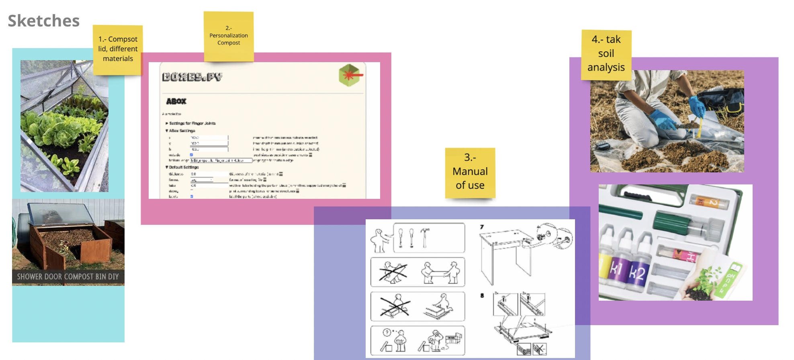
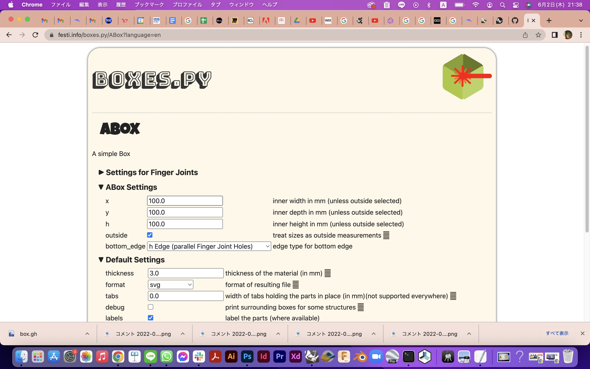
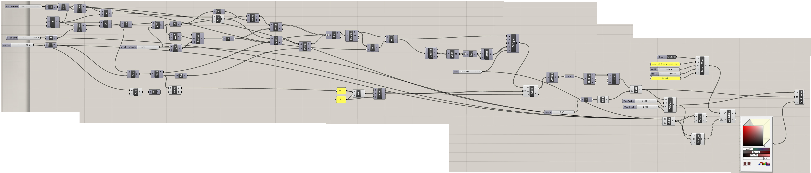
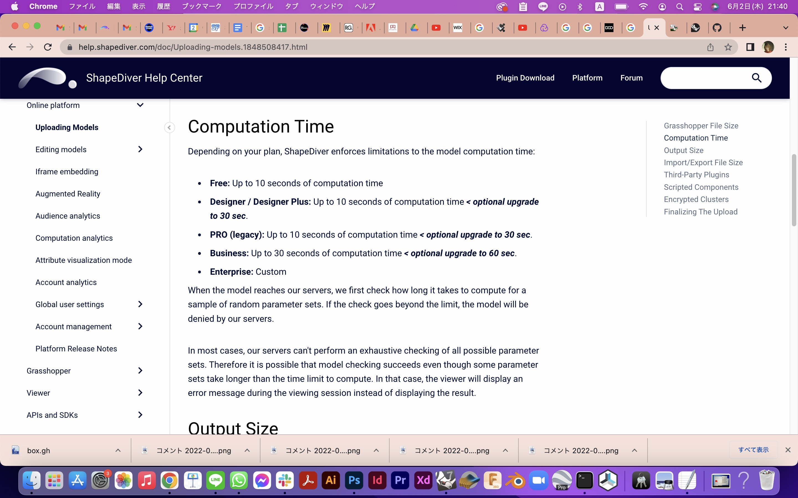
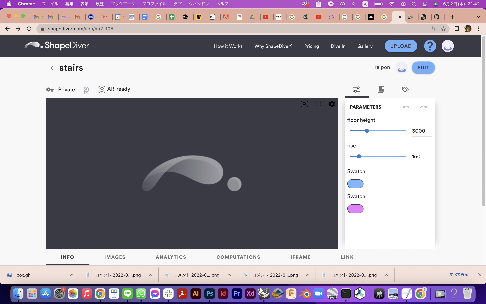
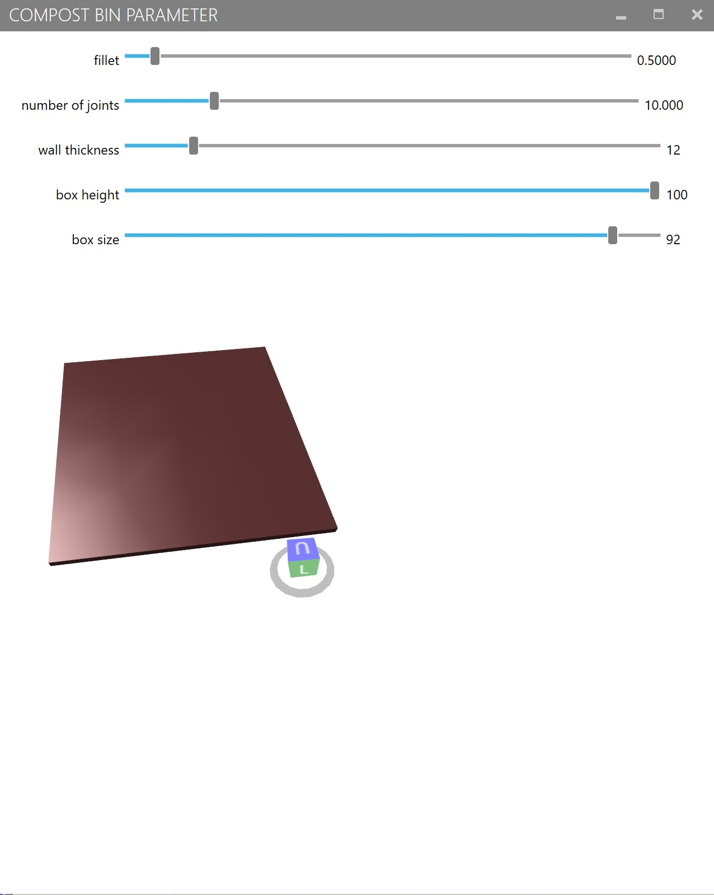
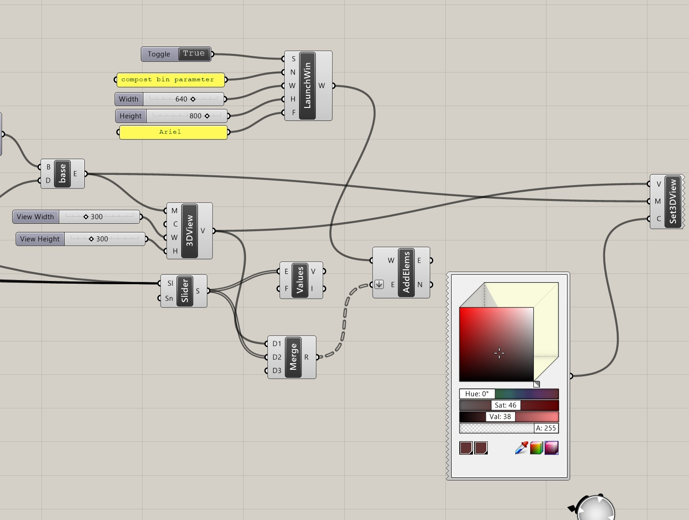

*4th Fabacademy Challenge**
===============

by [Rei Terauchi](https://terauchi-rei.github.io/mdefweb/) & [Emilio Smith](https://emiliosmith.github.io/mdef_emilio2/)

## Objective

The objective this time is to make some progress to complete our final project. Our compost final project has two approaches now and we are working separately to archive the goal. The one approach is community level, making a co-design compost bin in a local community garden in Poblenou with super local people. The other approach is platform level, making online platform to make compost networks over the world, where people can share open source knowledge and skills. In our theory, by developing these both approaches will lead us to accomplish the compost making as people's daily activity by introducing small and big perspectives.

## Process

1. Compost Bin Lid
2. Compost Bin Parameter

So we did two different things so there are two different processes. Hehe below shows how we worked on our own things to do.
Firstly we had this agenda of trying to make these things as examples.

# Compost Bin Lid

-->[this repository](https://github.com/emiliosmith/MicrochallengeIV)

# Compost Bin Parameter
For this process, I have wanted to make a open source compost bin data with parameters, so people can adjust it to their cases and download to build their own one for household composting. We designed a compost bin for the first fabchallenge, and I wanted to use it for the open source data.
Though I needed to learn grasshopper from zero to build one complete data, so I started with a simple box with finger joints. Also our compost bin design will be only capable for laser cut process, so I think finger joints will be more wide in the making process. 
I imaged that it will look exactly like this. 

I tried to follow the instruction by doing some other examples in grasshopper, and I managed to do the box with finger joints. Here you can change the box size, box height, wall thickness, number of joints, and fillet size. Though the bottom part is not finger jointed to the box, I still have this part to work on. 

This below is the whole grasshopper components I built. 

It changes by parameters just like this. 

Then I moved on to the interface building. First I tried to use ShapeDiver. I tried to upload my .gh
 File, though my free subscription is not enough to upload a file that I made because it took more than 10 seconds to open. In order to process this data, I needed to pay so much money for the subscription so I gave up on using ShapeDiver.

Next I used Human Ui, A plugging for grasshopper. This plugin is only available in windows OS, so I downloaded the parallel to operate it.  I tried to make an interface as a window with human UI plugin, but I finally did not proceed it. 

It shows a Window with parameters that you can change and there is a model. Though it doesn't change the 3d model in the window nor it shows the whole 3d model. I thinks there is something wrong with the mesh making. I will try to figure it out.

## Problems

<For Compost Bin Parameter>
-Grasshopper is a good source of making parametric design, but sometimes it takes more time to  build components than just modeling.
-Human UI plugin is useful but operation system matters is a problem when making open source.
-

## Learning

<For Compost Bin Parameter>
-Parameter is really easy to change the data, but making parameter is hard.
-these is so many grasshopper (or rhino) plugins that we can download for free, it is superior if you know about plugins, otherwise you have to take more steps to build up parameters

## Future Development

<For Compost Bin Parameter>
-will try to develop more and make parameter for different types of compost bin.
-Also want to make parameter for the layout of cutting data of compost bin. It is always hard and taking time to layout pieces in the material size.
-There will also be a need of making tolerance parameter in the cutting data.

