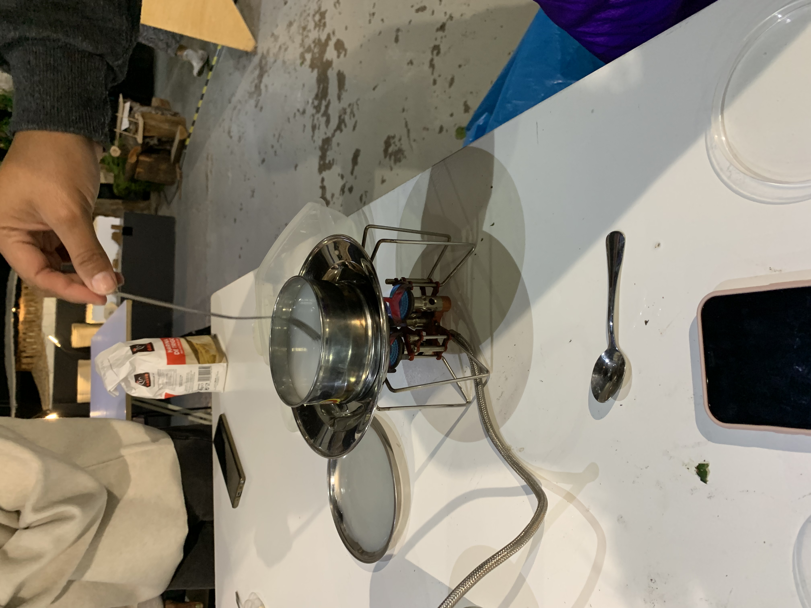
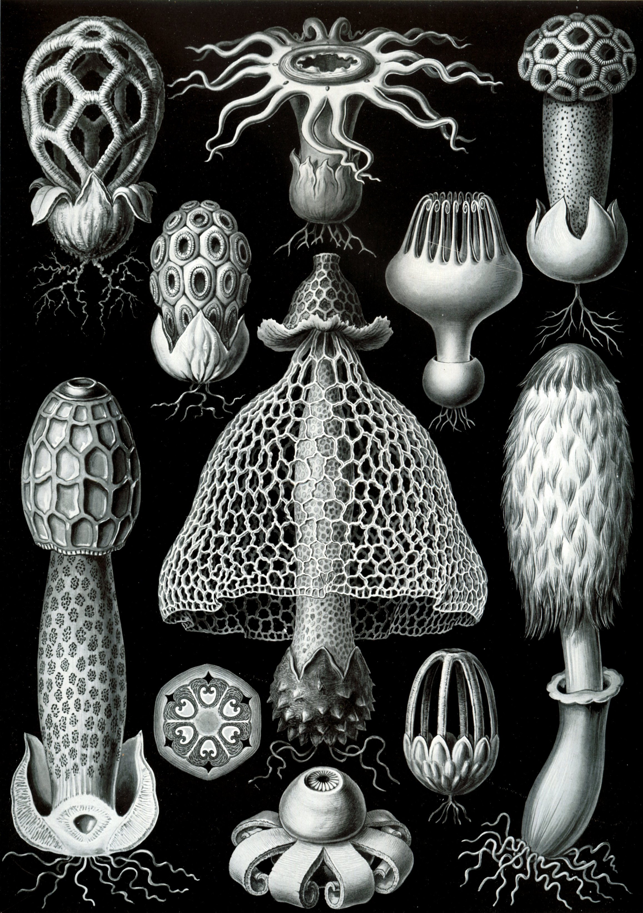

---
hide:
    - toc
---

**Bio&Agri Zero Oct.19-29**
====================

These last two weeks we have been exploring the possibilities of biology and agriculture especially in the design field. What we learned in the class was basically the basics of biology and agriculture. We had a lot of hands-on experiments and learning of basic contents.

First week we learned about what biology is and the first thing we started off with was growing baterias in a container, which is bacteria we got from around IaaC. I rubbed a tree surface and my iPhone and rubbed medium in a container. As time passes,  I have noticed , in this world there are microorganisms/bacterias everywhere. This is why we really need to wash or sanitize our hands now.

The other day we learned about spirulina and tried to grow it. Though it is hard to grow it( and it is why spirulina was only growing in specific places in the world). It will be a savior to the world of hunger if many people are really able to grow it everywhere.Though I did not find any difference than taking a capsule of proteins or minerals.
We also tried growing our own kombucha in a small pot and learned how fermentation processes. Now a pot is at my home and scoby seems to be growing little by little. 

Also we learned how to use microscopes and how it works. As we learned how to use microscopes, our perspective also got micro. I feel like I can think about things on a micro scale now so that is how I am now interested in the world of microorganisms in soil.

Second week was much about agriculture(+biology combined). What I enjoyed the most is about soil, how it is specified in types and circular systems flows.  I was not able to see soil using a microscope, though when I saw it with a digital microscope, even only one scoop of soil had many things in it. I felt it was some kind of galaxy. 

The lecture ended with bioplastic cooking. My group followed the direction and recipe which was shown by teachers though it did not get thick, it was a failure. Then I noticed even making bioplastic is chemistry and biology. Maybe the formula of each compound was not correct. With that in mind, this bio&agri zero lectures really meant a lot to me. When I make a bioplastic, it really seems to be doing design but it is not. It is chemistry/biology so I need to learn more about it.

・ I understood that biology on a different scale could be a different study.
・ Microorganisms/bacterias are everywhere so it is good to know that they can be helpful when I design something related to biology.
・ In biology, I felt everything natural is based on circulation.
・ Agriculture is a tool of survival  that human beings have invented to live but even agriculture is in survival now. What do we do?
・ Bioplastics are a hot trend now but they also require energy. 
・ Fermentation is used in daily products especially in food production. Can its process be used for hard things like furniture, architectural material, cloth or etc

#Scientific Paper Review

[Energy from Waste: Reuse of Compost Heat as a Source of Renewable Energy ](https://www.hindawi.com/journals/ijce/2010/627930/)

#summary
This paper was estimating if we could use the heart that is created by waste compost, into an energy source. It was analyzing how much energy it can create for heating up water and space using an example of a real  composting plant. Also it analyzes how much cost we need for it to be competitive with other energy systems, by designing a new way of getting energy from a compost plant. In conclusion, it was both doable and cheaper in comparison to other systems so that heat from compost is a realistic solution for nowadays energy problems.

#What I learned 
I was originally interested in compost since undergrad and had been making compost for the past two years. I was always thinking of how we can actually turn compost into something reusable because there are not many ways to reuse it.  Only we can come up with is to use compost as fertilizer. Though, not many people actually grow plants nor use compost. ( I hope I also want to work on this problem too) Then I found this article that compost makes energy. This paper was talking about the system of making compost energy, though as a designer I want to design something that everyone can get involved in this process of producing energy through composting. Since my objective is why everything around my life is in black box, I think everyone should be more responsible for at least something and they should be involved in the system. This made me think that compost energy can be a tool or platform for people who compost at home and produce energy for their use at home and I now want to design it just like the example of Precious Plastic.

#Hypothetical Designed Organism

As above, I am interested in microorganisms in the compost. It is said effective microorganisms are fermenting bacteria, actinomycetes, and, basidiomycota. You can get them from fallen leaves or organic food waste. Though it is hard to keep them active to make compost hot enough. I guess so I need to design a microorganism that can be fully effective to composting as itself only. 

I guess mushrooms is something that can most likely to be the one that has those three bacterias. Mushrooms are growing as they are biodegrading organic stuff around it by using enzymes they are producing. Mushrooms are basidiomycota. If I put them in water for several days to start fermentation, would they have both fermenting bacteria and actinomycetes?

