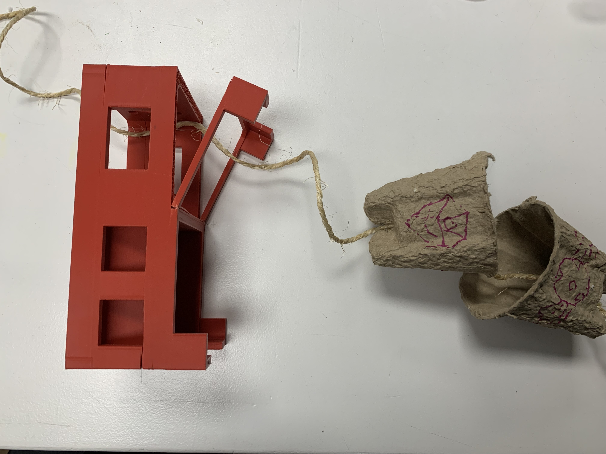
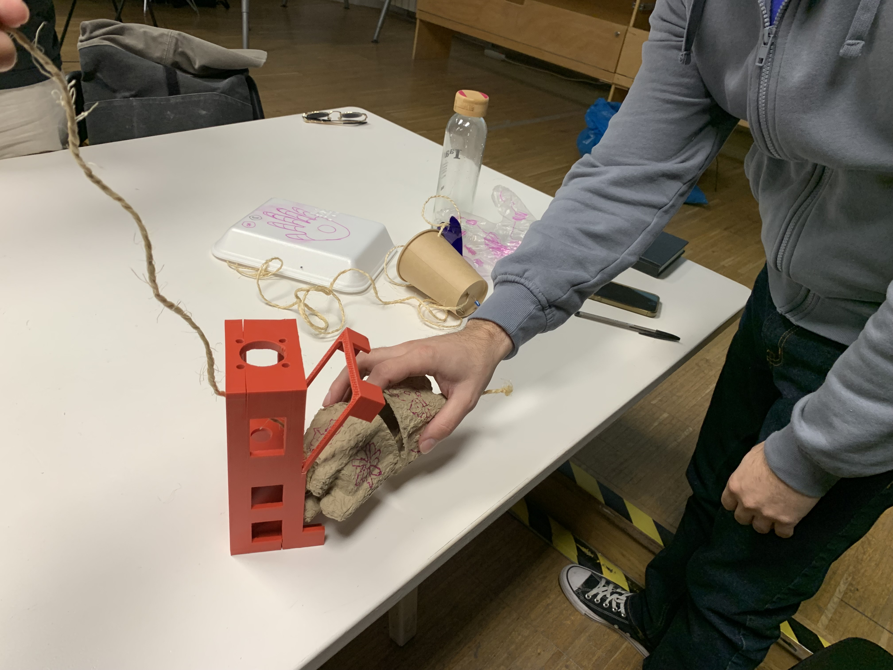
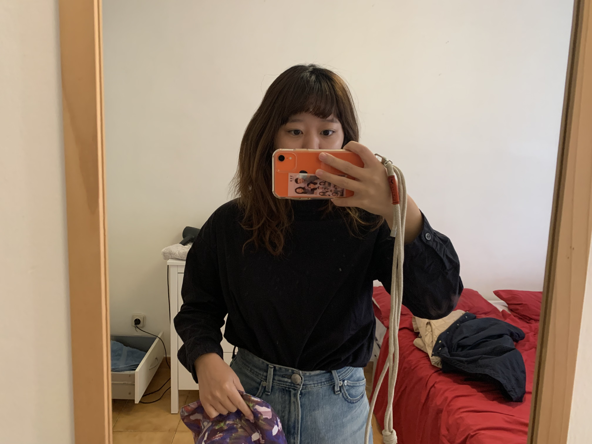
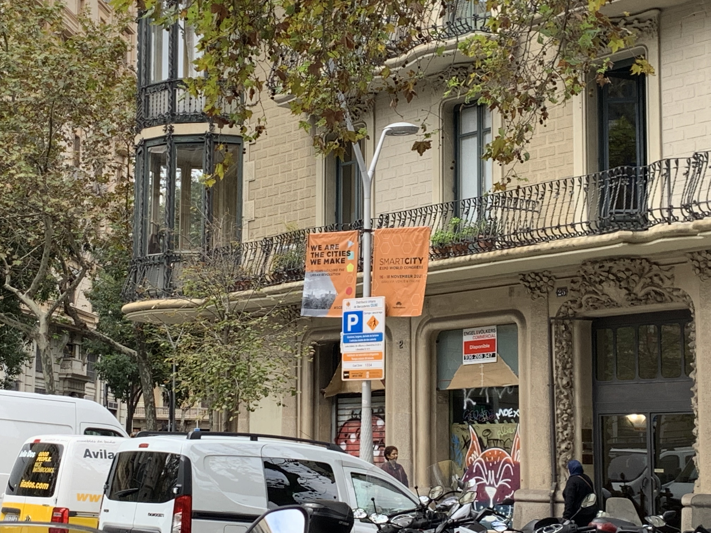

---
hide:
    - toc
---

**Living with Your Own Ideas Nov.2-5**
====================

<For magical machine>
This is the machine I made.

I made this machine called Friend Catcher.
It is fishing people by sweets that are sticked to the string which I am swinging.
If someone is fascinated by it and handed sweets,I can catch them.
Since I am shy to start talking to people, it is a good way to catch someone to talk with.

It was hard for me to come up with an idea that I can put it into a form.First I collected some garbage from outside the IaaC and Brough them to the class. It actually looks like something I cannot use since its like some junks of wall blocks, so I changed my mind to use some other garbage in the class. It actually was hard for me house something not around me to make something out of it, this way I had a hard time figuring out what to make. I kind of started out just making something random and finally got the idea in the end when I asked other people's machines. Though I had in mind that I wanted to make something that relates to collaboration.

It is my group's machines.

I was surprised almost everyone did make a machine that interacts with people. My group was first set the idea of "behavior change" as our main theme of post consumerism so I guess we all are interested in how people actually act and how to collaborate with them.

<For video making>
This is the video I made.
[coming & going](https://drive.google.com/file/d/1uFQ9JgH46ygnNdn7DXMc6vYlKiEUrclA/view?usp=sharing)

•What did you make? And why did it matter?
I made this video that analyzes where things are coming from and where things are going to. I was curious about everything provided around us is in a black box- all those services are not transparent. I wanted to know what is really happening behind the scenes of my life. I believe understanding of what keeps our life like this will lead us to take responsibility for the environment, society, economy, etc. I really think that we really need to look at the system in order to live properly. 

• What happens when you involve yourself?
I was able to realize the reality of reality. I was thinking that I would be able to understand more about things in tparency. Though involving myself to see what happens, it really did not change my perspective. I think it is also a part of the experience, so I don’t think this challenge was a failure. 

• What happens when you use yourself as an instrument?
I was able to look back on my everyday life. When I started doing this activity for the video, I kind of re-understood what I do in everyday life. It is something I always do without even noticing, but once I looked it back I realized more things. 

• Did anything change about your way of working?
Not much. Though I can say I started to think and choose more carefully about services that make our life. I kind of started to feel I want to research more deeply about those things. 

• What does it mean for your future work?
I think I will work on projects that will make people live as they are taking responsibility for their life. I mean I am not going to just make a service, but will make a project that will make people think about a service. Going through this video making, I had realized that is the thought I always had in my mind.

• After seeing the videos of your collective, how does it change your understanding of it, present new opportunities or inspire new possibilities for collaboration?
After watching the videos of my collective, I kind of realized that some of us are interested in products/services after consumption. Some of us are interested in interacting with people to see their behaviors. Some of us are interested in how to find a new lifestyle. For my understanding, we as a collective probably are not thinking that we want to change the system, but we want to look at things on a small scale in order to make a change. It changed my understanding of us. I think we can idealize something after consumption, behavior change, and etc.

