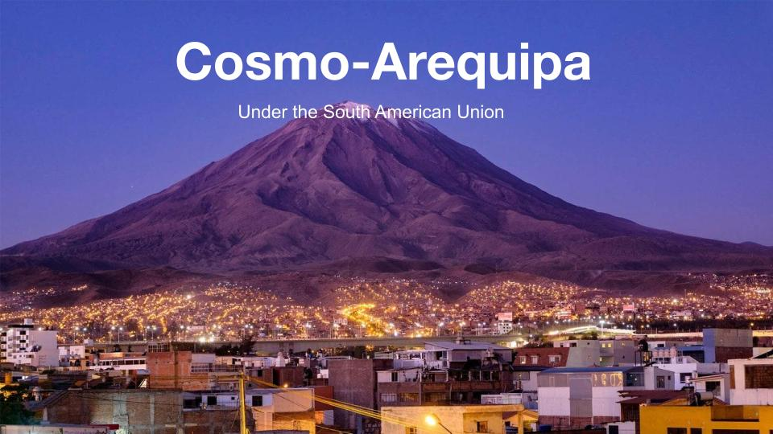
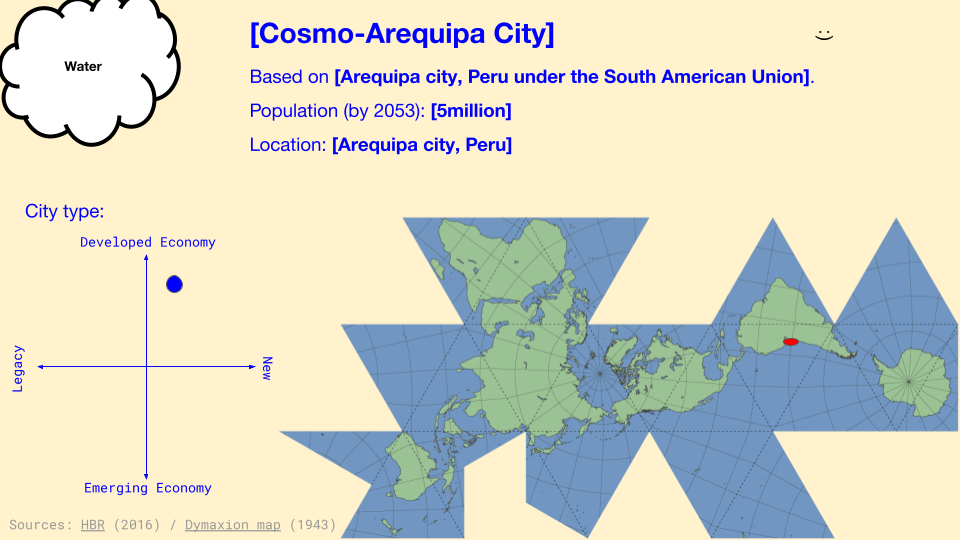

---
hide:
    - toc
---

**Designing for Next Billions Seconds Jan.11-14**
===============

Designing for the next billion seconds, it was a speculative session that we could imagine the world in 30 years. 

By looking back to our current situation, we could look into the future.  By doing activities, we could imagine what  would be for the design that we can engage for the future? 

It was not science-fiction-like, but at the same time it was. Because when we imagine the future for a better world, it's so much like the tech world. I wonder why because I imagined it to be more going back to low or indigenous tech.In the class, many people suggested a tech related person or thing as a TIME  magazine cover person. For this I did not think that it would be likely to happen. 

.jpg)
.jpg)
.jpg)

[Presentation](https://docs.google.com/presentation/d/1VdP4UH1tywT0ZIl7730hpXiX_4sDxcfL4wcwzeI4l9k/edit?usp=sharing
)

Speculating is also criticizing what today ‘s, I could think about it carefully as I was doing this activity to think how the nation would be in 30 years.
My group was just me and Fiorella. We put out that South America is going to be a union like the EU for more economic opportunities. I don't think this will happen and I don't want it to happen, though this idea says there is not much economic chance in South America right now because of the invasion from international companies and big countries. This idea was raised by Fiorella who is from South America. I think this kind of feeling and speculation from the person who is really living in the situation is the reality that we should focus on. 
