---
hide:
    - toc
---

**Remixing Materials Jan.13-27**
===============

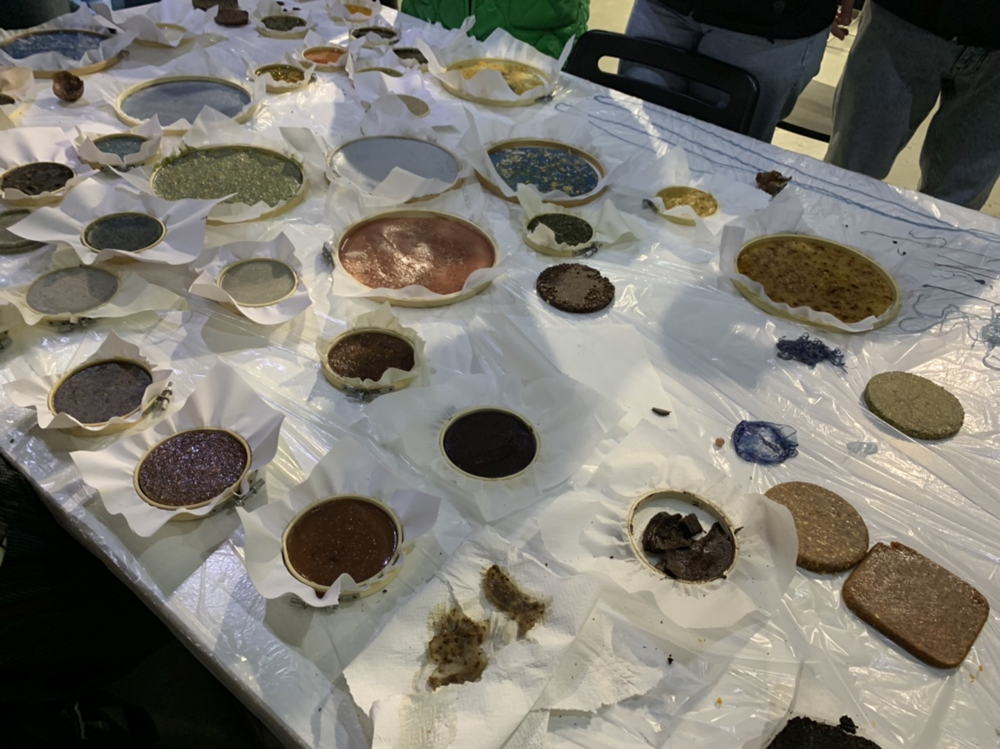
These last few weeks, I have been working on  a biomaterial practice both in class and after class.
I have made a biomaterial only once in my life and it was last term  I did in my house. It was a failure because I did not calculate each ingredient precisely. Now I know why Lara told us to calculate and write everything down that you put in.

Here is what we did in the class and after class for the biomaterial.

First of all, I brought a crab shell for the food waste additives.

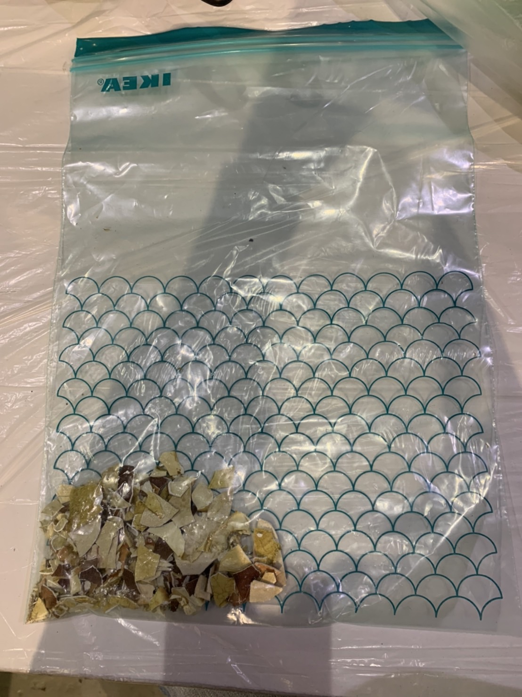
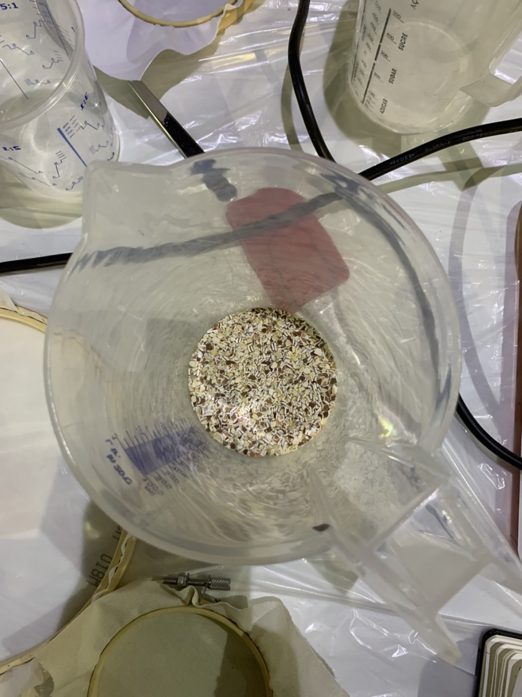

##Agar agar 
 

How:

1. We selected the additives and grinded

2.Weight and write quantities.

3.we put the fabric sandwiched by the frame

4.we pour water in agar in the pot

5. We put the pot on fire till the boiling point.

6.we put the pot down the fire and put glycerin and vinegar

7.we put the eggshells and pigment

8.we pour the the thing into the frame

9.let it dry

1)eggshells

10 grs. Agar

200 ml. Water

2 ml. Glycerin

2 ml. Vinegar

2 spoons of eggshell

1 pinch of blue powder pigment

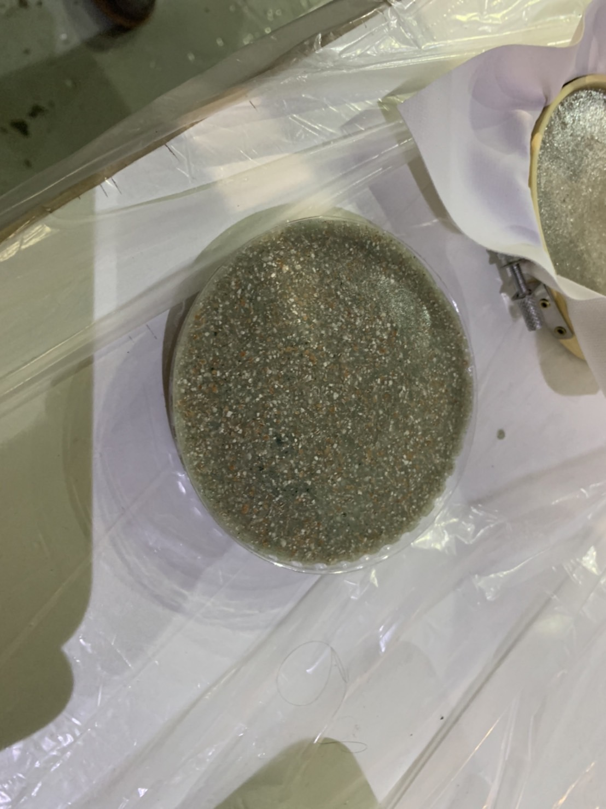

We chose eggshells for the first try because it was the one that we had for a huge amount. The result was not that beautiful. I was expecting it to be more bright blue, but it seems like gray. I was kind of sad. 

2)coffee

10 grs. Agar

200 ml. Water

2 ml. Glycerin

2 ml. Vinegar

2 spoons of coffee

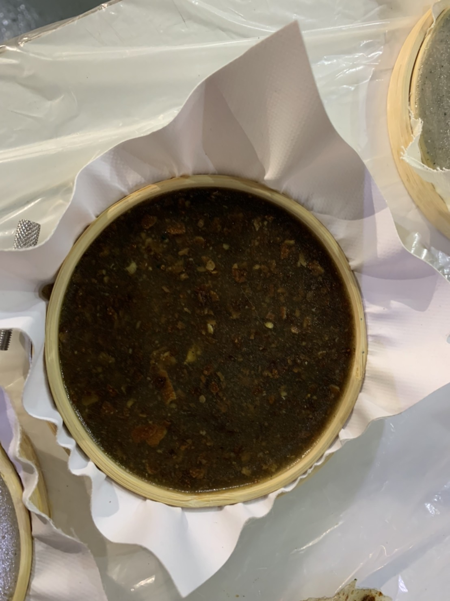

We then tried with the coffee which we got tons from a cafeteria. I don't know why, but it seems to be not that useful when it is dried. Maybe the color is not cool.

3)crab shell

10 grs. Agar

200 ml. Water

2 ml. Glycerin

2 ml. Vinegar

2 spoons of crab shell

1 pinch of red powder pigment

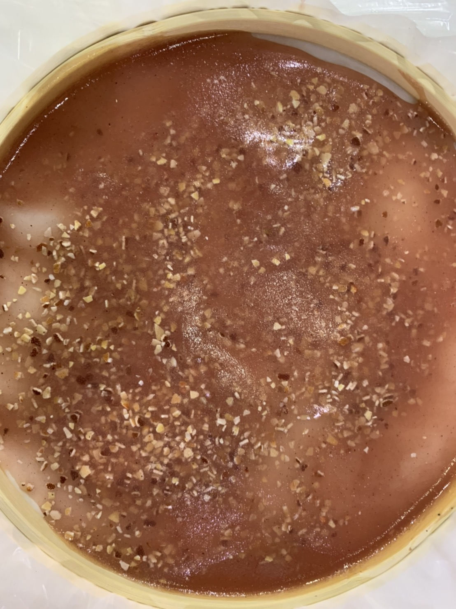

This crab shell is what I brought from my house. I didn't know what to do, but it smells like the sea and stinks. I wanted to get rid of it, but I didn't know how. Just followed the instructions and the result was fine. But when it dried, it shrank and cracked. Maybe I needed to add more additives.

My group has made a mistake to put it on a big mold that did not make liquids enough to reach to the edge otherwise it shrank and cracked after when it is dried.

##Alginate

How:
1.We chose additives and grinded

2.weight and write quantities

3. We prepared the frame with the thick fabric

4.we sprayed the calcium chloride on the frame and fabric

5. We mixed the ingredients except the additives

6.we take some solution with the cylinder

7.we added additives and poured into the frame

8.we sprayed the calcium chloride on the solution 

9. We let it dry

1)eggshells

12.5 grs. Alginate

500 ml. Water

30 ml. Glycerin

3 spoons of eggshell

2 pinch of blue powder pigment

1 pinch of unicorn glitter

Calcium chloride solution
30 grs. With 500 ml. of H2O

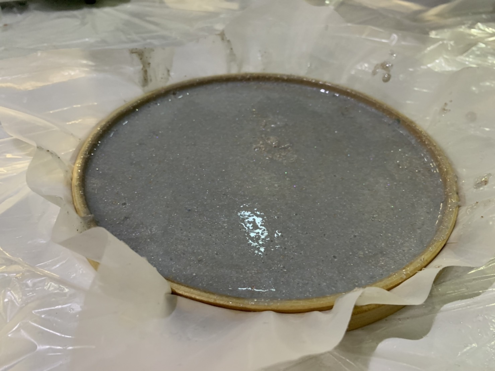

It was also that we tried the eggshell with blue pigment. It also turned out gray. Maybe eggshell with blue is not a good combination for the color.I liked how we spray and it turns solid.

2)orange peel 

12.5 grs. Alginate
500 ml. Water
30 ml. Glycerin
3 spoons of orange peel
2 pinch of green powder pigment
1 pinch of unicorn glitter

Calcium chloride solution
30 grs. With 500 ml. of H2O

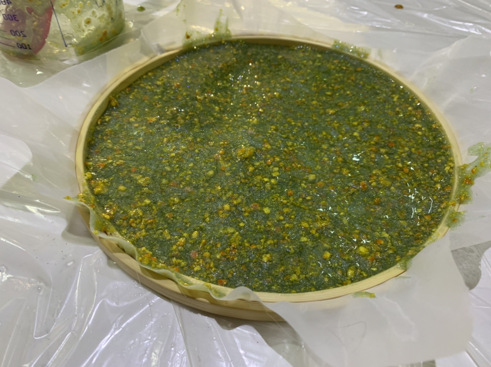

It was nicer that orange peel adds the color of orange to the biomaterial itself. I like this one the most.

Also the bio yarn was fun to make because we gently pushed the cylinder to pour the solution into the calcium chloride. It was a bit difficult for me to keep pushing with the same amount in order to make the yarn the same thickness. I feel like I want to knit something with this.

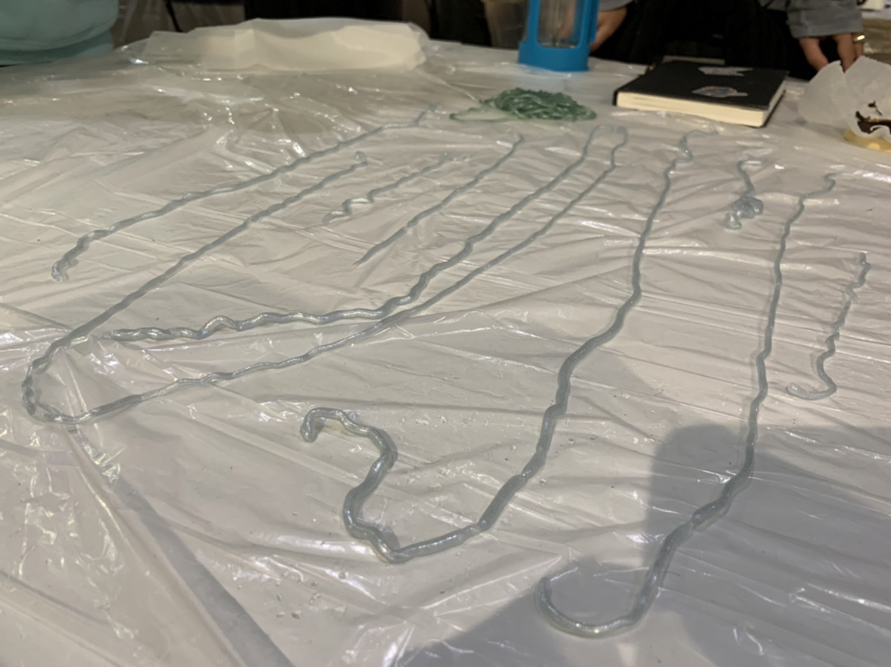

##Pine resin

How:

1.we chose additives and grinded

2.weight and write quantities

3.we pressed the baking paper on to the mold

4.we put the resin and alcohol in the pot

5.we heated it up until all the resin melt
6.we put the wax to melt

7.we put the pot down from the heat

8.we added additives

9.we pour the solution to the mold

10.we pressed the mold so hard with the baking paper and the lid

1)coffee

45 grs. Pine resin

15 ml. Alcohol

5 grs. Carnauba wax

60 grs. Coffee

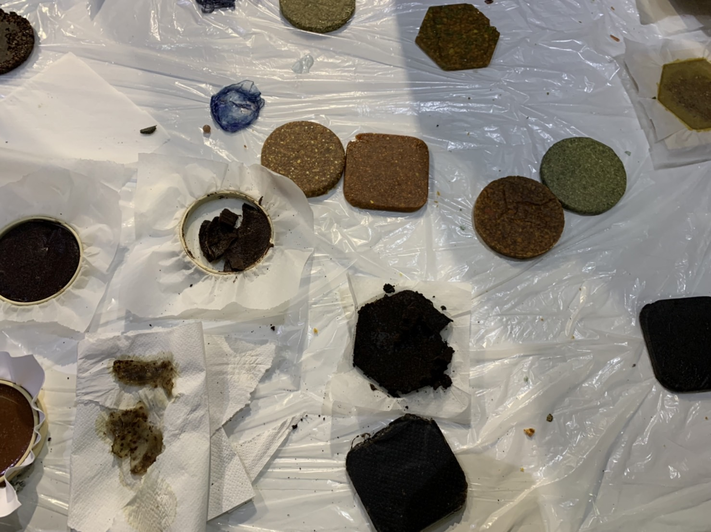

My group has failed because we put too much coffee which is causing the material to be weak and cracked. 

2)eggshell,crabshell,orange peel

45 grs. Pine resin

15 ml. Alcohol

5 grs. Carnauba wax

40 grs. eggshell,crabshell,orange peel

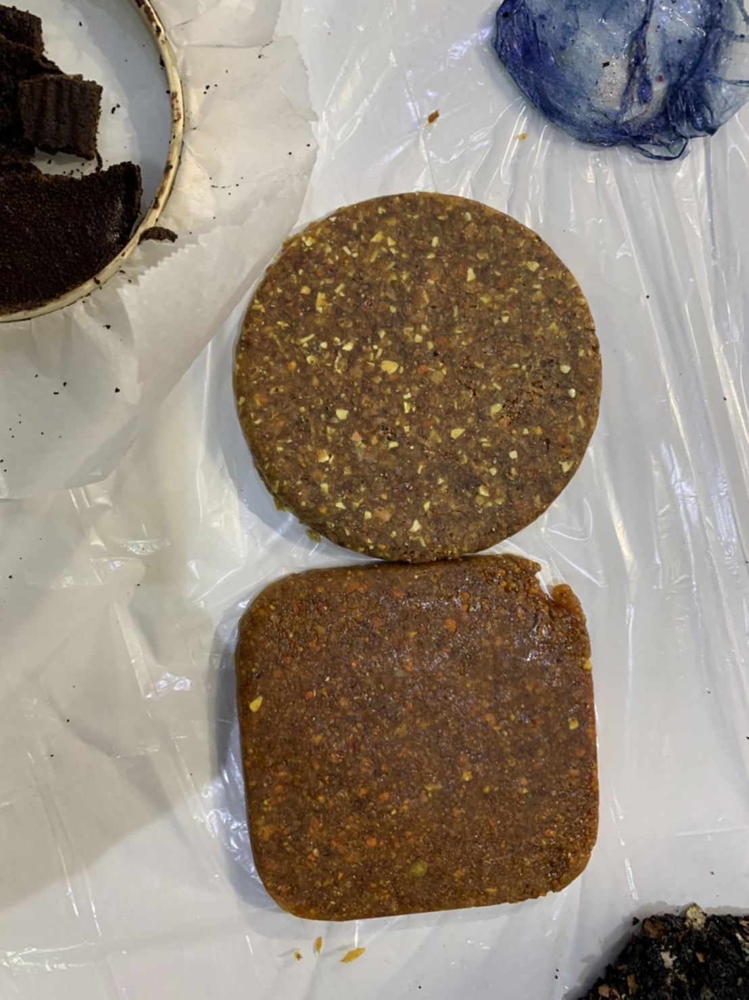

This was the last, so we only had a few amount of the additives left except the coffee, so we mixed all the things we had and made one. It turned out orangeish but not that beautiful. I think this pine resin recipe is most useful for making something solid-like a tool.

For this pine resin recipe, I kind of learned that the amount of  food waste additives differ by the mass of the additives. So after class, when I tried to do it with other molds, I kind of tried to balance to make it not too thick.

As we thought this recipe is useful and can make some procult out of it, we decided to develop it by using local wasted additives.

##Resin Development

How:
0.we made a frame with wood.

1.we went to get the additives in the local area and grinded

2.weight and write quantities

3.we pressed the baking paper on to the mold

4.we put the resin and alcohol in the pot

5.we heated it up until all the resin melt

6.we put the wax to melt

7.we put the pot down from the heat

8.we added additives

9.we pour the solution to the mold

10.we pressed the mold so hard with the baking paper and the lid

45 grs. Pine resin

15 ml. Alcohol

5 grs. Carnauba wax

20 grs. Leaves

115 grs. Pine resin

38 ml. Alcohol

12.5 grs. Carnauba wax

 75 grs. Flowers

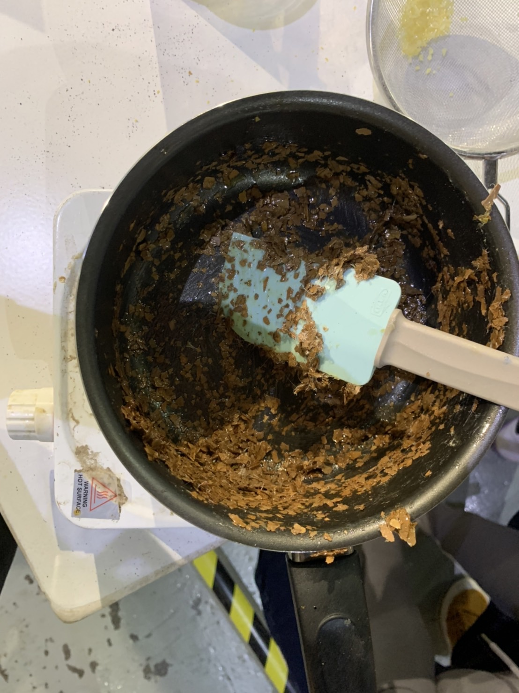
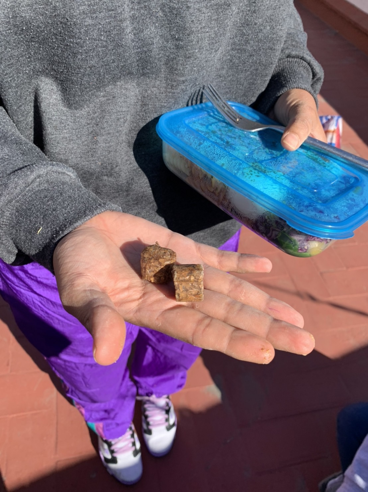

This is for the mold we made that can have 1mm thick biomaterial.

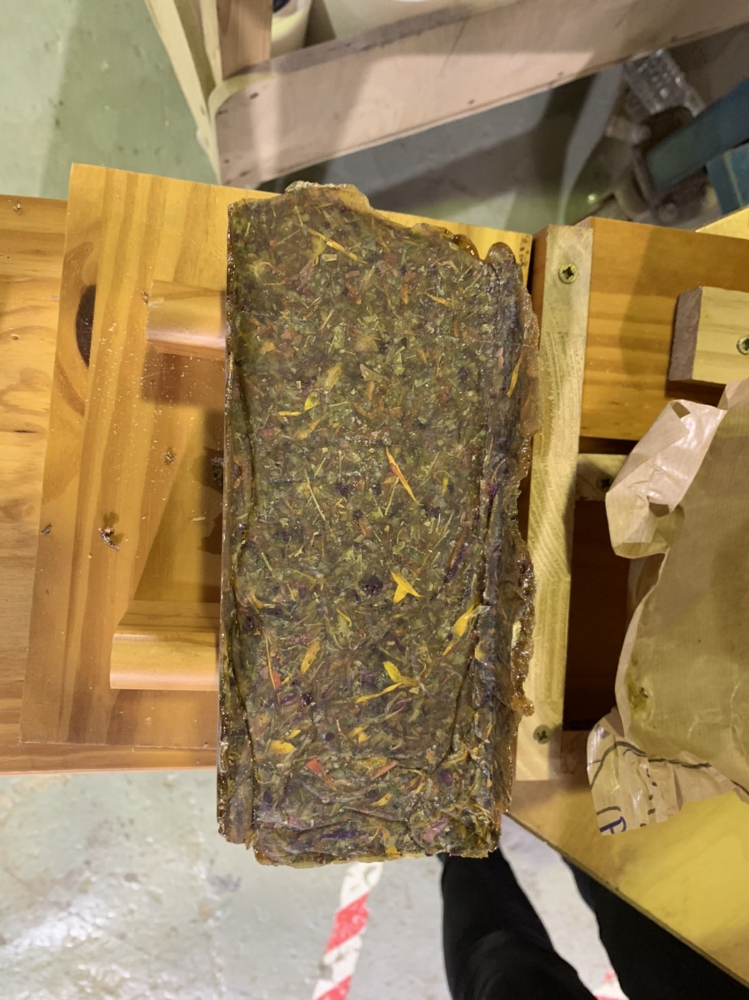

I still want to figure out how these biomaterials can be solid enough to be a product-like we are trying to make a comb with the recipe above, though it is still too weak to cut out, I think.

I want to try making a shovel next time with some food waste biomaterial, I will try to use some other recipe that can stay longer.
I mean, I think the idea of biomaterial is for something that does not have to last long. Though I want to make sure if I can make something that lasts longer like a shovel as a product. 

Also Now I want to try making a fashion item with biomaterial since I realized it is kind of hard to make a solid product with biomaterial.
As I saw Suzanne Lee’s bio couture, I want to try making a bioleather. For the cloth I will need a huge container to grow material, but I think for the small accessory like a wallet I can probably try. 

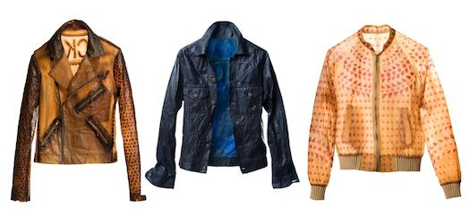

For doing that, I want to use this recipe as my reference.
http://fabtextiles.org/coffee-leather-bag/

 

