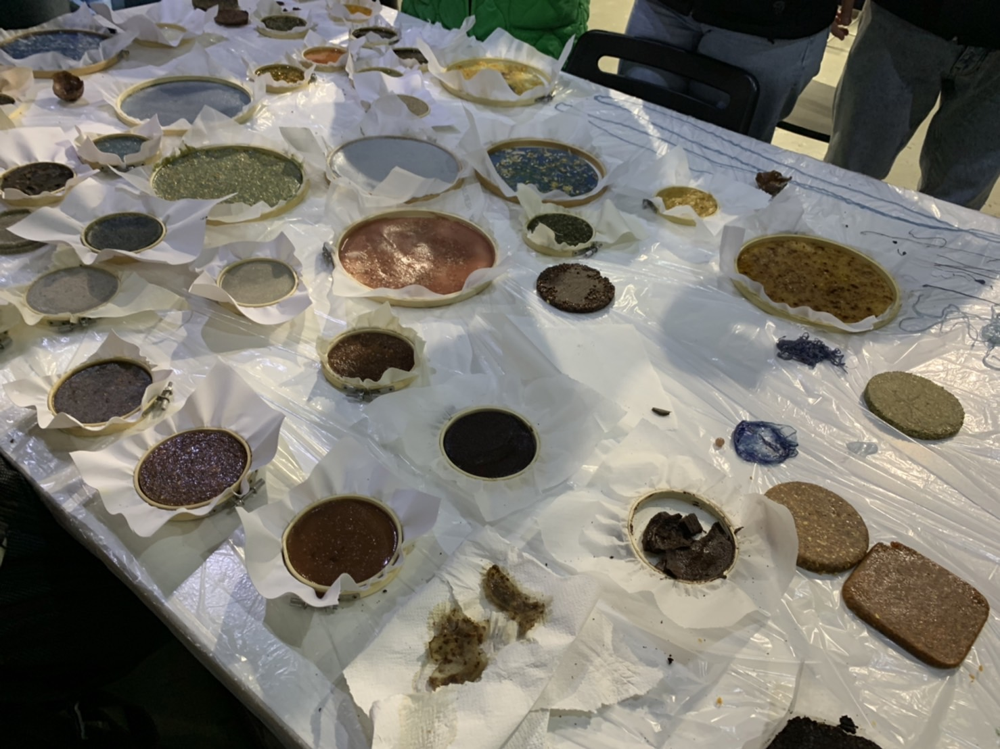
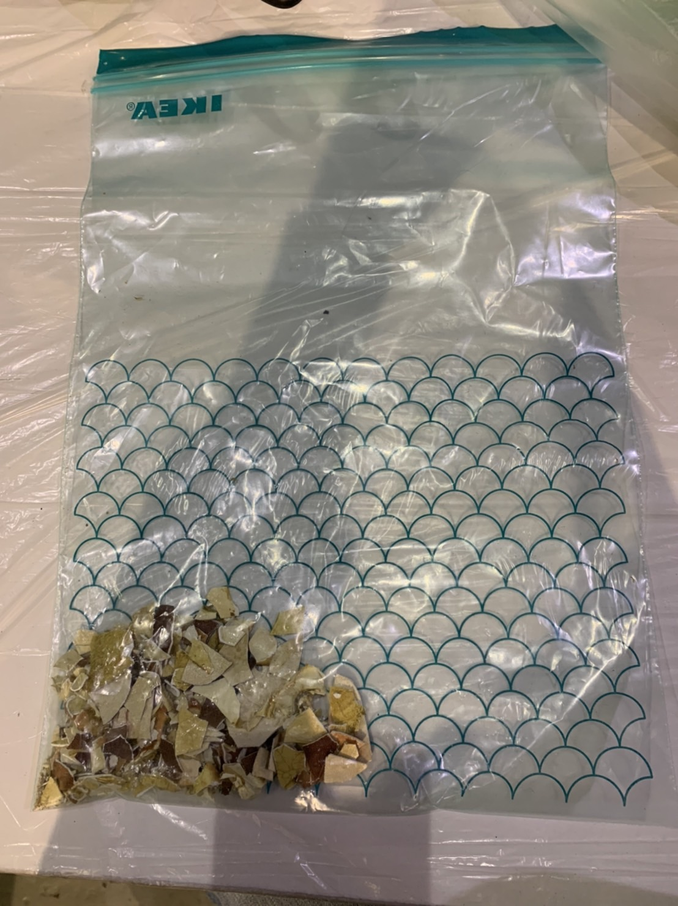
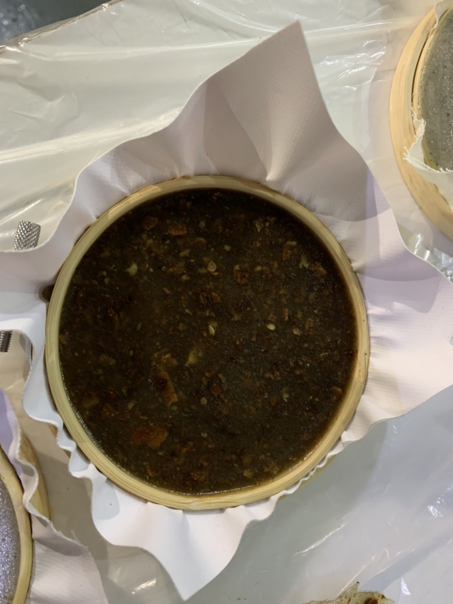
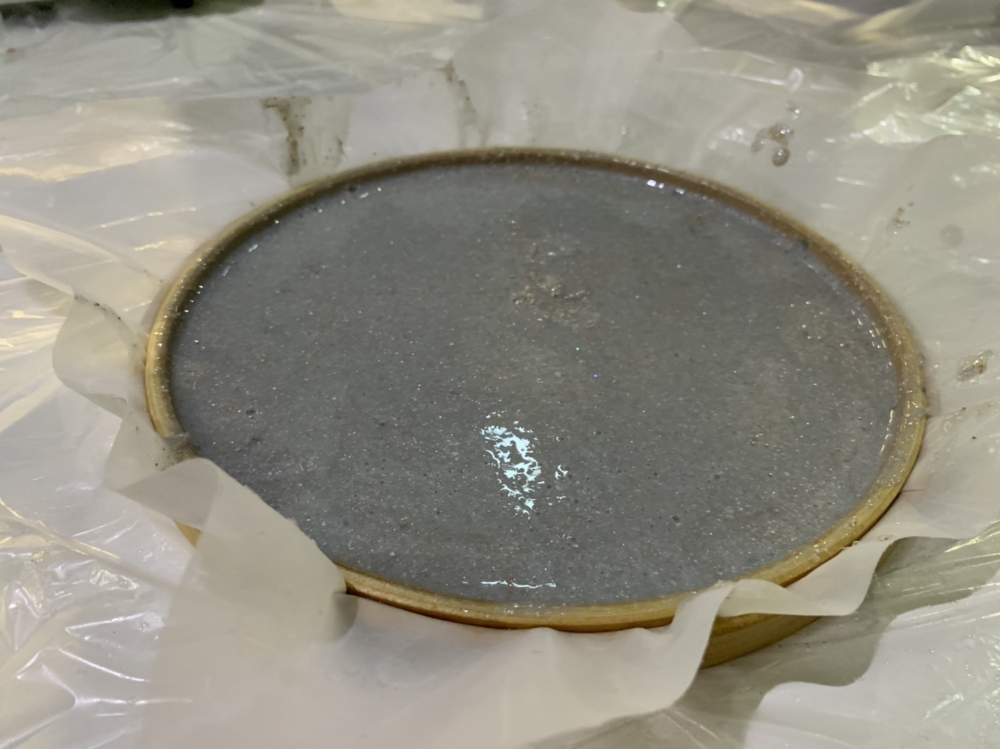
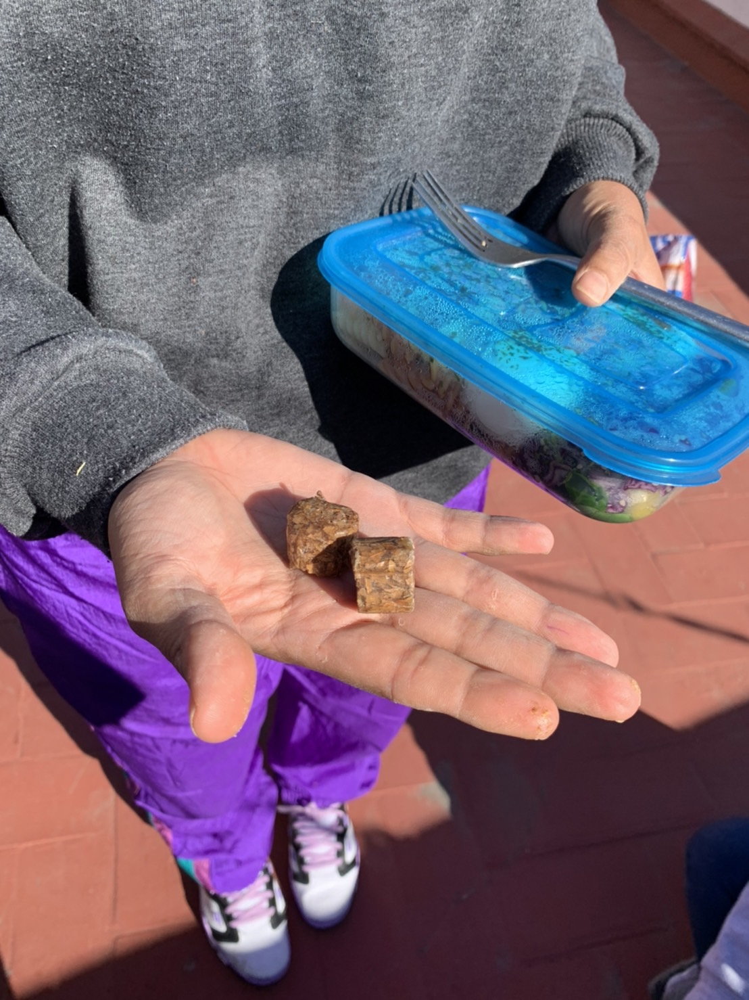

---
hide:
    - toc
---

**Remixing Materials Jan.13-27**
===============

These last few weeks, I have been working on  a biomaterial practice both in class and after class.
I have made a biomaterial only once in my life and it was last term  I did in my house. It was a failure because I did not calculate each ingredient precisely. Now I know why Lara told us to calculate and write everything down that you put in.

Here is what we did in the class and after class for the biomaterial.

First of all, I brought a crab shell for the food waste additives.

1.Agar agar 

10 grs. Agar
200 ml. Water
2 ml. Glycerin
2 ml. Vinegar
2 spoons of eggshell
1 pinch of blue powder pigment

10 grs. Agar
200 ml. Water
2 ml. Glycerin
2 ml. Vinegar
2 spoons of coffee

10 grs. Agar
200 ml. Water
2 ml. Glycerin
2 ml. Vinegar
2 spoons of crab shell
1 pinch of red powder pigment

My group has made a mistake to put it on a big mold that did not make liquids enough to reach to the edge otherwise it shrank and cracked after when it is dried.

2.alginate

12.5 grs. Alginate
500 ml. Water
30 ml. Glycerin
3 spoons of eggshell
2 pinch of blue powder pigment
1 pinch of unicorn glitter

Calcium chloride solution
30 grs. With 500 ml. of H2O

12.5 grs. Alginate
500 ml. Water
30 ml. Glycerin
3 spoons of orange peel
2 pinch of green powder pigment
1 pinch of unicorn glitter

Calcium chloride solution
30 grs. With 500 ml. of H2O

Also yarns.

3.Pine resin

45 grs. Pine resin
15 ml. Alcohol
5 grs. Carnauba wax
60 grs. Coffee

My group has failed because we put too much coffee which is causing the material to be weak and cracked.

45 grs. Pine resin
15 ml. Alcohol
5 grs. Carnauba wax
40 grs. eggshell,crabshell,orange peel

For this pine resin recipe, I kind of learned that the amount of  food waste additives differ by the mass of the additives. So after class, when I tried to do it with other molds, I kind of tried to balance to make it not too thick.

45 grs. Pine resin
15 ml. Alcohol
5 grs. Carnauba wax
20 grs. Leaves

115 grs. Pine resin
38 ml. Alcohol
12.5 grs. Carnauba wax
 75 grs. Flowers

This is for the mold we made that can have 1mm thick biomaterial.

I still want to figure out how these biomaterials can be solid enough to be a product-like we are trying to make a comb with the recipe above, though it is still too weak to cut out, I think.

I want to try making a shovel next time with some food waste biomaterial, I will try to use some other recipe that can stay longer.
I mean, I think the idea of biomaterial is for something that does not have to last long. Though I want to make sure if I can make something that lasts longer like a shovel as a product. 

 

