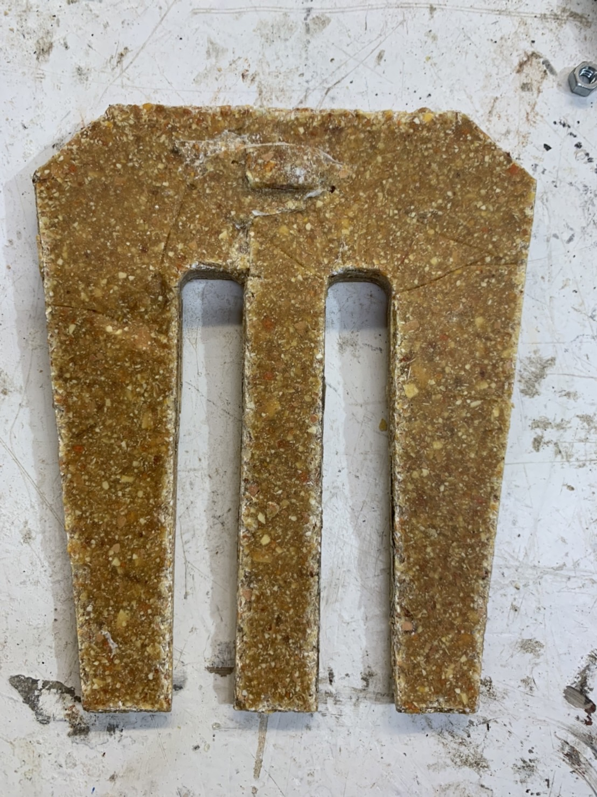

---
hide:
    - toc
---

**Remixing materials Second Half Feb.3-10**
===============

The second half of the remexing materials, we learned how to make biomaterials by engaging in the local community. We first went to fill the worksheet which Laura shared with us in  order to find a place that we can get in touch with to get some food waste.
We did this as a group with Andrea,Fiorella, and Emillio.

[work sheet](https://docs.google.com/document/d/1tvaRWxEboLcG47VOC2J04JcSnIWW-2Qityx_a1aBmUg/edit?usp=sharing)

By doing this, we have decided to collect flowers that are usually given to the grave at cemetary. 
Those flowers are thrown away after turning bad and taken by adjustment cars to the disposal plant.
Andrea came up with this idea of making a comb with these flowers, because in Spain women wear the traditional comb at the funeral or mourning. 

)

Also we wanted to research some practical way for biomaterial rathar than researching material itself.

We first tried to make a biomaterial with these flowers in, with a pine resin recipe. We wanted to cut it for a comb shape but literally we cannot use the cnc machine and it can break.

)

Then we changed our mind to make a mold with a laser and pour biomaterial in. It was too hard to take it out because we didn't put the wax paper on the mold. Although it was impossible to put it because the mold is too detailed.

Result was kind of hard but there might be some way to pursue this.
 I want to think more about how we can actually use the biomaterial for the products. Because now, it is being used in the fashion industry but not in architecture, industrial, etc . Also how these biomaterials can make circulation is the point I also want to research. If it is being disposed of just like all other things are, it is not doing good. Maybe there needs to be a way to dispose it on its own- for example using a compost or something.

At the time I also tried to make a fork that can be used for mixing soil. WIth the same process as the comb, I made a mold with a laser and poured biomaterial in. 

It was also super hard to take it out of the mold, but it turned out to be fine. Actually I wanted to put a stick in which is a hold for the fork, but it was not possible this time.

I used it for mixing the compost and it is doing the job! Maybe I want to try making it harder because now it is kind of bending. I also want to try to decompose it after using it. 

