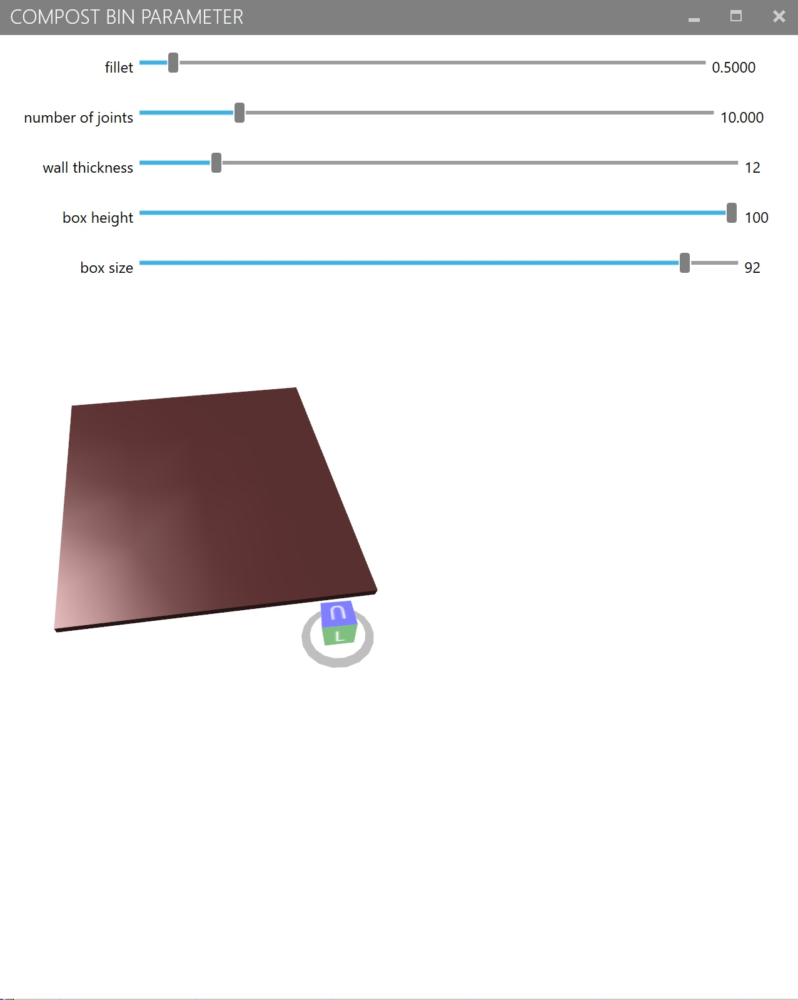

---
hide:
    - toc
---

**Final Project**
=============== 

# Fial Project

For the final intervention, there are so many things going on with my project and how I expected it to be. As a continuous approach from the last term's community engagement in Poblenou, Emilio and I decided to keep working with them to co-design a compost bin together for their community garden with local people. We first built up the scheme for local people to engage in the process of making compost together. Also at the same time, we decided to work on the platform-networking approach by making a website and some open-source data, in order to build a network. In my theory, for keeping up both approaches would lead it to achieve the goal of making people engage in the compost making activity to make a new urban lifestyle. 

Before co-designing a compost bin, we tried to make a humidity sensor to send the information to your device through wi-fi in order to make it easier to see the status. When we talk about compost making, we are lacking input to know if we are doing well or not if we are not used to working with soil and plants. With that in mind, it is needed to design something that can give a lecture and create an output of information that could be available for a community and in that way activate the participation. We intend to use this concept to design interaction between sensors that can be connected to the soil or the compost in order to connect to the people in the community and have a social action and integration in the task that benefits all... Somehow we wanted to pursue the way that we share collected data community-wise since we are engaged in this community garden in Poblenou. Emilio tried hard to control this humidity sensor using an Arduino IDE for the CPU we had of ESP32. So many problems happened through this process because the sensor gives random numbers which indicate the voltage that the sensor senses. So it was hard to convert them into the number percentages. Also, the percentage was somehow backward from the actual number. So it was also hard to fix it how it is supposed to be. In the end, it is connected to the rechargeable battery to be on its own so it doesn’t have to be connected to a computer. With a 3d printed case for both battery and the CPU, it can be embedded in the soil of plants/compost. While printing, Emilio worked on the Html to visualize the percentage in a nicer way to show information.
Afterward, the printing has been fixed into a nicer box and we used a rechargeable battery to keep it turned on for a while. We tested it several times and it worked out. Our plan was to put this into the co-design compost at the community garden to make local people understand the status of their compost to decide their actions towards it. This is why we keep the UI super simple to easily get the information on humidity. We hoped to duplicate this system for different sensors or use a low-tech way to check the soil status at the community garden.

 
For the community engagement project, we first started by designing a three-layer compost bin that has the following stages: throwing in the organic waste and decomposing, resting, and ready to use. We first designed and cut out the profile of this bin by using CNC, then brought it up to the community garden. We have been to the community garden several times before we started building a compost bin, so that is how we had some insights on what they want and how we should be working with these people. Then on the first day of the co-design project, two or three people from the community garden came to the site, where they were arguing about where to place the compost. Because they have this political structure of organizing the members as a democracy, everyone has to agree on every decision they make. We had to wait hours until they finally started talking about the place. While that, we started to assemble the compost bin using some waste materials on the street. I think, to be honest, we should have designed the agenda and goals for the co-design workshop because I think that is how a designer should behave toward people for building something together. Doing everything together is impossible and I think that we don't have to be patient with locals. We should be equal to them. Though Emilio refused to do so and he is the one communicating with them in Spanish, I was not able to say anything. Since Emilio did not help me out translating what they said and what I wanted to tell them, I totally got left out of the group. This way, I thought I couldn't do anything since I am the one that is not engaged in this co-design process, so I decided not to do the community engagement approach anymore. Actually, my interest was pretty much in community making, but how much I asked Emilio to help me translate and help me communicate, he never did it to me. Despite what I wanted to do, I got down. Instead, I decided to develop the platform approach by trying to build a website and make some open-source parametric data. It is really mortifying and regrettable that it turned out like this which has nothing to do with my will. Anyway, I did what I could do in the end.

 
 So, for the platform approach that I have been developing, I first started by making a website mock-up. I was wondering how to make one like precious plastic, so I thought about making it have these core features: network map, introducing communities, and sharing open-source.  After I was talking and reviewing by Tomas Civianco, he advised me to just make it really simple and easy. So I decided to make it by using Wix and also share some videos to show the process of co-designing community compost. At the same time, I have been developing to make this open-source data that I want to share on the platform which lets people download and adjust it to their own cases. I first started by making parameters on the compost bin to change the size, thickness of the wall, number of joints, and so on. It was challenging for me because I have never used the grasshopper before, I just started out learning from zero to make one. My best reference is this simple website. Also for having a user interface, I tried to use the grasshopper plugin called human UI to have a window that shows parameters to let you change them as you like.  For now, I am still working on it but I hope to finish it for the MDEFest. For the MDEFest, despite what is happening to me, we will hold a celebration event at the community garden to cheer for the complement of co-design compost, with local people drinking and eating food from the garden. There we will show the videos of the process of co-designing and introducing the platform. That is going to be the closure of this project.

# Alternative Present

The alternative present that I have been thinking about out of my project is the possibility of compost making. Compost-making is what makes the future possibilities for agriculture, food, and the energy for living things on earth. If we keep living like this, I am sure that someday we will realize that we are lacking so many resources. I guess it is already happening, but more conspicuously. Everything is limited. Also not only for the resources reasons, but we can also lack food. Now Japan is facing the problem of lacking enough imported food. Also, we are facing the problem of the fertilizers for agriculture rising slightly. This means that even the price of domestic production would slightly rise. While our salary rises and economic growth is not happening, how can citizens even economically survive in this situation? The daily diet can be changed to bad manners because citizens cannot afford to buy food that used to be not so expensive. This economical effect came from the Russian invasion and import agreement. Political effects are also one of the big problems that we cannot do anything with. I think for this kind of situation, I want to promote the compost making to people and local governments by telling them that this would help us in the way of producing. This is why I am developing a platform that can form networks all over the world, making alternative systems of producing food and making circulation from households or communities besides the political problems, and coming resources problems.  Also, the community engagement that I was doing is an alternative possibility for the present local life. It was one of the examples of future communities. And I am also working on the compost at the household to represent the alternative presence of urban circulation under compost networks. I hope this platform works out and in the near future that I can develop how we can produce to live better by introducing these possibilities.

# Final Reflection

However, many things were more difficult for me personally than learning. I felt the exclusivity characteristic of the Spanish-speaking world everywhere, especially in the community garden. And as a person from oriental culture, I often felt uncomfortable in many situations. Through these experiences, I was unable to develop a sense of independence toward Barcelona, and I could no longer find meaning in committing myself to this land. Originally, I had been thinking to stay here a little longer before  returning to Japan immediately after graduation. Because I had planned to continue working on the project if it turned out to be successful, but this did not happen. Although I was enjoying a livable city with a good living situation, I decided to return to Japan because I decided that it would not be beneficial to me in terms of my project. (I want to emphasize that I am not fed up with living abroad and would like to live in another country if the opportunity arises.) Through the master's in Barcelona, I have gained a remarkable understanding of the importance. When I am in Japan, I want to place myself in the community and take ownership of the land, and I would like to find a place where this can be realized.
 
Also, I can honestly say that my project at IaaC was not a successful one by any stretch of the imagination. It would be difficult to say that you can build something from scratch in 9 months while also completing classes. Of course, some things can be done on the spur of the moment, but it was difficult to build a project that answers the "weak signal" and is truly radical and financially sound. I have nothing but criticisms to offer about the program, but for better or worse, I am certain that one of the things I learned was to develop objectivity. However, for my own sake, I would like to rethink what I have learned this past year.
Personally, I can say that what I have learned from this year is that I was able to input methodologies to find the "weak signals" around me and scale out the signals and consider their potential for development at various levels, and from there connect them to my own design. I got the impression that this part of the MDEF framework is the most important perspective to cultivate when working as a designer, so I think I was able to understand that part of the framework. On the other hand, I could not deny that the scale required to connect to my own design was still very system change-oriented. Gig solutions to weak signals were unbalanced, and the lack of theories in between these things was noticeable. The expectation of more possibilities beyond that should be built into the framework. However, it is an interesting fact that IaaC is taking the lead in network-making design projects such as Fabcity and distributed design, and I was personally influenced by this. I think it was part of my learning experience to be in such an environment beyond the framework of a program.
 
