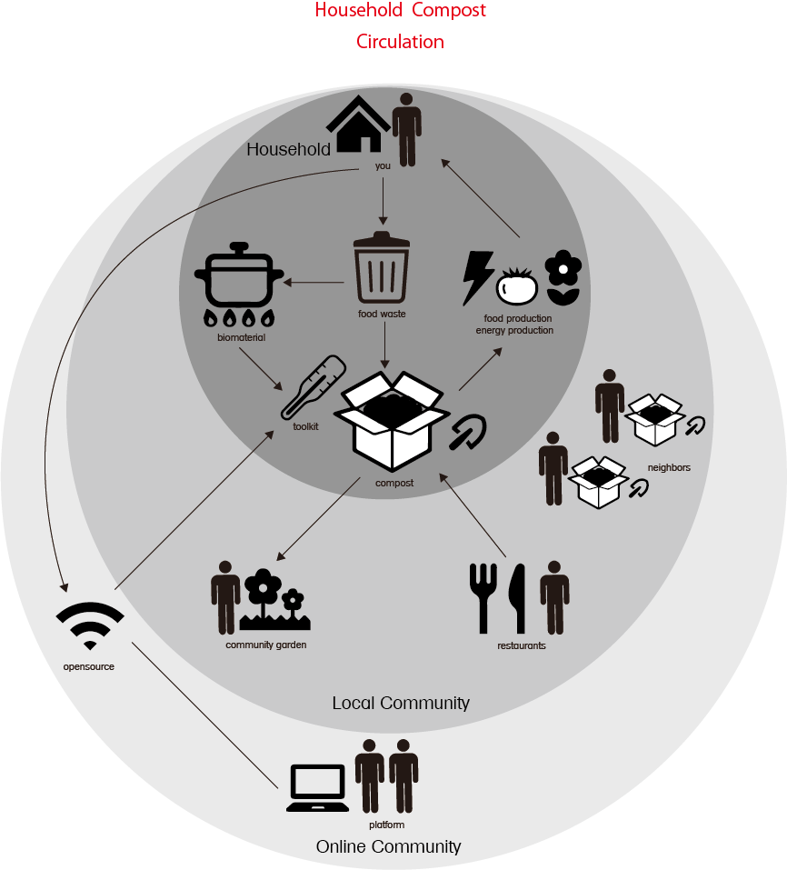
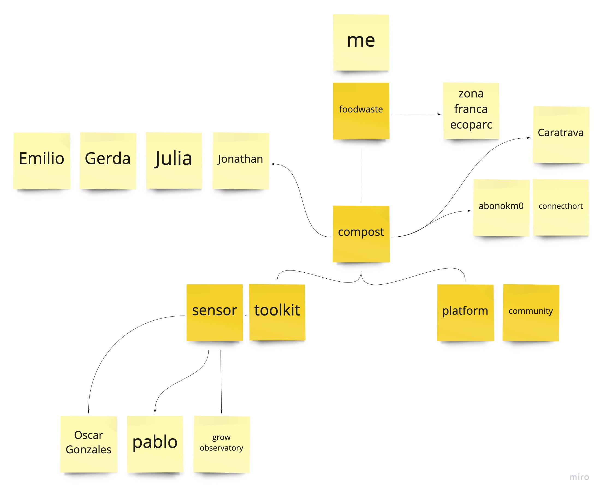

---
hide:
    - toc
---
**1PP Design Intervention**
===============

For this 1PP intervention, I did some research and summarized my project as doing what I need to do. At the time, I also started doing my worm compost in order to compare with aerobic compost that I have been doing. Then I am trying to make a biomaterial shovel as a compost toolkit.

I first drew a diagram for the household compost project which I want to archive.
Starting from your food waste at home, it is made into compost that can produce so many things.
To do this, I need to first try to make a sensor. When I talked with Jonathan and Tomas, they taught us so many references and people that have knowledge and skills for making compost sensors. 

I contacted them and will be in touch soon.

I compared worm compost and aerobic compost by doing both. I did it to design a toolkit that can be used in any kind of compost.
I summarized it  to see how it differs in the process. It has been only 10days, I can get to know a lot of things. 

As a result, it is case by case and depends on what you want for the compost, though It seems that aerobic compost is the easiest and practical for anyone.
This comparison shows the sensor should have at least the scale of ph, humidity, temperature, smell features. I think I can also ask the grow observatory what features should be scaled for healthy soil.

Also, I am trying to develop a toolkit by using biomaterials that have additives of food waste. Now I make a mold and will try to make a shovel with coffee waste and eggshells. I want to use food waste that can take time to compost for making biomaterial as a part of a toolkit.

