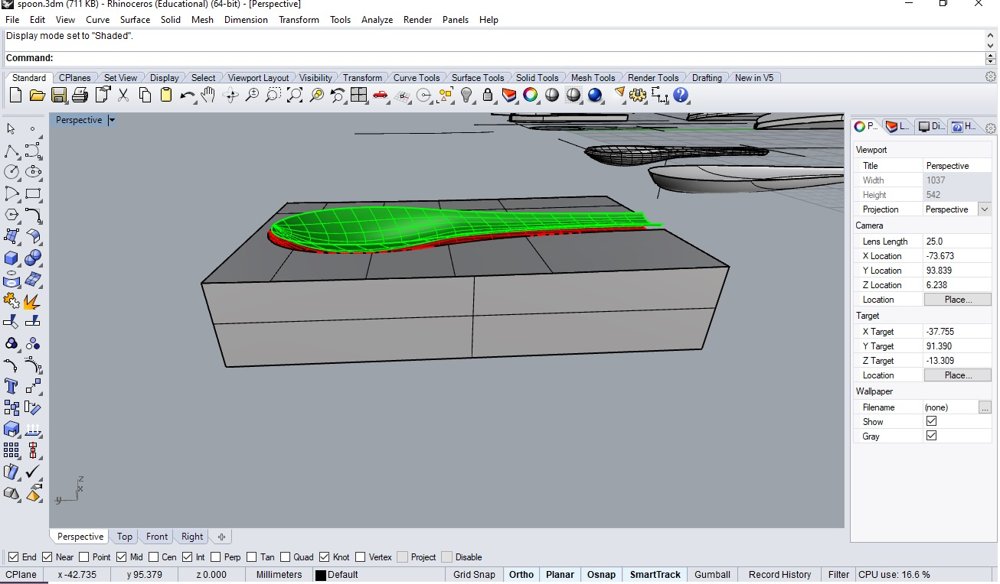

---
hide:
    - toc
---
**1PP Design Intervention**
===============

For this 1PP intervention, I did some research and summarized my project as doing what I need to do. At the time, I also started doing my worm compost in order to compare with aerobic compost that I have been doing. Then I am trying to make a biomaterial shovel as a compost toolkit.

I first drew a diagram for the household compost project which I want to archive.
Starting from your food waste at home, it is made into compost that can produce so many things.
To do this, I need to first try to make a sensor. When I talked with Jonathan and Tomas, they taught us so many references and people that have knowledge and skills for making compost sensors. 

I contacted them and will be in touch soon.

I compared worm compost and aerobic compost by doing both. I did it to design a toolkit that can be used in any kind of compost.
I summarized it  to see how it differs in the process. It has been only 10days, I can get to know a lot of things. 

(Recently I have started doing worm compost and Emilio started doing aerobic compost at home!)

Rei's worm compost 

Emilio's aerobic compost

As a result, it is case by case and depends on what you want for the compost, though It seems that aerobic compost is the easiest and practical for anyone.
This comparison shows the sensor should have at least the scale of ph, humidity, temperature, smell features. I think I can also ask the grow observatory what features should be scaled for healthy soil.

Also, I am trying to develop a toolkit by using biomaterials that have additives of food waste. Now I make a mold and will try to make a shovel with coffee waste and eggshells. I want to use food waste that can take time to compost for making biomaterial as a part of a toolkit.

Last design intervention was a small first step for us that we actually did not design something physical. We had this two workshops to make people more conscious and interested in the compost making as their companion species. We had this idea as a way, in the future, people will need to grow their own food and energy so the compost can be the key source for this coming situation. Also, the important thing is that people should be responsible and explicit about how food is produced and wasted in the current system, which is a black box. We want to open up the black box and let people do something in the system as we are all living together on the earth, co-working with companion species.
This intervention, we need to start designing things on hands as we will continue our subject for doing compost.

We believe that this circular system has to replace the linear system in which food is distributed nowadays, this linear system takes the user off the source of the food and place it only as a consumer not as a producer, placing them in a passive roll; this roll doesn’t allow to the user to participate in the system actively with the only function of consume and generate waste. No one can be responsible for their food and also waste.
Therefore, the user doesn’t realize the amount of resources needed for the production and the resources disposed as waste.
In a circular system the waste is perceived as a resource, meaning that people waste could be used to create new soil, land in form of the compost then, to grow their own food, in this system could interact some producers and intermediaries. It can be a design for Anthropocene that we can bring some impacts on the relationship between land and our human bodies.
Our purpose now is to empower and facilitate the activity of making a personal compost by making it more interactive, easy and productive through tools, toolkits and devices, and in the other hand create networks and spaces for sharing knowledge’s and co-creates solutions that could improve and nourish and generate new solutions.
For the next intervention, we will design a toolkit which mainly focuses on a sensor that has an interface to interact with people and makes the composting process easier so that it can be a daily activity for them. Also, we will design a do-design workshop in order to let compost users test our sensor so we can develop it more in the way they give us feedback.

