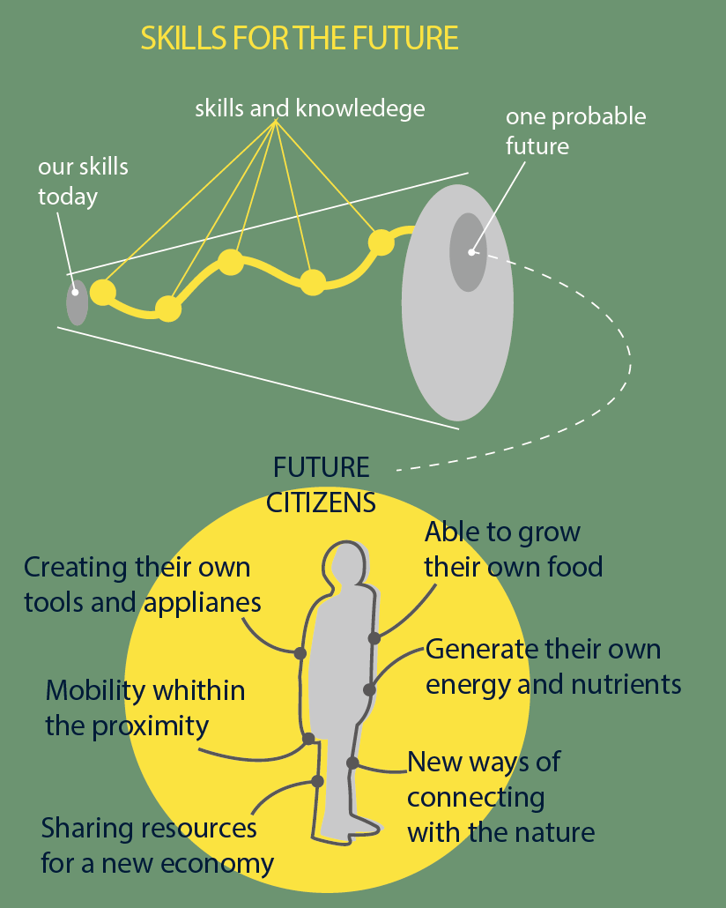

---
hide:
    - toc
---
**Design Dialogues**
===============

#Companion Compost

My intervention arose from my diploma.  As I was curious about the massive industrial food waste in Japan, I started working at the combini store which is an infrastructure for people in the city, to see the reality. In the system, food waste is reprocessed for livestock feed and they come back to a store as new food. Combini company says it’s a sustainable system but it actually keeps wasting food.

Working as a staff at the combini, I tried to distribute the food waste by reaching out to homeless people and food bank. Though, it failed because dead food had no demand for them. I needed to change the direction of how to reuse the food waste. At the time, I was invited to the little island where people are self-efficient about their food. There I learned about community compost and it can also grow food for them. This compost makes a circulation as well as the connection between the land and their bodies. 

I started doing compost at home also trying to make this connection and circulation in the city. I proposed the idea to the combini store and had the compost workshop together with the owner and the company manager. Compost can be a medium for the community as well as it can solve the huge food waste problem in the store and produce vegetables in the store. I wanted to make a platform and a system to make it happen. For that I started doing this intervention to make more people engaged in compost making.

This is why  Emilio and I started our intervention as a companion compost workshop to teach people how making compost has possibilities to survive future urban life. Our goal is to have future citizens presented in the diagram below. 

Main thing is to grow food and produce energy by making compost. To achieve this goal, we decided to take small steps and the first step was this companion compost making workshops.

We did two workshops for this intervention.
 Emilio’s 5-year-old nephew in the states. Online and made compost together by showing presentation slides and telling them how to do it.
MDEF friends in the IaaC class room. Explained why we are doing this intervention and made a compost together.

	
The objective pursued was to design the experience of compost making so that it becomes a habit or personal activity and to be perceived as a companion species for them, besides an opportunity of exploring the personal organic waste. Learning waste is
not waste, but it can be the production resource and also doing compost is making your pet-companion species that are living together in your world line.

After finishing the workshops, we detect several opportunities to improve the experience, therefore we formulate a design question for continuing the design process.

· For a better impact it is necessary to have a co-design process in order to design a toolkit that allows any person to engage in the compost making.
· The personal compost making activity could lead us to a community engagement activity in the form of a sharing resources platform.
· Our intent after that, would be directed to design an experience that could generate a change in the personality to have more people interested in making positive changes and make compost making a regenerative activity for the future such as toolkit/platform.

Next attempt we are going to do is designing a toolkit or interface that attracts people to do it everyday with joy and fun.  At the design dialogues exhibition, we have got a lot of feedback on how to make it a daily activity for people at any age and any type of the house. We should make it easy, fun, interactive, smell-less, and space-less. To overcome these important objects, I am going to start off interviewing people who have actually done making compost toolkits. Then we are going to design and do some workshops or probes in order to see how actual compost makers feel about it. At the same time, we are going to open a platform where people can share ideas and fears as well as resources.  That might be open for domestic and neighborhood/city level.

