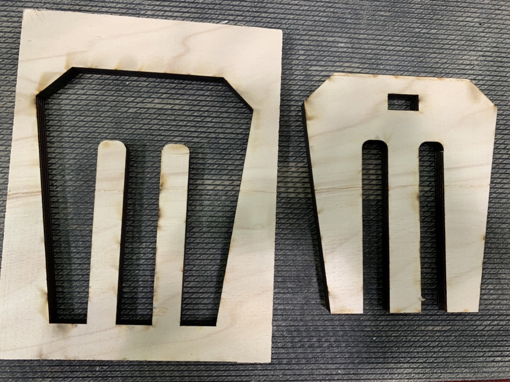

---
hide:
    - toc
---
**Design Intervention 2**
===============

For the 2nd intervention, it was not for me to intervene with people, but with materials as I used the fabacademy and remixing materials for the opportunity to prototype.

First, in the remixing material classI tried to make a fork that can be used for mixing soil with food waste.
In the compost project shown in the diagram, I want to pursue the way of reusing food waste which takes a long time to be decomposed, for biomaterials. And with that biomaterial, I want to make a tool(toolkit). 

I first made a mold with a plywood and laser cutter. Then I made a pine resin based biomaterial with eggshells and a pinch of orange peel to make its color orange.

I actually wanted to put a wooden handle, so I put it in the mold but it didn't stay. 
I used it for mixing compost and it works, but then I got so many reflections. 

-It should be hard because it sometimes bent like a gum
-It should have had a handle to mix
-it should be a bit bigger in size so that it can mix more at a time
-it should be a shovel?

I will probably refer to the indegenous tools  for tool making.

Also I have some reflections on the method of making.
-the mold should not be complicated shape when using plywood mold
-it should not require digital fabrication for making mold
-the method and the recipe also should be open source so it should be done with  the ingredients that are easily found at supermarket

So now I will try to make another shape and way to make a mold with a new recipe I will think of.
Maybe using wasted rice can be like glue to make the material harder. I will try.

Second, in the fabacademy I made a transparent compost box that shows what is thrown inside and temperature change.
In the beginning, I wanted to use sensors for detecting the status of compost, but when talking with Guillem he told me that technology is not always the answer. (Also I am not good at electronics) Then I chose to use a thermochromic paint that changes the color between 26-31 degrees so I can assume how much compost is being active by seeing the color change.

I used the laser cutter to make it and it is two layers. Also the material is acrylic, it shows inside and food waste that can lead to waste consciousness for people. 
Top layer is for composting and the bottom layer is for the soil that is ready to use. The bottom part in the top layer has many holes, so some ready to use compost will be sieved to go down. It can be a pot for planting when there is enough soil inside.

I just started to place it in the MDEF class room for classmates to use it and test it, it will be our intervention from now on to see how people would use it. Also then I can make supre if the color change really works and could it be effective for the process. 

Lastly, I have been in contact with alumni Pablo who had Farmacademyas his project. He is helping me to improve my project and introduced Abonokm0, Miki. I will have a meeting with him next week to see how I can collaborate with him. 

Also I talked with Oscar Gonzales that he was a part of Grow Observatory. He taught me how this kind of project works and what I should do now. He told me that now I should focus on one feature of the compost -like temperature - if I am making a toolkit to detect the data/status. So that I now concentrate on how to get the temperature change of the compost and how I can make it interactive and fun for people who do the compost.

