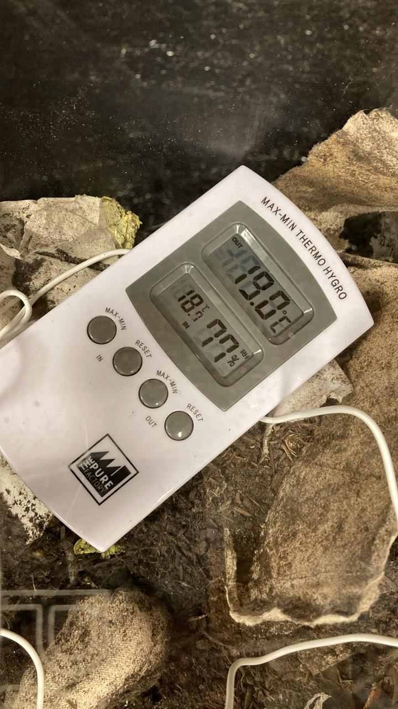

---
hide:
    - toc
---
**Design Intervention 3**
===============

From the last design intervention, we have been developing several things below though all of them are ongoing.

1.Interviews with compost makers
2.Food waste Biomaterial carry bag 
3.Organic Material Library
4.Rooftop Compost and gardening
5.Classroom compost observation
6.Community engagement in Poblenou

1. Interviews with compost makers

As we wanted to develop and exchange the knowledge and skills relating to our project, we have been interviewing and communicating with many people. We interviewed people below.

1)Madrid Community Compost (https://compostajecomunitariohtz.wordpress.com/)
 They are the group of people who approach the government and engage into the education of teaching how to compost at local elementary schools in Madrid. We basically asked how they manage to be involved at the community level.

Also they put a blog about the meeting with us.

2)Emilio’s Design office partner Rebecca
She is also a professor at the university where she teaches design. Recently she got this project from the faculty that she and her students researched about how much their university produces waste every day and every year. She then thought about the compost can be a good solution for this and will start some kind of prototypes with her students. She shared that the school in the community can be the hub for waste management in the city.

3)Abonokm0 Miki
He is also a guy who charges in connecthort. Pablo introduced him to us. We basically shared what we are doing and came up with a way to think if we could collaborate in some way. 

2. Food waste Biomaterial carry bag 
 Since we thought it is also a way to make compost as activities for people to be involved, we started to think of another way of doing compost other than having it at home. Also our classmates asked if they could bring their food waste to the community garden. We decided to develop a carry bag that they can put their food waste inside and throw away the whole thing.
So the material should be compostable and obviously we used some organic waste to make it. This time I wanted to try bio leather and this recipe, we used wasted  tea leaves for this. 

I followed this recipe. http://fabtextiles.org/coffee-leather-bag/ 

Recipe:

12G sodium alginate
12G dried tea leaves
12G oil
30G glycerin
198G water 

MIX for calcification
7G of calcium chloride in 100ml of water

How:
1- Weight all the ingredients with a precision scale.
2- Mix the tea leaves and sodium alginate together with the glycerin and the oil.
3- Add the water and use a mechanical blender to obtain an homogeneous solution.
4- Mix the Calcium chloride with water in a sprayer bottle.
5- Spray the biomaterial on top and bottom with the calcium chloride solution.
6- Cast in a frame. Spread the solution with a spatula to make the surface smooth.
7- Let the calcium chloride act for 5
8- Let the composite sample dry in a dry and warm place.
9- When the product is dry you can separate it from the frame.

It is still drying so I have not been trying to sew it yet, but I will try as soon as it dries. I also want to try this one to use a laser for biomaterial and make a bag without sewing.

3.Organic Material Library

This is what Julia,Pippa, and Fiorella were developing for the Fabacademy challenge to make an organic matter material list relating to the shelf they made. I asked them if I could join for adding information about compost.
I am still researching it but hopefully we can publish it by the end of this term.

4. Rooftop Compost and gardening

This is also what we are doing as a group with classmates to make the IaaC rooftop as a continuous experimentation place for especially those who has interest in bio and solar punks.
Emilio and I will make a community compost for all IaaC and gardening pots to grow some vegetables using compost.
For this, Emilio went to hunt some discarded materials on the street and started seeding some vegetables.
As soon as we decide to start, we will work on it.

5.Classroom compost observation
Continuing from fabacademy challenge, we have been observing how classmates will use our compost. It seems like they have been putting a lot of compostable cups and trays which they bought at nearby cafes. Also some vegetables and fruit skins. Though it seems like they are not mixing it well, so we out up a poster which explains how to use and what to put,
I don't know if it is working, but it will surely take some time to decompose since it is not increasing the temperature which is indicated by the thermochromic paint. Also by puting real temperature sensor and humidity sensor, it is obvious that it is not warm. I need to think how it can do well.

6.Community engagement in Poblenou
As we talked with Tomas Vivianco, we started to think about how we could engage in the community. Like our goal is not to make compost but generate something through compost.

We started to interview at the IaaC neighborhood restaurant in Poblenou. We so far asked NOMAD and Galega for how they are dealing with their organic waste.They told us they are just throwing them away into the Barcelona city organic waste bin on the street. They said they don't separate precisely on what they are throwing away like they mix vegetable peels and leftovers together.
If we could have a good relationship to make their industrial waste throw into the compost we make( or not), it would be a circulation in the community which is what we want to archive.
Also we started to get in touch with the Maripossas community. It looks like they had a compost before so if we can get in touch about it.

