---
hide:
    - toc
---

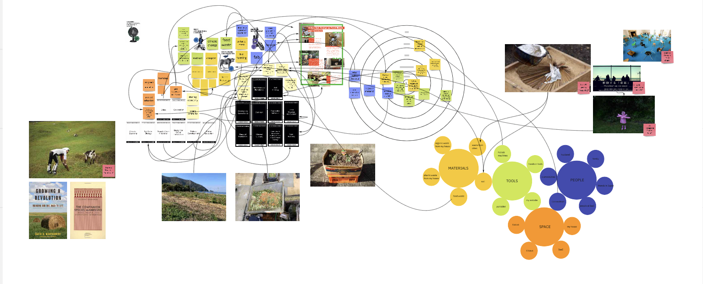

In my work space, I chose weak signals that are related to circular economy, sustainability, and inter-species which are the big topics of the Anthropocene.  I have been doing a project with that in mind for past years.
Though, my actual interest is not thinking about sustainability nor climate change. What I really want to work on is how to make people be aware and take responsibility of living. I thought about this since I realized everything around us, I mean infrastructure and systems are in black box. We do not know what is behind the scenes. That way people will never stop wasting less. People will never stop engaging in the bad part of capitalism. Even if a system changes in a good way, the same bad things will happen again as long as people in a system realize to change how they should be. So basically this is my position.

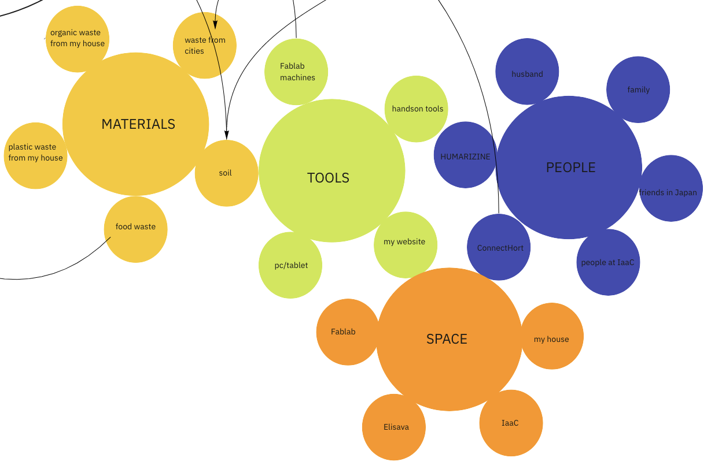

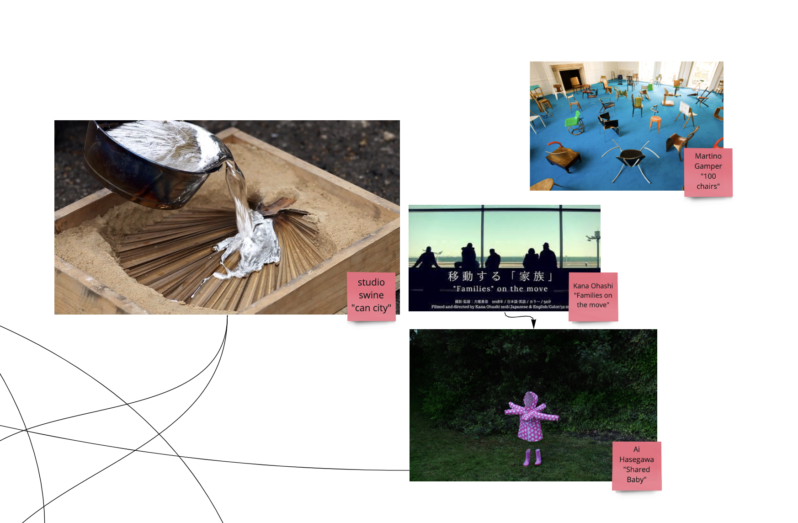

I have references that are mostly how a designer(or artist) himself/herself goes to see the reality of cases and they find out how to break through it.  I want to see the reality of the cases which I want to work on and take actions as understanding the real needs. This reality includes problems, systems, structures and etc. of certain case. 

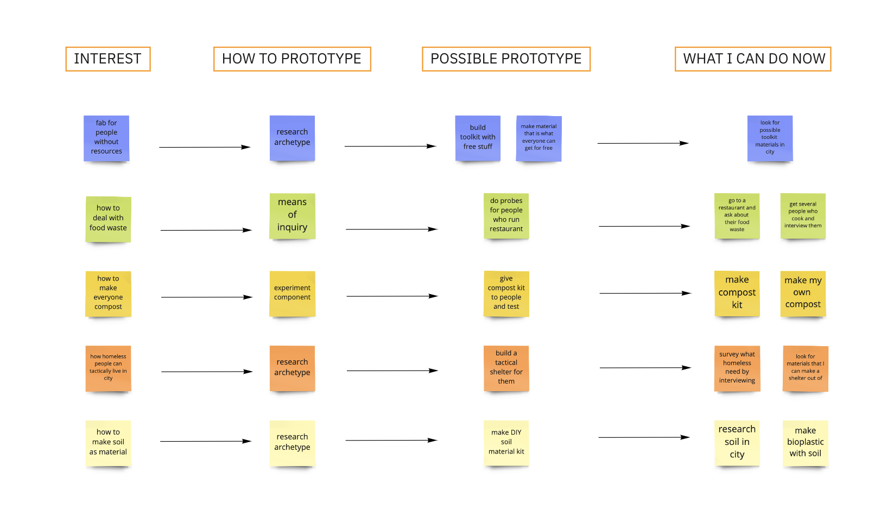

Ever since I am more comfortable prototyping with myself engaged, I decided to make my compost first. Hoping this can lead to some other kind of ideas beside making a compost kit.
My most preferable prototype method will be “means of inquiry”. My research type is always kind of ethnography and I like to do the probes and sometimes interview. 

In my work space, I chose weak signals that are related to circular economy, sustainability, and inter-species which are the big topics of Anthropocene. 

## My First Prototype

Since I was interested in bio related design, I decided to make the bioplastic.
I first did the agar-agar one, then tried eggshell one.

These are materials I used.

<For agar-agar>
Recipe; https://materiom.org/recipe/41
As I followed this recipe to heat the things in a pan and poured the solution into a container.

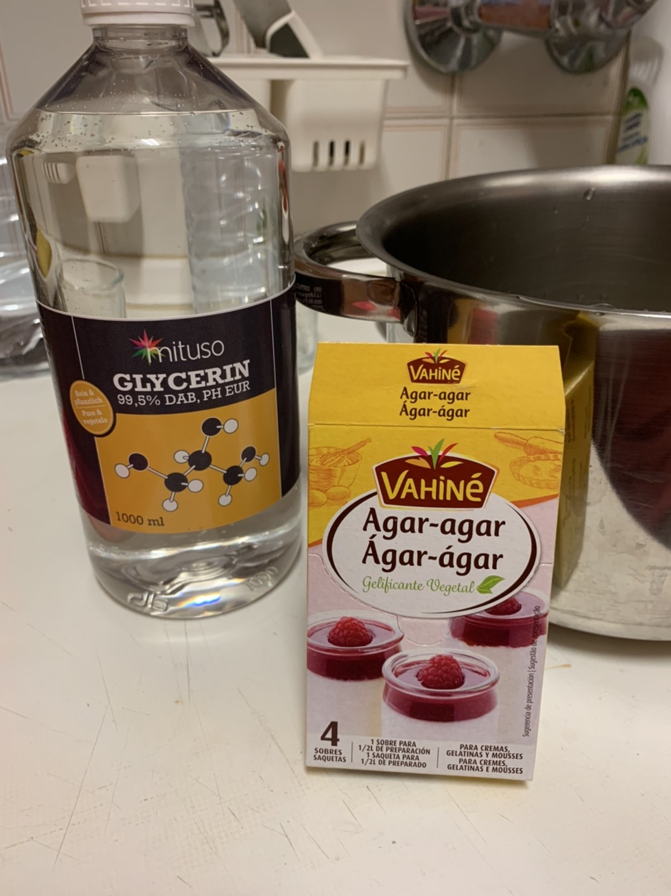
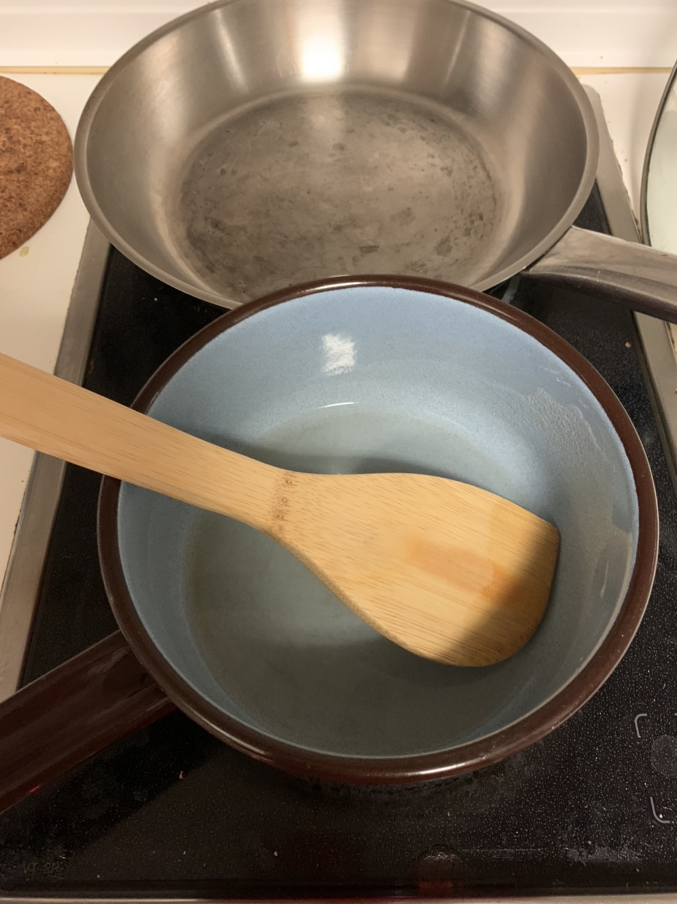

I let them dry for 2 days and it still looks like this. It is not fully dried and still is jelly.I don't know if I did it differently or if I sit it more it is gonna look like bioplastic. Lt's see.

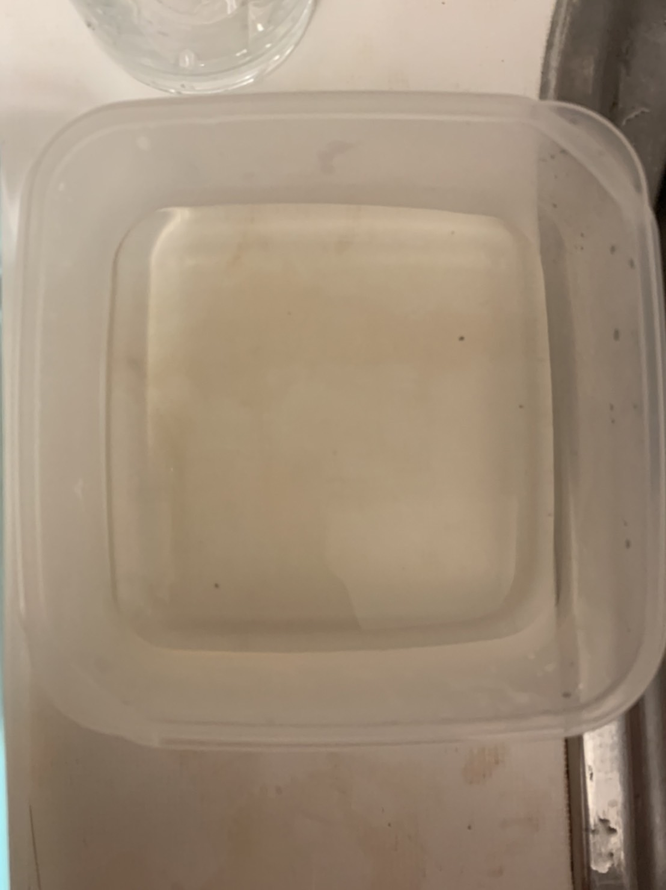
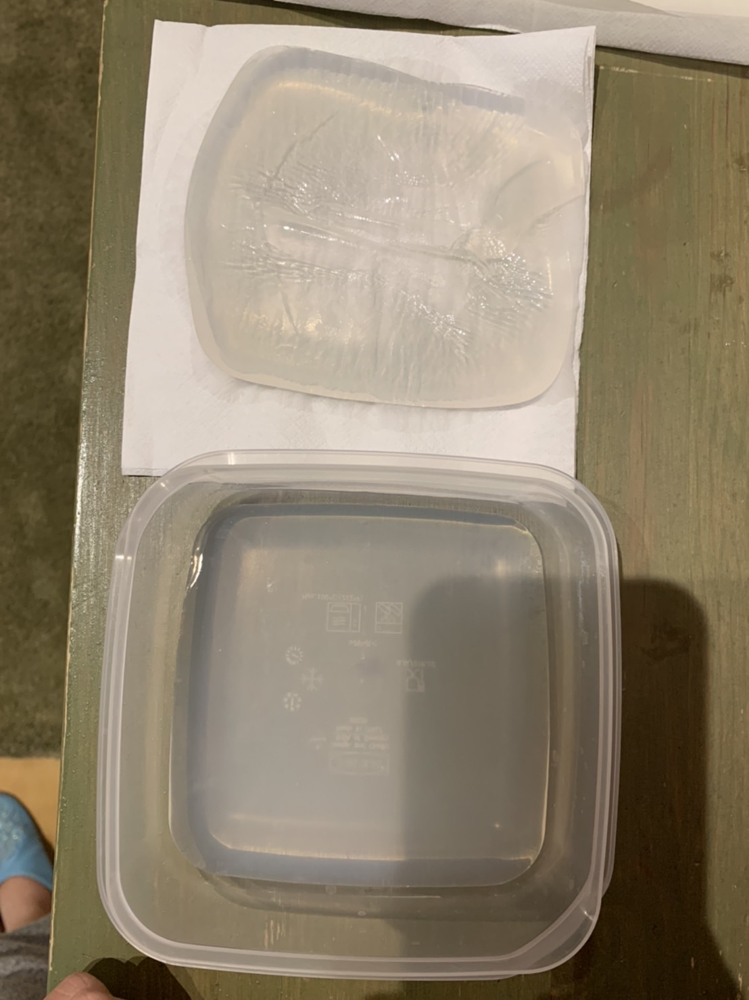
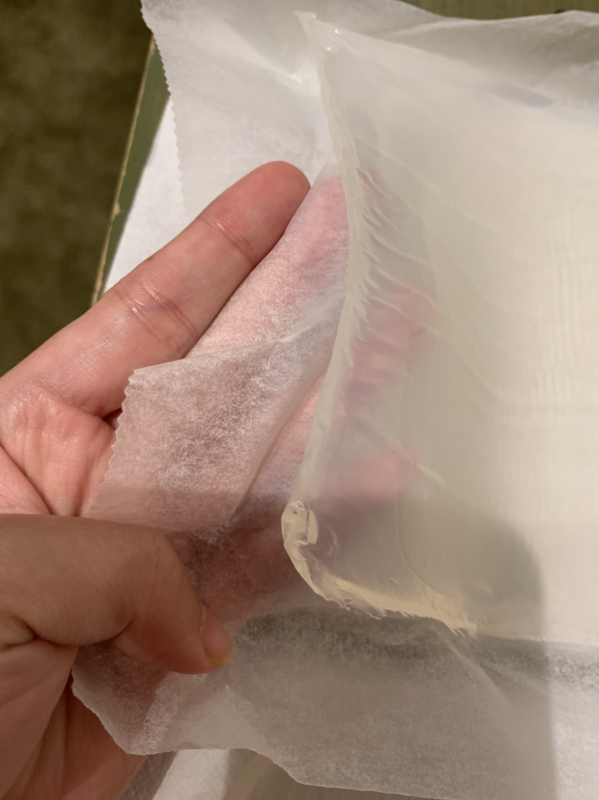

<For eggshell>
Recipe;https://materiom.org/recipe/623
As I did using this recipe, I ignored vaccinium myrtillus L (Wild Bilberry powder) which I was not able to buy.

I first boiled and dried eggshells then mushed it in little pieces.

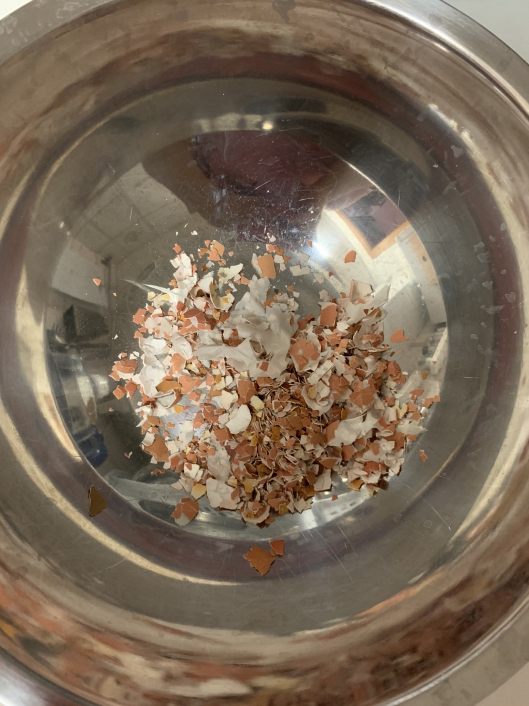

Rest of the process is similar to the agar-agar one.  I mixed solution and eggshell pieces at the end and poured in into a container.

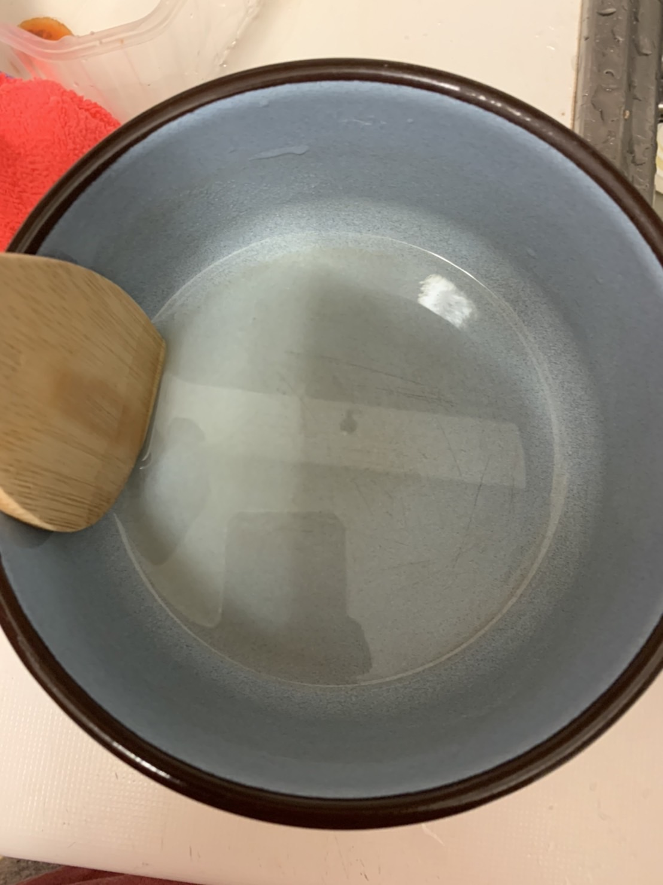

 Next day when I checked it, it was kind of dried. Still, it seems not smooth because I didn't mush eggshells enough so it looks bumpy and rough. Maybe I need to buy a grinder.

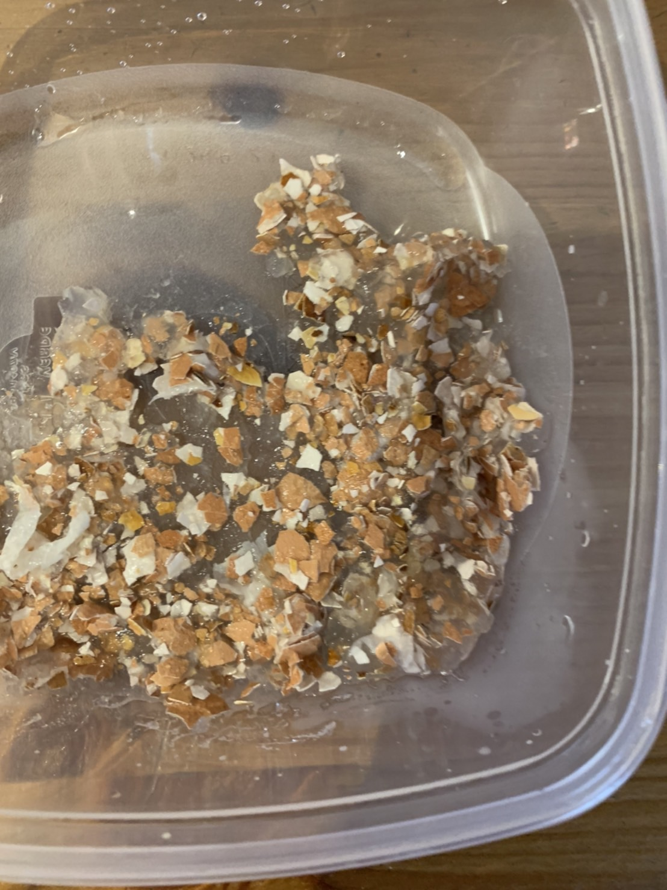

Next, I want to try throwing them away into a compost and see how my bioplastic is going to be biodegraded.

