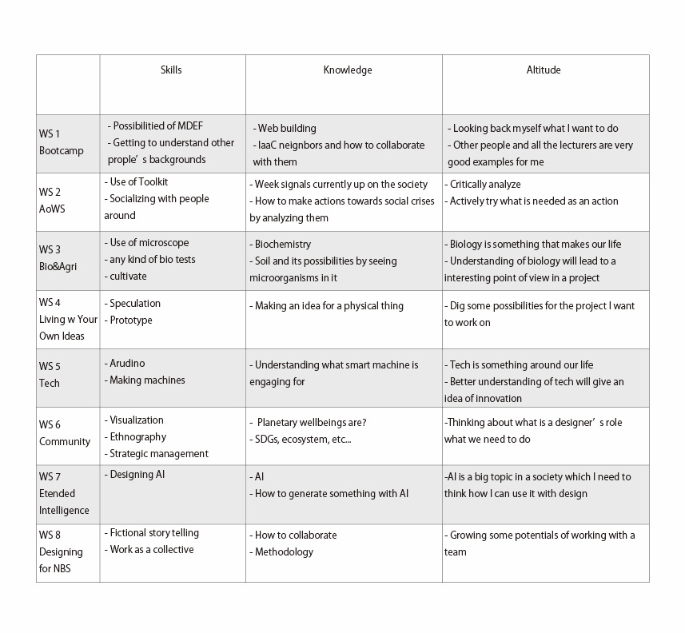

---
hide:
    - toc
---
**Bootcamp Oct.4-8**
====================

This week was a first week after 2021 academic year has officially started at IaaC and our course MDEF. As everyone gathered for the first time in our classroom, we started to exchange our beliefs that also explains our fight.

##My Fight

My fight is a bit too specific. I explained as I want to design the soil of urban areas using food waste to make compost out of it. Because I have doubts on urban infrastructure that is in a black box, like we will never know what is actually happening behind our scenes of life.  This black box situation is leading to people unconscious about making a huge amount of waste in industry or even at home. I am now willing to change that situation and make food waste into some kind of nutrition of cities which can become some food production-urban farming in a future. For that, my keywords will be circular design, soil design, food waste, compost, and urban farming.

・ I was able to get to know what everyone is fighting for.
・ I was able to look back what I want to do and why I came to IaaC.
・ I was able to imagine that I can collaborate with someone when working on a real project in a future.

##Elisava 

Elisava tour was interesting as it is so much different from IaaC education and facility. They have basically every kind of machines- laser cutter, CNC router with 3 axis, 3D printers, coping machines, bio-related machines, and so on… Elisava is somehow so much like “academia” for me, though I think it is good for me to go both IaaC and Elisava, learning in between them.
I was also impressed to see graduation project that each student at Elisava has developed.

・ I was able to see the difference between IaaC and Elisava.
・ I realized I can use the difference of these two in a good  way when learning and making.
・ Thesis examples from past year’s students that Oscar showed us really pushed me to work hard.

##Skills/Knowledge/Altitude

Personal vision is something I have never tried to think of before because I had a tiny tiny goal for everything I did that won’t improve me at all.  When I thought of it and actually had a meeting with other people to exchange our visions, it somehow improved me to have a real goal I want to achieve every week of our session. 

・ I was able to think deeply about my vision both as designer and a person.
・ Long term vision is hard to make it true but will encourage me.
・ It is always important to think about vision because it gives you some hints on your work as well.

##Gitlab Website

Making website using gitlab is pretty hard. Also keeping website active is hard as well. I already have my website that I run with my friends and it is hard to keep it updated, so this is.  Git is so confusing but I tried.

・ It is always good to update/archive what you’ve up to because this will give you a opportunity to connect with others.
・ it is important to reflect what you’ve learnt and archive it in order to improve yourself.

##Poblenou 

Poblenou is such an inspiring place. I can find anything nice here. It is said Poblenou 10 years ago was nothing, though these 10 years artists and designers started to move here and became such a lovely neighborhood. I tried to find a flat in Poblenou, though it was kind of expensive and very popular. I hope this place is not going to be like Brooklyn where gentrification has happened after artists started to live.( well I don’t think so)

・ Neighbors are good to make community with and collaborate with.
・ Making furnitures out of trash happens.
・ Mobility is well concerned and its sharing mind is impressing.
・ urban farming makes sharing economy, also culture and community.

I used to do urban design with research and also a bit of architecture. Somehow there is many people thinking about how to make this place better and really work on it. This means there is many ways I can connect my interest to. I am really looking forward to collaborate with people or projects I have met this week.

