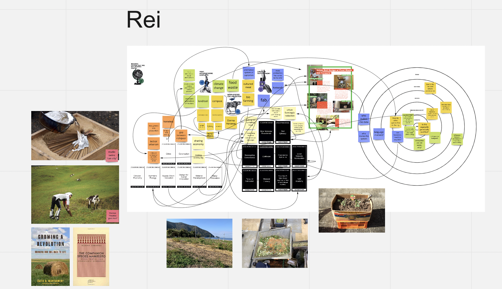
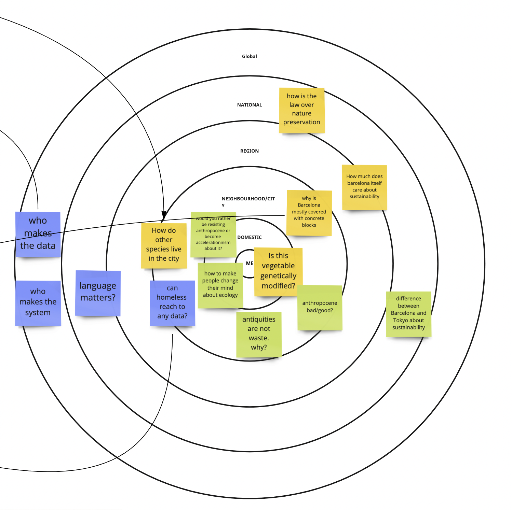
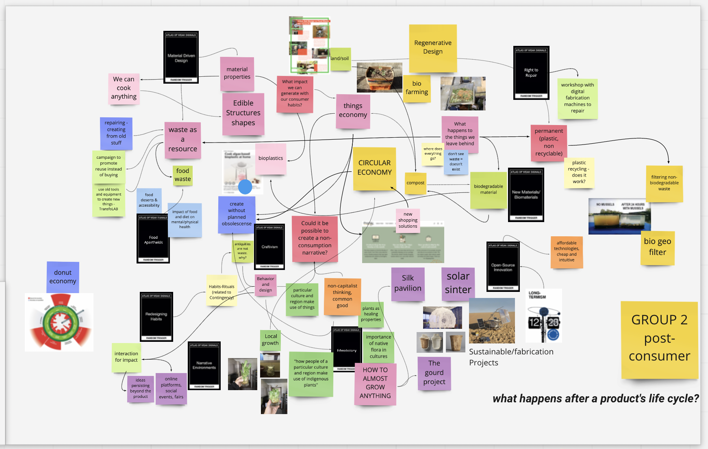

---
hide:
    - toc
---

Atlas of Weak Signals Oct.11-15 
This week, we had a session about atlas of weak signals.
Weak signals are analysis of the main change factors that shows certain directions of now day society.

Through out the week, we have been introduced to those weak signals and thought about how to connect them to our interests. First, we did this exercise to randomly select a weak signal and make a scenario on how to make a change with it.  Afterward, we had to choose one weak signal that we want to think about.

Q. Why did you choose your main weak signals?How do they relate to the fight you presented one week ago?
 I chose Inter-species  Collaboration. It has been my interest for last several years how human beings can live with soil and microorganisms in the soil or air. I had been interested in compost  since I did my graduation project on turning food waste into compost at urban infrastructure system combini. (Just as I talked about it as my fight)  Since then, I also got interested in soil and microorganisms.  As I was impressed by Donna Haraway who says her compost is also her partner in a sense of “significant others”, I wanted to make that kind of relationship more practical in a city. I actually chose Fight Anthropocene Conflicts as my second weak signal which it is related to the topic of food waste I was also interested about. Also chose Circular Data Economy as my third one as I was interested about how to make everyone involved in a process of making compost using fabrication.

Q. Reflect on your experience looking for weak signals in a situated approach though scales.
As I was too sick to go for a hiking, I did my looking at weak signals in a situated approach through scales exercise in my room.  As my weak signal “Inter species collaboration” , I could just think something very general. Mostly related to my shopping experience at grocery store, when I choose vegetables and if it is genetically modified or not. Farther more, I recognized this city Barcelona is mostly covered with concrete blocks which means it is hard to see soils, relating this to my interest in soil. 
It was hard for me to think about a weak signal in national or global situation because my question towards society is always related to my experience in life. Though going through this exercise brought me  learn that I need to relate things in larger scale which can be led to a change factor in society.

Q. How was the experience of finding points of resonance with others?
It was such a hard exercise for me. Everyone has chosen close topics, though everyone’s approach and way of thinking is different.  For example, someone in my group was interested in making sustainable product because she cares about climate change, though my view towards sustainability is a bit different from hers so we kind of ended up making a board on their own purposes. Our team set our theme as “What happens after Product’t life cycle?”, it is okay for me but what I want to think more about is how people can be responsible for product’s life cycle. If we could have more time, we could just talk and explain what we really think about on each topics. Though, I learned there is many ways to approach one single problem in a society because everyone has a different approach. This means I can learn from others so I could have exchanged more about our thoughts just like  it was nice that we could exchange some projects that relate. 

    1. Someone you would like to contact
        1. RemixThe School
        2. SISCODE
        3. ROMI
        4. FOOD SHIFT
    2. An experiment you’d like to make 
        1. I want to try designing a toolkit for helping people make compost in their house in a city. Also I want to make a soil as a new material which everyone can get for free.
    3. A new skill you’d like to add to your personal development plan
        1. A skill to deeply think about a scenario starting from a weak signal

# Atlas of Weak Signals

