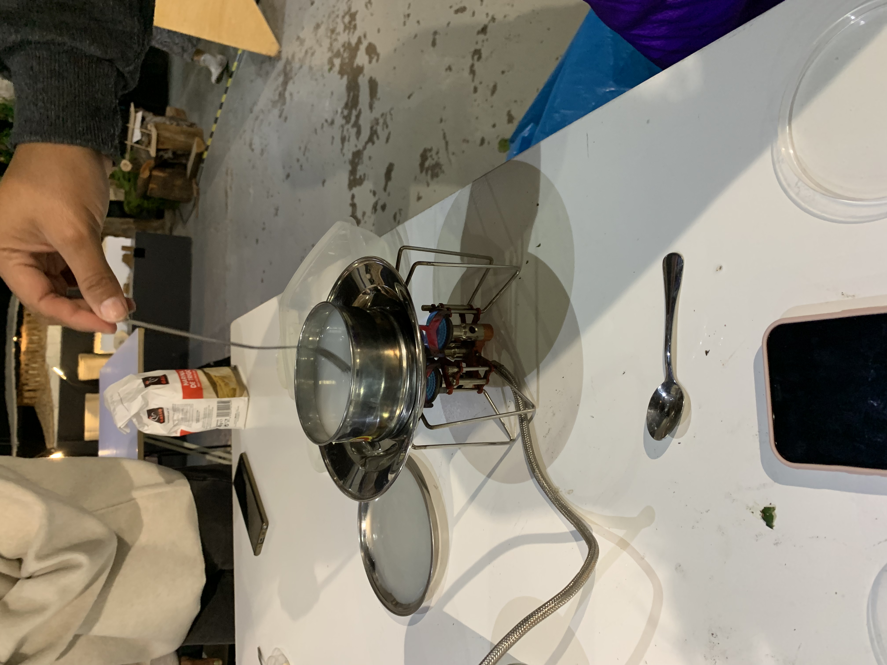

---
hide:
    - toc
---

Bio&Agri Zero Oct.19-29
These last two weeks we have been exploring the possibilities of biology and agriculture especially in the design field. What we learned in the class was basically the basics of biology and agriculture. We had a lot of hands-on experiments and learning of basic contents.

First week we learned about what biology is and the first thing we started off with was growing baterias in a container, which is bacteria we got from around IaaC. I rubbed a tree surface and my iPhone and rubbed medium in a container. As time passes,  I have noticed , in this world there are microorganisms/bacterias everywhere. This is why we really need to wash or sanitize our hands now.

The other day we learned about spirulina and tried to grow it. Though it is hard to grow it( and it is why spirulina was only growing in specific places in the world). It will be a savior to the world of hunger if many people are really able to grow it everywhere.Though I did not find any difference than taking a capsule of proteins or minerals.
We also tried growing our own kombucha in a small pot and learned how fermentation processes. Now a pot is at my home and scoby seems to be growing little by little. 

Also we learned how to use microscopes and how it works. As we learned how to use microscopes, our perspective also got micro. I feel like I can think about things on a micro scale now so that is how I am now interested in the world of microorganisms in soil.

Second week was much about agriculture(+biology combined). What I enjoyed the most is about soil, how it is specified in types and circular systems flows.  I was not able to see soil using a microscope, though when I saw it with a digital microscope, even only one scoop of soil had many things in it. I felt it was some kind of galaxy. 

The lecture ended with bioplastic cooking. My group followed the direction and recipe which was shown by teachers though it did not get thick, it was a failure. Then I noticed even making bioplastic is chemistry and biology. Maybe the formula of each compound was not correct. With that in mind, this bio&agri zero lectures really meant a lot to me. When I make a bioplastic, it really seems to be doing design but it is not. It is chemistry/biology so I need to learn more about it.

・ I understood that biology on a different scale could be a different study.
・ Microorganisms/bacterias are everywhere so it is good to know that they can be helpful when I design something related to biology.
・ In biology, I felt everything natural is based on circulation.
・ Agriculture is a tool of survival  that human beings have invented to live but even agriculture is in survival now. What do we do?
・ Bioplastics are a hot trend now but they also require energy. 
・ Fermentation is used in daily products especially in food production. Can its process be used for hard things like furniture, architectural material, cloth or etc

