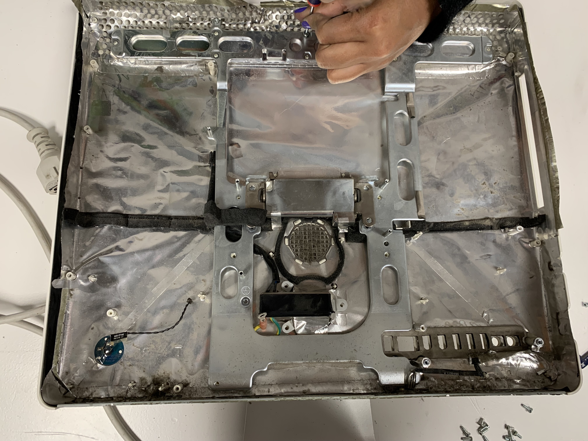
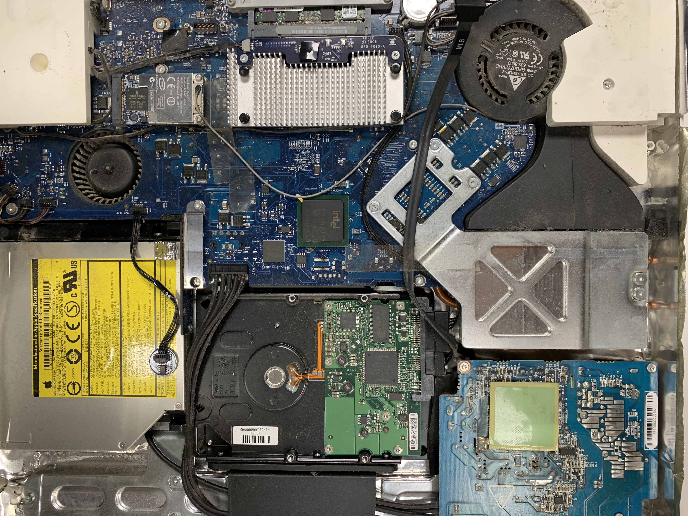
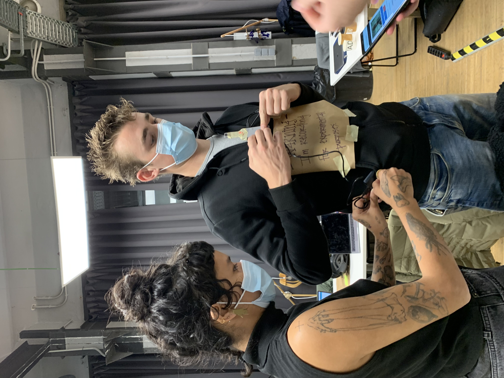
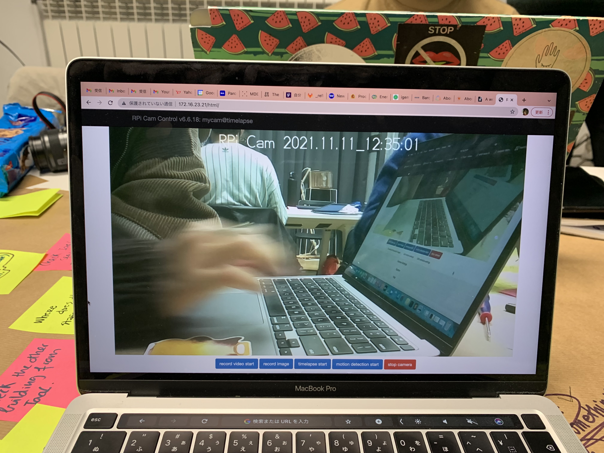
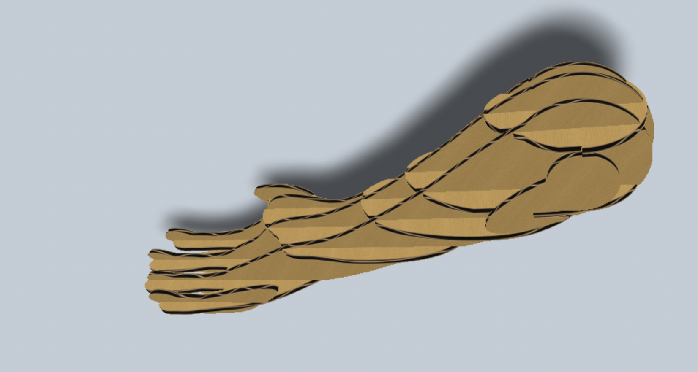
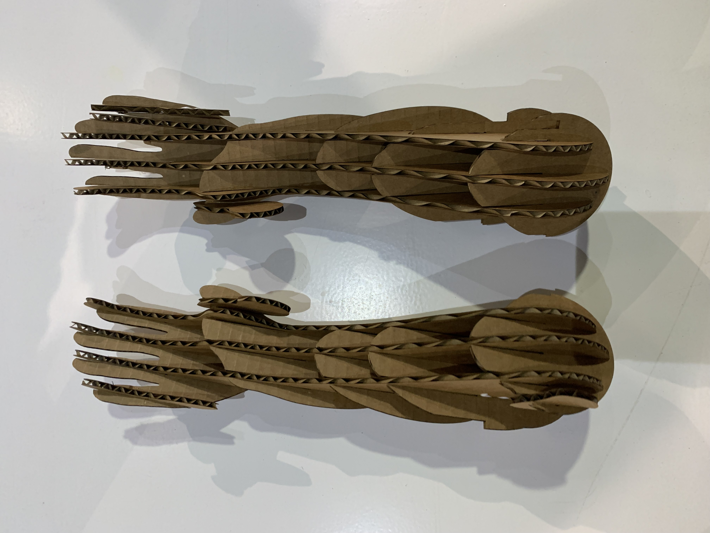

---
hide:
    - toc
---

**Tech Beyond thE Myth first week Nov.8-20**
===============

These last two weeks have been about techs which I thought I would have a tough time. Result is I had so much fun.

<Forensic Report>
Firstly we disassembled the machine in order to see what is inside and analyze the maker’s strategies. When we opened the iMac 2006 which was the 2nd generation iMac ever made, we found a lot of Apple's strategic design. (Which is also capitalism point of view)
Basically Apple products are not allowing users to fix or touch product mechanics. They have the point to keep users patient to buy their next products coming out. If a user ever fixes or touches inside their product, Apple will never help supporting them. BUT how do they get to know if a user touches or not? That was what we found inside the iMac, basically everything inside was covered with aluminium sheet and that was for detecting heat and radiation but also for this- because a user cannot see things inside by tearing it. That really made me think Apple is really good at marketing and design for gaining more money from customers. Recently, they have announced that they will be selling some parts for iphones to let users fix by themselves. Though, I still think there are some strategies behind it.

<Measuring the World>
First half of the week we also did learn data collecting methods. There are several devices they introduced us to collect data- Smart Citizen Kit, Pi Camera, Light Sensor, and Web Scraping. My group chose a  Pi Camera and collected data by placing it at one point and putting it on a body to walk around. My group had these following as a set of ideas.
Objective: I want to have a place to eat lunch inside IAAC.
Question: Are all spaces in IAAC in use at lunch time?
Hypothesis: - Lunch&Afternoon Data “There is a space for a (covid-safe) lunch?” - Morning Data “Are there people in Iaac interested in having a space to have lunch?”
I actually thought it was better to use Smart Citizen Kit because it can collect data on several places and that we can get to know which places are actually in use or not. Sadly my opinion was rejected in the group and so we tried to capture where we can eat by putting the camera on a body to walk around. In the end I kind of realized that a camera is basically only good for capturing at one specific place in order to get precise data. We only had one camera that time which means we were not able to collect data that is using cameras advantage of surveillance without interacting. If I were to do the same data collection with the same objective, I would choose Smart Citizen Kit for sure.  
Actually we also did a 

<Almost Useless Machine>
Second week we did this for a whole week: to make a useless machine. My group was to make a HUG ME NOT machine which tells the anticipation/expectation moment of life. Based on this concept, we tried to make a machine that almost hugs but not hugs someone who gets nearby.
My group had 6 people. I joined the fabrication process to design the arms. I first downloaded the free 3d data of arms and basically used the Slicer to make it able to cut by laser. 
Other parts are processed by other people in the group. What was hard for the process of making is prototyping takes so much time when making data into a physical model. Even if it looked okay in the data, it is actually not in reality. This is why we do prototyping, but still I had used a long time working on it. It was hard to decide the size of the intersection of materials for data. Once I made it a bit bigger, the intersection was too fluffy and I needed to print it again.

Group work was okay, my group somehow had people with good skills of techs and programming but this means I am still not understanding the techs( because I did not have to do it) , I might need some time to really learn it.

