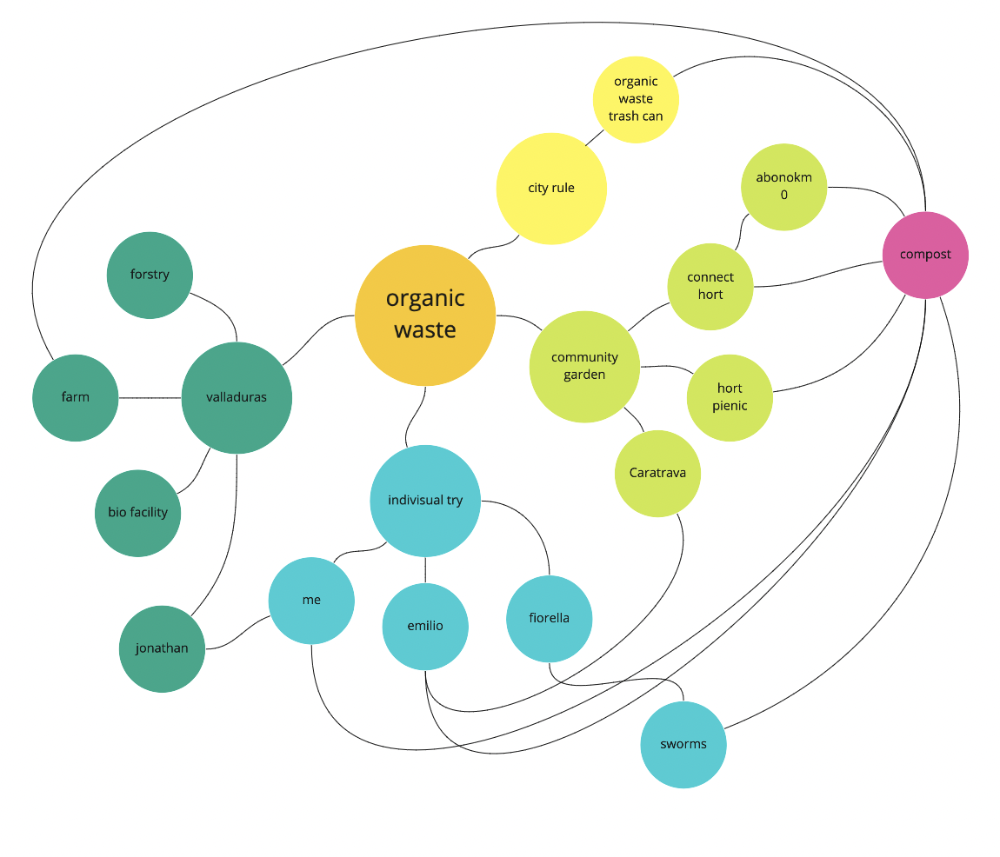
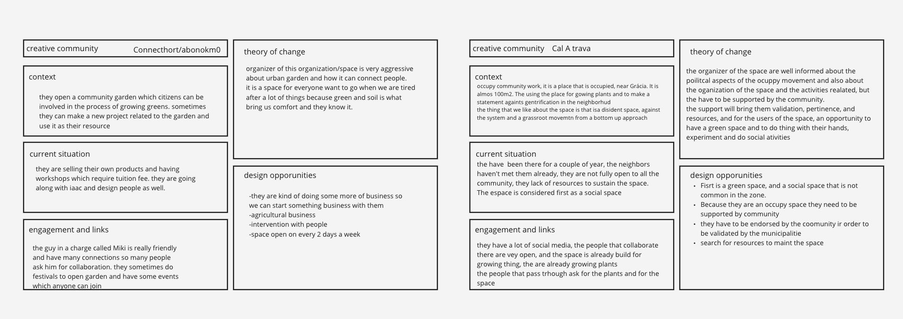
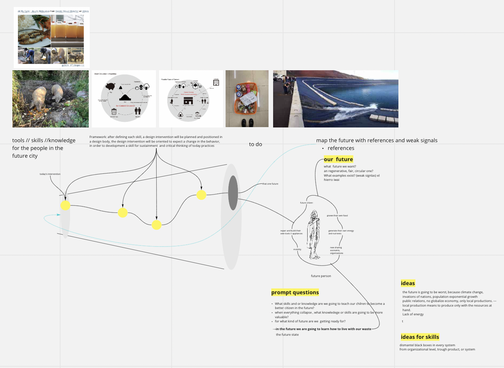
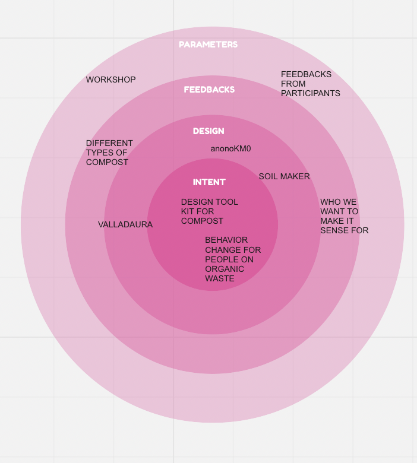

---
hide:
    - toc
---

**Community Engagement Nov.23-26**
===============

This week we have been going through such a tough time since we started thinking about collective intervention.

My group, which is only Emilio and me, is doing something that changes the behavior of people, as a concept. Since my diploma, I have been very interested in soil and compost in the way of using nutrients from food waste.

So I mapped the local organic waste and compost communities and people.

We put out creative communities that we can think of related to our intervention.

Now our goal as a group is to make future people in the city be able to compost their organic waste. This means that people will also be able to make their own food and produce energy by using compost. In the future we are going to learn how to live with our waste.

For this goal, we need to take it step by step. Maybe for the first intervention, we will try to do a workshop which involves people from MDEF to participate in “making your compost”. After the workshop, we will probably be able to figure out what will be needed for making compost by getting feedback from participants. That is how we will be able to think about a compost tool kit that will be easy for people to access and try their compost at home which will make their behavior change towards organic waste.

Now we are contacting people who might have good advices and possibilities to collaborate with.

